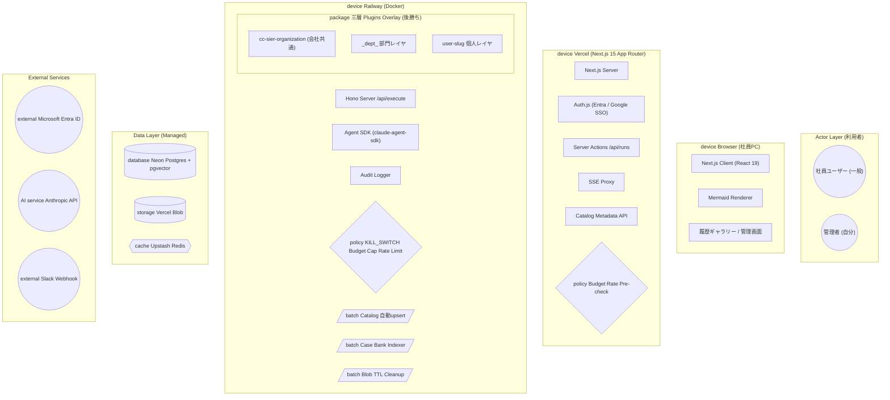

# cc-sier-organization Webアプリ アーキテクチャ図 (UML Deployment + Component)

| 項目 | 内容 |
|---|---|
| 図名 | cc-sier-webapp-architecture |
| 種類 | UML コンポーネント図 + デプロイメント図ハイブリッド |
| 作成日 | 2026-05-02 |
| 作成者 | SAS-Sasao |
| 案件 | CC-SIer WebApp Phase 1 (Vercel版) |
| 元設計書 | cc-sier-organization Webアプリ 設計書【Vercel版 / Phase 1】v0.1 |
| 出力先 | `docs/drawio/cc-sier-webapp-architecture.{drawio,html}` |

## 図形ステレオタイプ仕様

| 要素種別 | drawio 形状 | ステレオタイプ | 該当要素 |
|---|---|---|---|
| 人間ユーザー | UML Actor (棒人間) | «actor» | 社員ユーザー / 管理者 |
| 実行環境 | Swimlane (色分け) | «device / node» | Browser / Vercel / Railway |
| ソフトウェアモジュール | UML Component (左側ノッチ付き) | «component» | Next.js Server / Hono / Auth.js / Agent SDK 等 |
| RDB | Cylinder3 (青) | «database» | Neon Postgres + pgvector |
| オブジェクトストレージ | Cylinder3 (緑) | «storage» | Vercel Blob |
| KVS / キャッシュ | Hexagon (黄) | «cache» | Upstash Redis |
| 外部 AI / SaaS | Cloud 形 | «AI service / external» | Anthropic API / Microsoft Entra ID / Slack |
| セキュリティ機構 | 赤色矩形 (太枠) | «policy» | KILL_SWITCH / Budget Cap / Rate Limit |
| バッチ / 定期処理 | 平行四辺形 (オレンジ) | «batch / scheduler» | Catalog upsert / Case Bank Indexer / Blob TTL |
| パッケージ | Folder 形 | «package» | 三層 Plugins Overlay (会社共通 / 部門 / 個人) |

## レイヤー構成 (6 層 + 1 Right-column)

| レイヤー | swimlane 色 | 配置 | 主要コンポーネント |
|---|---|---|---|
| L1 Actor Layer | 青 (#dae8fc) | x=40, y=30, w=1240, h=110 | 社員ユーザー / 管理者 |
| L2 Browser | 黄 (#fff2cc) | x=40, y=160, w=1240, h=120 | Next.js Client / Mermaid / 履歴 |
| L3 Vercel | 緑 (#d5e8d4) | x=40, y=300, w=680, h=200 | Next.js Server / Auth.js / Server Actions / SSE Proxy / Budget Pre-check / Catalog API |
| L4 Railway | 紫 (#e1d5e7) | x=40, y=520, w=680, h=320 | Hono / Agent SDK / Audit / Plugins Overlay / Policies / 3 Batches |
| L5 Data Layer | 橙 (#ffe6cc) | x=740, y=300, w=540, h=540 (右列) | Neon Postgres / Vercel Blob / Upstash Redis |
| L6 External | 赤 (#f8cecc) | x=40, y=860, w=1240, h=140 | Microsoft Entra ID / Anthropic API / Slack |

L5 Data Layer は右列に縦長配置することで、Vercel と Railway の両方からの依存を、横方向の直線エッジで干渉なく表現している。

## エッジ設計

| 種類 | スタイル | 用途 |
|---|---|---|
| HTTPS 主動線 | 太線 + 塗り矢印 | Browser → Vercel / Vercel → Anthropic API |
| 内部 API (HMAC) | 点線 + 塗り矢印 | Vercel → Railway |
| SSE | 点線 + 開矢印 | Browser ↔ SSE Proxy / SSE Proxy ↔ Hono |
| OIDC / 監査 / association | 点線 細 | Auth.js → IdP / Audit Logger → DB / Slack |
| 層内エッジ | orthogonal | swimlane 内 |
| 層間エッジ | 直線 (edgeStyle なし) | swimlane 間 (貫通回避) |

## 設計のポイント (HTML 詳細ページに記載した 5 項目)

1. 図形ステレオタイプによる役割の明確化 (9 種類の図形使い分け)
2. Vercel + Railway 分離の必然性を視覚化 (Functions 800 秒上限・ephemeral filesystem 制約)
3. 多層 Budget Cap を二重に配置 (Vercel pre-check + Railway enforce)
4. 三層 Plugins Overlay を package ステレオタイプで強調 (会社共通 → 部門 → 個人 後勝ち)
5. バッチ / スケジューラ系を平行四辺形で独立可視化 (Catalog upsert / Case Bank Indexer / Blob TTL)

## Mermaid ソース (HTML 埋め込み版)

(完全版は `docs/drawio/cc-sier-webapp-architecture.html` 内 `<pre class="mermaid">` を参照)
