# コンビニ店舗スタッフの1日の作業フロー

- **ファイル名**: cvs-daily-workflow
- **図の種類**: 業務フロー
- **作成日**: 2026-03-29
- **作成者**: SAS-Sasao
- **ツール**: open_drawio_mermaid
- **関連案件**: ストコンAWS移行

## 概要

コンビニエンスストア店舗で働くスタッフの1日の作業を、時間帯別（深夜・朝・昼・午後・夕方〜夜）に整理した業務フローチャート。

ストアコンピューター（ストコン）を中心とした発注・検品・廃棄・精算の各業務プロセスと、それらが1日のどの時間帯にどう組み込まれているかを可視化する。

## 参考資料

- [convenience-business-processes.md](../retail-domain/convenience-business-processes.md) — 発注3方式・廃棄管理・日次精算・検品の詳細プロセス
- [convenience-industry-structure.md](../retail-domain/convenience-industry-structure.md) — 業界構造・店舗運営の1日の流れ
- [store-computer-domain-knowledge.md](../retail-domain/store-computer-domain-knowledge.md) — ストコンの機能一覧・用語集

## Mermaid ソースコード

```mermaid
flowchart TD
    subgraph midnight["🌙 深夜帯 00:00〜06:00"]
        direction TB
        M1["夜間スタッフ出勤\n引継ぎ受け"] --> M2["店内清掃\nトイレ・床・棚"]
        M2 --> M3["デイリー品の廃棄処理\n弁当・おにぎり・サンド"]
        M3 --> M4["ストコンで廃棄スキャン登録\n廃棄区分: 期限廃棄"]
        M4 --> M5["深夜便の納品受入\nハンディで検品スキャン"]
        M5 --> M6["商品の品出し・前出し\n先入れ先出し(FIFO)"]
        M6 --> M7["翌朝便の発注確認\nストコンでAI推奨数チェック"]
        M7 --> M8["フライヤー清掃\n翌朝FF仕込み準備"]
    end

    subgraph morning["🌅 朝帯 06:00〜11:00"]
        direction TB
        A1["朝シフト出勤・引継ぎ"] --> A2["朝一便 納品受入\n※1日で最大量の入荷"]
        A2 --> A3["検品: ハンディターミナルで\n全品スキャン・数量照合"]
        A3 --> A4["弁当・おにぎり・サンドの\n品出し・陳列(FIFO)"]
        A4 --> A5["カウンターFF準備\nコーヒーマシン・揚げ物投入"]
        A5 --> A6["前日分 日次精算\n各レジの締め処理"]
        A6 --> A7["現金実査・POS売上突合\n過不足を確認"]
        A7 --> A8{"過不足あり？"}
        A8 -->|"差異あり"| A9["レジログ確認\n現金過不足として記録"]
        A8 -->|"一致"| A10["ストコンで精算確定\nEOBデータ本部送信"]
        A9 --> A10
        A10 --> A11["店長・SVとデータ確認\n売上・廃棄ロス率レビュー"]
    end

    subgraph noon["☀️ 昼帯 11:00〜14:00"]
        direction TB
        N1["昼ピーク対応開始\n※最多来客時間帯"] --> N2["レジ対応（複数台稼働）\n決済: 現金/電子マネー/QR"]
        N2 --> N3["昼便の納品受入・検品"]
        N3 --> N4["弁当・飲料の緊急補充\n売れ筋の前出し"]
        N4 --> N5["在庫確認・欠品チェック\nストコンで理論在庫照合"]
        N5 --> N6{"欠品あり？"}
        N6 -->|"Yes"| N7["ストコンで追加手動発注\n締め時刻前に送信"]
        N6 -->|"No"| N8["棚の前出し・整理"]
        N7 --> N8
        N8 --> N9["カウンターFF補充\n揚げ物追加投入・コーヒー補充"]
    end

    subgraph afternoon["🌤️ 午後帯 14:00〜18:00"]
        direction TB
        P1["午後スタッフ交代\n引継ぎ"] --> P2["商品の品出し・前出し\n常温品・日用品の補充"]
        P2 --> P3["棚割変更・POP設置\nプロモーション展開"]
        P3 --> P4["消費期限チェック\nストコンの値引きアラート確認"]
        P4 --> P5{"販売期限が近い商品？"}
        P5 -->|"あり"| P6["値引きシール貼付\nまたは電子値引き設定"]
        P5 -->|"なし"| P7["夕便の納品受入準備"]
        P6 --> P7
        P7 --> P8["カウンターFF\n時間超過品の廃棄登録"]
        P8 --> P9["店内清掃・トイレ清掃"]
    end

    subgraph evening["🌆 夕方〜夜帯 18:00〜00:00"]
        direction TB
        E1["夕食需要ピーク対応"] --> E2["夕便の納品受入・検品"]
        E2 --> E3["商品補充・品出し\n夕食向けデイリー品"]
        E3 --> E4["⭐ 翌日分の発注作業\n※1日で最も重要な業務"]
        E4 --> E5["ストコンでAI推奨発注数を表示\n販売実績・在庫・発注残を確認"]
        E5 --> E6["天候・近隣イベント・曜日を考慮\n店長判断で推奨数を手動調整"]
        E6 --> E7["発注締め時刻前に確定\nEOS経由で本部へ送信"]
        E7 --> E8["閉店前の廃棄処理\nストコンで廃棄スキャン登録"]
        E8 --> E9["カウンターFF片付け\n揚げ物・中華まん撤去"]
        E9 --> E10["レジ点検・翌日準備"]
        E10 --> E11["深夜スタッフへ引継ぎ"]
    end

    midnight --> morning
    morning --> noon
    noon --> afternoon
    afternoon --> evening
    evening --> midnight
```

