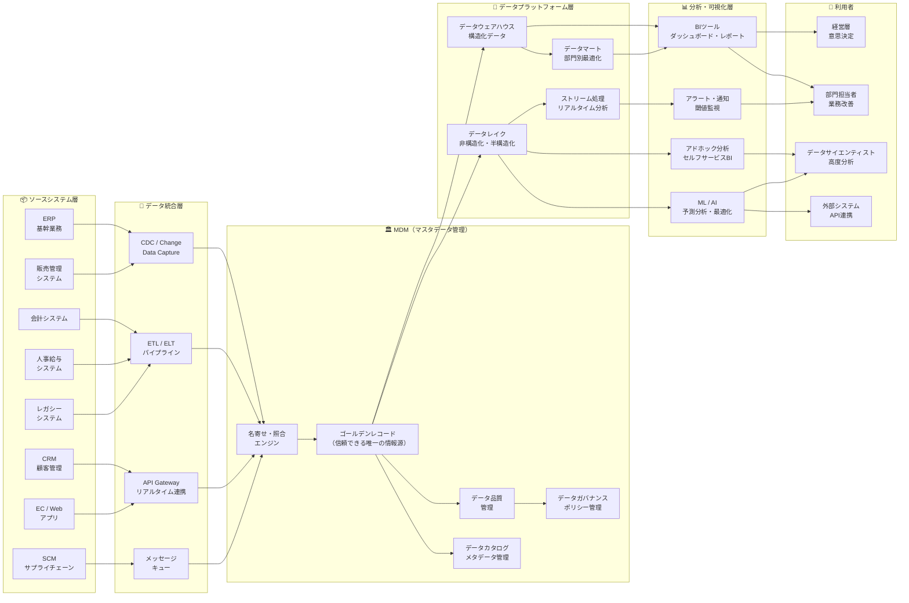

# エンタープライズデータアーキテクチャ（MDM中心）

- **ファイル名**: enterprise-data-arch
- **図の種類**: C4モデル
- **作成日**: 2026-03-29
- **作成者**: SAS-Sasao
- **ツール**: open_drawio_mermaid
- **関連案件**: 汎用エンタープライズアーキテクチャ

## 概要

ERP・販売管理・会計・人事・CRM等の社内アプリケーションからMDM（マスタデータ管理）を通じてゴールデンレコードを抽出し、データウェアハウス・データレイクを経由してBIツールでインサイトを得る、エンタープライズデータアーキテクチャの全体像。

特定のクラウドサービスに依存しない抽象的な構成図として設計。

## アーキテクチャ層

| 層 | 役割 | 主要コンポーネント |
|---|------|-----------------|
| ソースシステム層 | 業務データの発生源 | ERP, 販売管理, 会計, 人事給与, CRM, SCM, EC/Web, レガシー |
| データ統合層 | データの収集・変換・転送 | CDC, ETL/ELT, API Gateway, メッセージキュー |
| MDM層 | マスタデータの統合管理 | 名寄せ・照合, ゴールデンレコード, データ品質管理, ガバナンス, カタログ |
| データプラットフォーム層 | データの蓄積・加工 | DWH, データレイク, データマート, ストリーム処理 |
| 分析・可視化層 | データの分析・活用 | BIダッシュボード, アドホック分析, ML/AI, アラート |
| 利用者層 | インサイトの消費 | 経営層, 部門担当者, データサイエンティスト, 外部システム |

## Mermaid ソースコード

