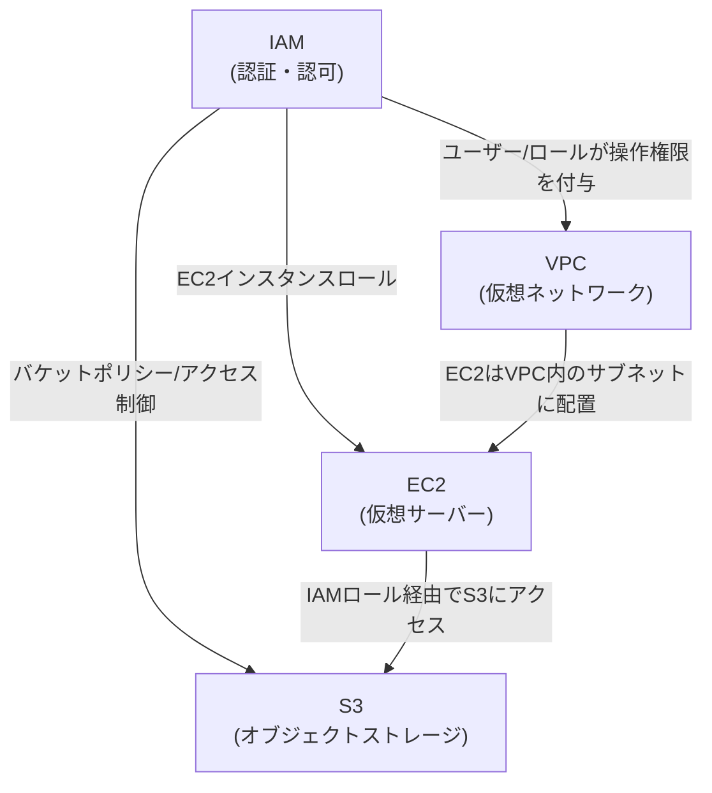
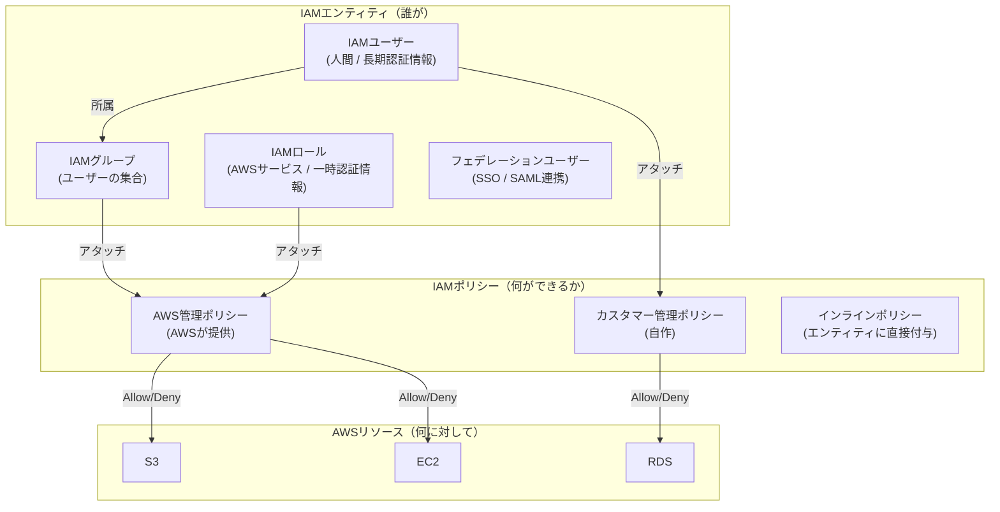
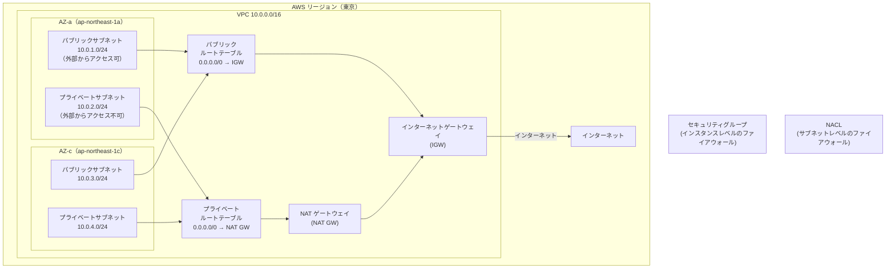
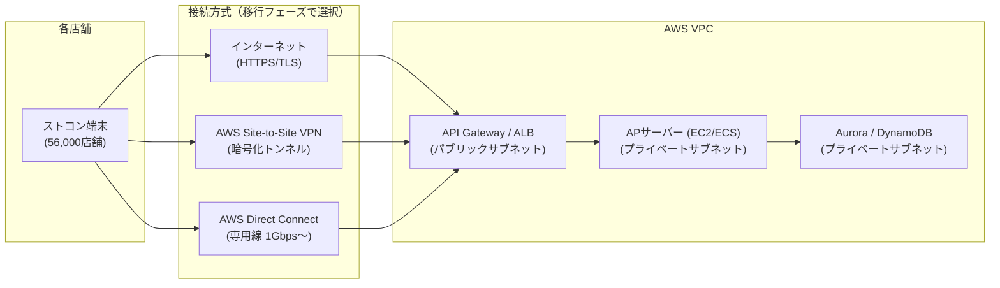
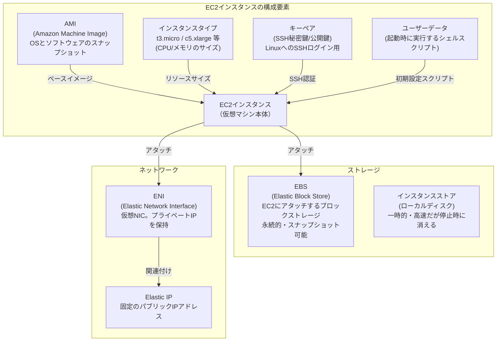
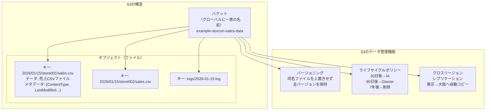
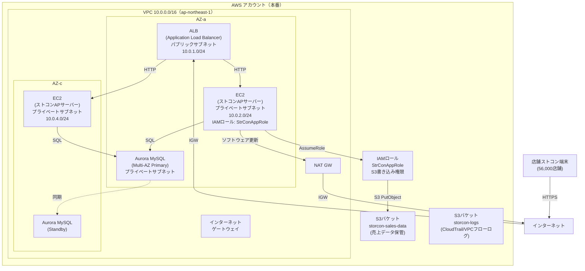

# AWS基礎4サービス 学習ロードマップ＆ハンズオン手順書

- **対象者**: 笹尾豊樹（PM）
- **目標**: ストコン AWS 移行案件への参画準備 ＋ SAA 取得（W10: 5月末）
- **作成日**: 2026-03-26
- **作成者**: tech-researcher
- **関連文書**:
  - [技術スタック調査レポート](./store-computer-aws-migration-tech.md)
  - [DB比較資料](./aws-database-comparison-for-storcon.md)
  - [モダナイゼーション＆データ分析](./storcon-aws-modernization-analytics-2026-03-26.md)

---

## 目次

1. [学習ロードマップ（概要）](#1-学習ロードマップ概要)
2. [IAM — 目安45分](#2-iam--identity-and-access-management)
3. [VPC — 目安60分](#3-vpc--virtual-private-cloud)
4. [EC2 — 目安75分](#4-ec2--elastic-compute-cloud)
5. [S3 — 目安60分](#5-s3--simple-storage-service)
6. [4サービス統合チェック](#6-4サービス統合チェック)
7. [次のステップ](#7-次のステップ)

---

## 1. 学習ロードマップ（概要）

### 推奨学習順序と理由

```
IAM（45分） → VPC（60分） → EC2（75分） → S3（60分）
合計: 約240分（4時間）
```

| 順序 | サービス | 推奨順序の理由 |
|------|---------|-------------|
| 1 | IAM | すべての AWS 操作の「前提」。IAM を理解せずに他サービスを操作すると権限エラーで詰まる。アカウント戦略・最小権限の考え方はPMが最初に押さえるべき設計思想 |
| 2 | VPC | EC2・RDS等の「箱」を置くネットワーク空間。先に構造を理解しておくと、EC2のデプロイ先選択で迷わない |
| 3 | EC2 | オンプレサーバーの移行先（Lift&Shift）として最初に触れるコンピュートサービス。VPCの中に置くことで理解が深まる |
| 4 | S3 | EC2・VPCに依存しない独立したストレージ。他3サービスを理解した後に触れると、「ログはS3へ」「バックアップはS3へ」という連携イメージが湧きやすい |

### サービス間の依存関係



### 「PMとして」vs「SAA対策として」の区分

| カテゴリ | 学習の目的 | 深さの目安 |
|---------|---------|-----------|
| **PMとして知るべきこと** | アーキテクチャ議論に参加できる、設計判断を理解してベンダーに説明できる、コスト感覚を持つ | 概念と用語を説明できれば十分 |
| **SAA対策として知るべきこと** | 試験の選択問題で正解を選べる、ユースケース別の最適解を判断できる | 具体的な設定値・制限値・サービス比較まで押さえる |

---

## 2. IAM — Identity and Access Management

**公式ドキュメント**: https://docs.aws.amazon.com/IAM/latest/UserGuide/

### 2-1. 概念整理

IAM はAWSの「誰が何をできるか」を管理するサービス。すべてのAWS操作はIAMの認証・認可を通過する。



**主要概念の一言説明**

| 概念 | 説明 | ストコン案件での例 |
|-----|-----|-----------------|
| IAMユーザー | 特定の人間や外部システムに発行する長期的な認証情報（アクセスキー + シークレット） | 本部の運用担当者アカウント |
| IAMグループ | ユーザーをまとめてポリシーを一括付与する入れ物 | 「店舗担当者グループ」「本部エンジニアグループ」 |
| IAMロール | AWSサービス（EC2・Lambda等）や別アカウントに付与する一時的な権限。アクセスキーを持たない | EC2がS3に書き込む権限、本番アカウントから開発アカウントへのアクセス |
| ポリシー | Allow（許可）/ Deny（拒否）をJSON形式で記述した権限の設定書 | 「S3の特定バケットのみ読み取り可」 |
| MFA | 多要素認証。パスワード+認証アプリのコードでの2段階認証 | 本部管理者の不正ログイン防止 |
| SCP (Service Control Policy) | AWS Organizations で複数アカウントを横断して適用する最上位のポリシー。IAMポリシーより優先 | 「全店舗アカウントからは東京リージョン以外へのEC2起動を禁止」 |

### 2-2. ストコン案件での使いどころ

**アカウント戦略: マルチアカウント vs シングルアカウント**

| 観点 | シングルアカウント | マルチアカウント |
|-----|-----------------|--------------|
| 管理コスト | 低い（IAMだけで制御） | 高い（AWS Organizations, 各アカウントの管理） |
| セキュリティ境界 | 論理的分離（IAMポリシー依存） | 物理的分離（アカウント単位で爆発半径を限定） |
| コスト可視性 | 全体まとめて請求（タグ分けが必要） | アカウント単位で自動集計 |
| **ストコン56,000店舗規模での推奨** | — | **マルチアカウント推奨** |

ストコン案件では、少なくとも以下のアカウント分離を推奨:
- 本番環境アカウント（店舗AP、本部AP）
- ステージング環境アカウント
- 開発環境アカウント
- ログ集約アカウント（CloudTrail、VPCフローログの集中管理）

**IAMロールによる権限分離（ストコン設計例）**

```
本部エンジニア(IAMユーザー)
    → AssumeRole → 「EC2管理者ロール」 → EC2への操作権限
    → AssumeRole → 「DBアドミンロール」 → RDS/DynamoDBへの操作権限

EC2インスタンス(ストコンAPサーバー)
    → IAMインスタンスロール → 「StrConAppRole」
        - S3バケット（売上データ）への書き込み
        - SecretsManagerからDB接続情報の読み取り
        - CloudWatchへのメトリクス送信
```

### 2-3. ハンズオン手順

**前提**: AWS Management Console にルートユーザーまたは管理者権限のIAMユーザーでログイン済み

#### 手順1: IAMユーザー作成 + MFA設定

1. AWSコンソール上部の検索ボックスに「IAM」と入力 → **IAM** をクリック
2. 左メニュー「**ユーザー**」→「**ユーザーの作成**」をクリック
3. ユーザー名: `storcon-pm-test` と入力
4. 「**AWS Management Consoleへのアクセスを提供**」にチェック
5. カスタムパスワードを設定（大文字・小文字・数字・記号を含む12文字以上）
6. 「**次のステップ: 権限**」→「**グループへのユーザーの追加**」を選択（今はスキップ）
7. 「**次のステップ: 確認**」→「**ユーザーの作成**」
8. 作成したユーザーをクリック → 「**セキュリティ認証情報**」タブ
9. 「**MFAデバイスの割り当て**」→「**認証アプリ**」を選択
10. スマートフォンの認証アプリ（Google Authenticator等）でQRコードをスキャン
11. 表示された6桁コードを2回入力して「**MFAの追加**」

#### 手順2: ポリシーのアタッチ（S3ReadOnly, EC2ReadOnly）

1. IAM → 「**ユーザー**」→ `storcon-pm-test` をクリック
2. 「**許可の追加**」→「**ポリシーを直接アタッチ**」
3. 検索ボックスに「S3」と入力 → `AmazonS3ReadOnlyAccess` にチェック
4. 検索ボックスをクリアして「EC2」と入力 → `AmazonEC2ReadOnlyAccess` にチェック
5. 「**次のステップ**」→「**許可の追加**」
6. アタッチされたポリシーが表示されることを確認

**[確認]** `storcon-pm-test` でログインし直し、S3コンソールを開いてバケット一覧が見えること、EC2コンソールでインスタンス一覧が見えることを確認する。EC2インスタンス起動ボタンはグレーアウトしていることも確認（ReadOnlyのため）。

#### 手順3: IAMロール作成（EC2がS3にアクセスするロール）

1. IAM → 「**ロール**」→「**ロールを作成**」
2. 「**信頼されるエンティティタイプ**」: 「**AWSのサービス**」を選択
3. 「**サービスまたはユースケース**」: 「**EC2**」を選択 →「**次のステップ**」
4. 検索ボックスに「S3」→ `AmazonS3FullAccess` にチェック →「**次のステップ**」
5. ロール名: `StrConAppRole` と入力
6. 説明: `EC2インスタンスからS3にアクセスするためのロール（ストコンAPサーバー用）` と入力
7. 「**ロールを作成**」

#### 手順4: AssumeRoleの体験（コンソールでのロール切替）

1. 作成した `StrConAppRole` をクリック
2. 「**ロールARN**」をコピーしておく（例: `arn:aws:iam::123456789012:role/StrConAppRole`）
3. コンソール右上のアカウント名 → 「**ロールの切り替え**」
4. アカウントID・ロール名を入力 → 「**ロールの切り替え**」
5. ヘッダーにロール名が表示され、ロールの権限でコンソール操作できることを確認
6. 右上のロール名 → 「**元のロールに戻る**」でロール解除

> **PMとして押さえるポイント**: EC2上で動くアプリケーションは、アクセスキーをコードに埋め込まずに「IAMロール」経由でS3・SecretsManager等を利用する。これが「認証情報の漏洩リスクゼロ」を実現する最重要のセキュリティプラクティス。

### 2-4. SAA頻出ポイント

| テーマ | 内容 | 覚えるポイント |
|-------|-----|-------------|
| 最小権限の原則 | 必要最小限の権限のみ付与する。ワイルドカード（`*`）は避ける | `"Action": "s3:*"` はNG、`"Action": "s3:GetObject"` のように絞る |
| SCP vs IAMポリシー | SCPはOrganizationsで設定する「最大権限の天井」。IAMポリシーはその範囲内で付与 | SCPでDenyされたらIAMポリシーでAllowしても無効 |
| クロスアカウントアクセス | ロールのAssumeRoleで別アカウントのリソースにアクセス | 信頼ポリシー（Trust Policy）に許可アカウントを明記する |
| IAMロール vs IAMユーザー | EC2・Lambda等のサービスにはロールを使う（アクセスキー不要） | EC2に直接アクセスキーを設定するのはアンチパターン |
| インラインポリシー vs 管理ポリシー | インラインは1対1、管理ポリシーは再利用可能 | 試験では管理ポリシーの再利用性を問う問題が頻出 |

### チェックリスト: PMとして説明できればOK

- [ ] IAMユーザー・グループ・ロール・ポリシーの違いを図で説明できる
- [ ] 「EC2がS3にアクセスするときなぜアクセスキーが不要か」をIAMロールで説明できる
- [ ] シングルアカウントとマルチアカウントのトレードオフを述べられる
- [ ] SCPが「最大権限の天井」であることを説明できる
- [ ] MFAを有効化すべき対象（特にルートユーザー・特権ユーザー）を言える
- [ ] ストコン案件で「本部と店舗の権限分離」をどう実現するか説明できる

---

## 3. VPC — Virtual Private Cloud

**公式ドキュメント**: https://docs.aws.amazon.com/vpc/latest/userguide/

### 3-1. 概念整理

VPC は AWS 上に作る「自分専用のプライベートネットワーク空間」。EC2・RDS等のリソースはすべてVPCの中に配置する。



**主要概念の一言説明**

| 概念 | 説明 | ストコン案件での例 |
|-----|-----|-----------------|
| VPC | AWSアカウント内の仮想ネットワーク。CIDRブロック（IPアドレス範囲）を指定して作成 | 本番VPC: `10.0.0.0/16`、開発VPC: `10.1.0.0/16` |
| サブネット | VPCを分割した小さなネットワーク。1つのAZに属する | パブリック: ALB配置、プライベート: EC2/RDS配置 |
| ルートテーブル | パケットの行き先を決めるルール表。サブネットにアタッチする | パブリック: `0.0.0.0/0 → IGW`、プライベート: `0.0.0.0/0 → NAT GW` |
| IGW（インターネットゲートウェイ） | VPCとインターネットをつなぐ出入口。パブリックサブネットのルートテーブルに設定 | ALB・Bastionサーバーがインターネットと通信するための出口 |
| NAT GW（NATゲートウェイ） | プライベートサブネットのEC2が**アウトバウンドのみ**インターネットへ出る中継役 | プライベートサブネットのEC2がソフトウェアアップデートするための出口 |
| セキュリティグループ | EC2・RDS等インスタンスにアタッチする**ステートフル**なファイアウォール。インバウンド/アウトバウンドのルールをポートとIPで設定 | Webサーバー: 80/443をALBからのみ許可、DBサーバー: 3306をEC2からのみ許可 |
| NACL（ネットワークACL） | サブネット全体に適用する**ステートレス**なファイアウォール。インバウンド/アウトバウンドを個別に設定 | 特定IPをサブネット全体からブロックする際に使用 |

> **ステートフル vs ステートレスの違い（重要）**
> - セキュリティグループ（ステートフル）: インバウンドを許可すれば、その応答のアウトバウンドは自動で許可される
> - NACL（ステートレス）: インバウンド許可しても、アウトバウンドルールも別途設定が必要

### 3-2. ストコン案件での使いどころ

**店舗-クラウド間のネットワーク設計**



| 接続方式 | 帯域・信頼性 | コスト | ストコンでの採用場面 |
|---------|-----------|-------|------------------|
| HTTPS（インターネット） | ベストエフォート | 低（データ転送費のみ） | Lift直後の暫定構成、移行初期 |
| Site-to-Site VPN | 最大1.25Gbps | 中（VPN接続時間課金）| 中規模店舗、要件が中程度の場合 |
| Direct Connect | 1〜100Gbps（保証帯域） | 高（専用線工事+月額）| 本部DCとの接続、高信頼性が必要な基幹連携 |

**パブリック/プライベートサブネットの使い分け**

| サブネット | 配置するもの | 理由 |
|-----------|-----------|-----|
| パブリック | ALB、API Gateway、Bastionサーバー、NAT GW | インターネットからのアクセスを受け付けるリソースのみ |
| プライベート | EC2（APサーバー）、RDS、ElastiCache、ECS | インターネットから直接アクセスさせないセキュリティ要件 |

### 3-3. ハンズオン手順

#### 手順1: カスタムVPC作成

1. AWSコンソール → 検索ボックスに「VPC」→ **VPC** をクリック
2. 「**VPCを作成**」をクリック
3. 設定:
   - 作成するリソース: 「**VPCのみ**」を選択
   - 名前タグ: `storcon-vpc`
   - IPv4 CIDR: `10.0.0.0/16`
   - IPv6: なし
4. 「**VPCを作成**」

#### 手順2: パブリックサブネット + プライベートサブネット作成

1. 左メニュー「**サブネット**」→「**サブネットを作成**」
2. VPC ID: 作成した `storcon-vpc` を選択
3. **サブネット1（パブリック）**:
   - サブネット名: `storcon-public-1a`
   - アベイラビリティゾーン: `ap-northeast-1a`
   - IPv4サブネットCIDR: `10.0.1.0/24`
4. 「**新しいサブネットを追加**」をクリック
5. **サブネット2（プライベート）**:
   - サブネット名: `storcon-private-1a`
   - アベイラビリティゾーン: `ap-northeast-1a`
   - IPv4サブネットCIDR: `10.0.2.0/24`
6. 「**サブネットを作成**」

#### 手順3: IGW作成・アタッチ

1. 左メニュー「**インターネットゲートウェイ**」→「**インターネットゲートウェイの作成**」
2. 名前タグ: `storcon-igw` →「**インターネットゲートウェイの作成**」
3. 右上の「**アクション**」→「**VPCにアタッチ**」
4. `storcon-vpc` を選択 →「**インターネットゲートウェイのアタッチ**」

#### 手順4: ルートテーブル設定

1. 左メニュー「**ルートテーブル**」→「**ルートテーブルを作成**」
2. **パブリック用ルートテーブル**:
   - 名前: `storcon-rtb-public`
   - VPC: `storcon-vpc`
   - 「**ルートテーブルを作成**」
3. 作成した `storcon-rtb-public` を選択 → 「**ルート**」タブ → 「**ルートを編集**」
4. 「**ルートを追加**」:
   - 送信先: `0.0.0.0/0`
   - ターゲット: 「**インターネットゲートウェイ**」→ `storcon-igw`
5. 「**変更を保存**」
6. 「**サブネットの関連付け**」タブ → 「**サブネットの関連付けを編集**」
7. `storcon-public-1a` にチェック → 「**関連付けを保存**」

> **[確認]** `storcon-public-1a` のルートテーブルに `0.0.0.0/0 → igw-xxxx` のルートが追加されていること。`storcon-private-1a` はデフォルトルートテーブルのまま（ローカルルートのみ）であることを確認。

#### 手順5: セキュリティグループ作成（SSH許可、HTTP許可）

1. 左メニュー「**セキュリティグループ**」→「**セキュリティグループを作成**」
2. **Webサーバー用SG**:
   - セキュリティグループ名: `storcon-sg-web`
   - 説明: `Web server security group`
   - VPC: `storcon-vpc`
3. **インバウンドルール**の追加:
   - ルール1: タイプ「**SSH**」、ソース「**マイIP**」（自分のIPのみ許可）
   - ルール2: タイプ「**HTTP**」、ソース「**Anywhere-IPv4**」（0.0.0.0/0）
   - ルール3: タイプ「**HTTPS**」、ソース「**Anywhere-IPv4**」
4. 「**セキュリティグループを作成**」

### 3-4. SAA頻出ポイント

| テーマ | 内容 | 覚えるポイント |
|-------|-----|-------------|
| VPCピアリング | 2つのVPC間をプライベートIPで接続。推移的ルーティング不可（A↔B, B↔C でもA↔CはNG） | 数が多いとメッシュ状に複雑化 → Transit Gatewayを使う |
| Transit Gateway | 複数VPCとオンプレをハブ&スポーク型で接続。ストコン本番・開発・ステージング・ログ集約VPCを接続する場合に使用 | VPCピアリングの代替（スケーラブル） |
| VPCエンドポイント | プライベートサブネットのEC2がインターネットを経由せずS3・DynamoDB等にアクセス。ゲートウェイ型（S3/DynamoDB）とインターフェース型（その他）がある | セキュリティ要件が厳しいストコンでは必須 |
| VPCフローログ | VPCのネットワークトラフィックをログ記録。S3またはCloudWatch Logsに保存 | セキュリティ監査・トラブルシューティングで使用 |
| SG vs NACL | SGはインスタンス単位・ステートフル・Allowルールのみ。NACLはサブネット単位・ステートレス・Allow/Deny両方 | 試験でよく問われる |

### チェックリスト: PMとして説明できればOK

- [ ] VPC・サブネット・ルートテーブル・IGWの関係を図で説明できる
- [ ] 「パブリックサブネットとプライベートサブネットをなぜ使い分けるか」をセキュリティ観点で説明できる
- [ ] セキュリティグループとNACLの違い（ステートフル vs ステートレス）を述べられる
- [ ] Direct Connect / VPN / インターネットの3つの接続方式のトレードオフを言える
- [ ] Multi-AZ構成で「なぜ複数のAZにサブネットを作るか」を可用性の観点で説明できる
- [ ] ストコン案件で「NAT GWが必要な理由」を説明できる（プライベートサブネットのEC2がソフトウェア更新等を行うため）

---

## 4. EC2 — Elastic Compute Cloud

**公式ドキュメント**: https://docs.aws.amazon.com/AWSEC2/latest/UserGuide/

### 4-1. 概念整理

EC2 はAWSの仮想サーバーサービス。オンプレのサーバーを「そのままAWSに移す」Lift&Shiftの移行先として最初に検討するサービス。



**インスタンスタイプの命名規則**

```
m 5 . xlarge
↑ ↑   ↑
│ │   └── サイズ (nano/micro/small/medium/large/xlarge/2xlarge...)
│ └────── 世代 (数字が大きいほど新しい)
└──────── ファミリー (用途別)
```

| ファミリー | 用途 | ストコンでの例 |
|----------|-----|-------------|
| t系（バースト） | 開発・テスト・低負荷 | 開発環境、管理ツール |
| m系（汎用） | バランス型 | 汎用APサーバー |
| c系（コンピュート最適化） | CPU集中処理 | 発注バッチ処理 |
| r系（メモリ最適化） | 大容量メモリ | ElastiCache、大型DB |
| i系（ストレージ最適化） | 高速ローカルI/O | 大規模DBのI/O集中処理 |

### 4-2. ストコン案件での使いどころ

**EC2 vs ECS/Fargate の選択基準**

| 観点 | EC2 | ECS/Fargate |
|-----|-----|-------------|
| 移行のしやすさ | Lift&Shift に最適（既存アプリをそのまま動かせる） | コンテナ化が必要（改修コストあり） |
| 運用負荷 | OS・ミドルウェアのパッチ管理が必要 | サーバーレス（Fargate）ならOS管理不要 |
| スケーリング | Auto Scalingで実現（起動まで数分）| ECSタスク単位でスケール（より素早く） |
| コスト | 停止すれば課金停止 | Fargate: 使用分のみ課金（秒単位） |
| **ストコン移行フェーズ** | **Phase1: Lift&Shift** | **Phase2: Replatform** |

**56,000店舗対応のスケーリング設計**

発注締め切り時間帯（例: 14:00、22:00）に全国店舗から発注リクエストが集中する。

```
[平常時]  EC2 × 2台（最小2台でAZ冗長）
[ピーク時] EC2 × 20台（Auto Scalingで自動拡張）

スケールアウト条件: CPU使用率 > 70% が5分継続
スケールイン条件:  CPU使用率 < 30% が15分継続
```

**購入オプションのコスト最適化**

| オプション | 特徴 | ストコンでの活用 |
|----------|-----|---------------|
| On-Demand | 時間単位課金、いつでも停止・変更可 | 開発・テスト環境 |
| Reserved Instance（1年/3年） | 最大72%割引、1〜3年のコミット | 常時稼働の本番APサーバー（需要予測が立つ） |
| Savings Plans | RIより柔軟（インスタンスタイプ変更可）、最大66%割引 | 本番環境のベースライン分 |
| Spot Instance | 最大90%割引、AWSの余剰リソース。中断リスクあり | 日次バッチ処理（中断しても再実行可能な処理） |

**[PMの設計判断ポイント]** 常時稼働の本番APサーバーにOn-Demandを使い続けると大幅コスト増。Reserved Instanceへの切り替えで年間コストを40〜70%削減できる。1年コミットから始めて使用状況を見ながら3年コミットに移行するのが現実的。

### 4-3. ハンズオン手順

**前提**: VPCとセキュリティグループが作成済み（第3章の手順完了後）

#### 手順1: EC2インスタンス起動

1. AWSコンソール → 「**EC2**」→ 左メニュー「**インスタンス**」→「**インスタンスを起動**」
2. 名前: `storcon-web-test`
3. **AMI**: 「Amazon Linux 2023 AMI」を選択（無料利用枠適用あり）
4. **インスタンスタイプ**: `t3.micro`（無料利用枠）
5. **キーペア**: 「新しいキーペアを作成」
   - キーペア名: `storcon-keypair`
   - キーペアのタイプ: RSA
   - プライベートキーのファイル形式: `.pem`（macOS/Linux）または `.ppk`（Windows/PuTTY）
   - 「**キーペアを作成**」→ `.pem`ファイルがダウンロードされる（保管場所を記録しておくこと）
6. **ネットワーク設定**:
   - VPC: `storcon-vpc`
   - サブネット: `storcon-public-1a`
   - パブリック IP の自動割り当て: 「**有効化**」
   - セキュリティグループ: 「**既存のセキュリティグループを選択**」→ `storcon-sg-web`
7. **ストレージ**: デフォルト（8GB gp3）のまま
8. 「**インスタンスを起動**」

#### 手順2: SSHでログイン

1. インスタンスが「**実行中**」になるまで待機（1〜2分）
2. インスタンスを選択 → 「**接続**」→「**SSHクライアント**」タブでコマンドを確認

```bash
# ダウンロードしたキーファイルの権限を設定（macOS/Linux）
chmod 400 storcon-keypair.pem

# SSHログイン（パブリックIPは各自の値に置き換え）
ssh -i storcon-keypair.pem ec2-user@<パブリックIP>
```

3. 「Are you sure you want to continue connecting?」→ `yes` と入力
4. `[ec2-user@ip-10-0-1-xxx ~]$` のプロンプトが表示されればログイン成功

> **[確認]** `uname -a` を実行してLinuxカーネルバージョンが表示されること。`whoami` を実行して `ec2-user` と表示されること。

#### 手順3: Nginxインストール → ブラウザでアクセス

```bash
# パッケージ更新
sudo dnf update -y

# Nginxインストール
sudo dnf install -y nginx

# Nginx起動 + 自動起動設定
sudo systemctl start nginx
sudo systemctl enable nginx

# 動作確認
sudo systemctl status nginx
```

ブラウザで `http://<パブリックIP>` にアクセス → 「Welcome to nginx!」ページが表示されればOK。

> **[ポイント]** セキュリティグループのインバウンドルールでHTTP（80番ポート）を許可していたからアクセスできた。許可しない場合はタイムアウトになる。

#### 手順4: EBSボリューム追加・アタッチ

1. EC2コンソール → 左メニュー「**ボリューム**」→「**ボリュームの作成**」
2. 設定:
   - ボリュームタイプ: `gp3`
   - サイズ: `5 GB`
   - アベイラビリティゾーン: EC2と**同じAZ**（`ap-northeast-1a`）を選択（重要: 異なるAZにはアタッチできない）
   - 名前タグ: `storcon-data-vol`
3. 「**ボリュームの作成**」
4. 作成したボリュームを選択 → 「**アクション**」→「**ボリュームのアタッチ**」
5. インスタンス: `storcon-web-test` を選択 → 「**ボリュームのアタッチ**」
6. SSHで確認:

```bash
# ブロックデバイス一覧（/dev/xvdb が追加されていればOK）
lsblk

# ファイルシステム作成 → マウント
sudo mkfs -t xfs /dev/xvdb
sudo mkdir /data
sudo mount /dev/xvdb /data
df -h  # /data が表示されればOK
```

#### 手順5: AMI作成 → 別AZで起動（可用性の体験）

1. インスタンス `storcon-web-test` を選択 → 「**アクション**」→「**イメージとテンプレート**」→「**イメージを作成**」
2. イメージ名: `storcon-ami-test` →「**イメージを作成**」
3. 「**AMI**」メニューでステータスが `available` になるまで待機（5〜10分）
4. AMIを選択 → 「**AMIからインスタンスを起動**」
5. 今度はサブネットを `storcon-private-1a` (別AZ: `1c` でもよい)を選択して起動
6. 同じAMI（同じ設定・ソフトウェア）から複数AZでインスタンスを起動できることを確認

#### 手順6: インスタンス停止・終了（コスト管理）

1. 不要なインスタンスを選択 → 「**インスタンスの状態**」→「**インスタンスを停止**」
   - 停止: EBSは保持、インスタンス課金は停止（EBS課金は継続）
2. 「**インスタンスの状態**」→「**インスタンスを終了**」
   - 終了: インスタンスとデフォルトのEBSは削除。完全な課金停止

> **[PMの意識]** 開発・テスト環境の EC2 を停止せず放置するとコストが膨らむ。夜間・週末の自動停止スケジュール（AWS Instance Scheduler等）の導入をPMとして推進すること。

### 4-4. SAA頻出ポイント

| テーマ | 内容 | 覚えるポイント |
|-------|-----|-------------|
| インスタンスストア vs EBS | インスタンスストアは一時的（停止で消える）、EBSは永続的（停止後も保持） | DBデータはEBS、一時ファイル処理はインスタンスストアでOK |
| AMI | EC2の「テンプレート」。OS・ミドルウェア・設定を含んだスナップショット | AMIから同一構成のインスタンスを何台でも起動できる（Auto Scalingの基盤） |
| 購入オプション | On-Demand/Reserved/Spot/Savings Plans の使い分け | コスト最適化問題で頻出。本番=RI or Savings Plans、バッチ=Spot |
| 配置グループ | クラスター（高スループット）、スプレッド（障害分離）、パーティション（Hadoopクラスタ等） | ストコンでは可用性重視のスプレッド or デフォルト |
| Auto Scaling | 需要に応じてEC2台数を自動増減。スケールアウト（台数増）とスケールイン（台数減） | 目標トラッキングポリシーが最も簡単（例: CPU70%を目標に自動調整） |

### チェックリスト: PMとして説明できればOK

- [ ] AMI・インスタンスタイプ・キーペア・EBSの役割を説明できる
- [ ] 「ストコンのAPサーバーをEC2で移行するときの最初のステップ（Lift&Shift）」を説明できる
- [ ] Auto Scalingで「発注ピーク時に自動でサーバーを増やす」仕組みを説明できる
- [ ] On-Demand / Reserved Instance / Spot Instanceの使い分けを述べられる
- [ ] EC2の「停止」と「終了」の違いとコストへの影響を説明できる
- [ ] パブリックサブネットにALBを置き、プライベートサブネットにEC2を置くアーキテクチャの理由を述べられる

---

## 5. S3 — Simple Storage Service

**公式ドキュメント**: https://docs.aws.amazon.com/AmazonS3/latest/userguide/

### 5-1. 概念整理

S3 はAWSのオブジェクトストレージ。ファイル（オブジェクト）を「バケット」という入れ物に保管する。耐久性 99.999999999%（イレブンナイン）。容量無制限、1オブジェクト最大5TB。



**ストレージクラスの比較**

| ストレージクラス | 用途 | 取り出しコスト | 保管コスト（相対）|
|--------------|-----|------------|-------------|
| S3 Standard | 頻繁にアクセスするデータ | 無料 | 高 |
| S3 Intelligent-Tiering | アクセスパターン不明なデータ（自動で最適クラスに移動） | 低 | 中 |
| S3 Standard-IA | 月1回程度アクセス（Infrequent Access）| 低 | 中低 |
| S3 Glacier Instant Retrieval | アーカイブ（ミリ秒で取り出し） | 中 | 低 |
| S3 Glacier Flexible Retrieval | アーカイブ（数分〜12時間で取り出し） | 中 | 低 |
| S3 Glacier Deep Archive | 長期アーカイブ（12〜48時間） | 高 | 最低 |

### 5-2. ストコン案件での使いどころ

| ユースケース | S3の活用方法 | 推奨ストレージクラス |
|-----------|-----------|-----------------|
| 日次売上データファイル | 各店舗から夜間バッチでCSV/JSONをアップロード | Standard（直近90日）→ IA（〜1年）→ Glacier（〜7年） |
| 商品マスタCSV配布 | 本部→店舗への商品マスタ更新ファイルの配置 | Standard |
| アプリケーションログ | CloudWatch Logs → Firehose → S3 に自動流し込み | Standard（30日）→ Glacier（長期保管）|
| CloudTrailログ | AWS操作の監査ログ（セキュリティ要件）| Standard-IA（1年）→ Glacier Deep Archive（7年）|
| VPCフローログ | ネットワーク通信の記録 | Standard-IA |
| 静的Webコンテンツ | 管理画面のHTML/CSS/JS | Standard（CloudFront経由で配信）|

**コスト試算イメージ（ストコン56,000店舗）**

各店舗が1日あたり平均1MBの売上データをS3にアップロードする場合:
- 日次蓄積: 56,000店 × 1MB = 約55GB/日
- 年間蓄積: 55GB × 365日 ≒ 20TB/年
- S3 Standard（東京）: 約0.025 USD/GB/月 → 月額約500USD程度
- ライフサイクルポリシーでGlacierへ移行すれば長期保管コストを90%削減可能

### 5-3. ハンズオン手順

#### 手順1: バケット作成

1. AWSコンソール → 「**S3**」→「**バケットを作成**」
2. 設定:
   - バケット名: `storcon-test-<自分の名前>-2026`（グローバルで一意な名前が必要）
   - AWSリージョン: `アジアパシフィック（東京）ap-northeast-1`
   - オブジェクト所有者: 「**ACL無効（推奨）**」
   - **パブリックアクセスをすべてブロック**: チェックあり（デフォルト・推奨）
   - バージョニング: 一旦「無効」のまま
3. 「**バケットを作成**」

#### 手順2: ファイルアップロード・ダウンロード

1. 作成したバケットをクリック → 「**アップロード**」
2. 「**ファイルを追加**」→ テキストファイルを選択（`sales_test.csv` 等、手元の任意のファイル）
3. 「**アップロード**」
4. アップロードされたファイルを選択 → 「**ダウンロード**」でダウンロード確認
5. 「**オブジェクトURL**」にブラウザでアクセス → **403 Forbidden** になることを確認（パブリックアクセスブロック中のため）

#### 手順3: バケットポリシー設定（パブリックアクセスブロックの確認）

1. バケット → 「**アクセス許可**」タブ
2. 「**パブリックアクセスをすべてブロック**」: 4つすべてが有効であることを確認
3. 「**バケットポリシー**」: 何も設定されていないことを確認（デフォルト）

> **[PMとして押さえるポイント]** S3バケットの誤公開はAWSセキュリティインシデントの定番。ストコン案件では店舗売上データが入るバケットは絶対にパブリックアクセスをブロックすること。AWS Config の「s3-bucket-public-read-prohibited」ルールで自動監視を設定する。

#### 手順4: バージョニング有効化 → 上書き → バージョン確認

1. バケット → 「**プロパティ**」タブ → 「**バージョニング**」→「**編集**」
2. 「**有効にする**」を選択 → 「**変更の保存**」
3. 同じ名前のファイル（`sales_test.csv`）を内容を変えて再アップロード
4. 「**バージョン**」トグルを「**オン**」に切り替え → 同名ファイルの複数バージョンが表示されることを確認
5. 古いバージョンを選択して以前の内容を確認できることを確認

#### 手順5: ライフサイクルルール設定（30日後にGlacierへ）

1. バケット → 「**管理**」タブ → 「**ライフサイクルルールを作成**」
2. 設定:
   - ルール名: `archive-old-sales-data`
   - フィルター: プレフィックス `sales/`（sales/フォルダ内のオブジェクトに適用）
3. **ライフサイクルルールのアクション**:
   - 「**オブジェクトの現行バージョンをストレージクラス間で移行**」にチェック
   - 移行先: 「**S3 Glacier Flexible Retrieval**」
   - 移行するまでの日数: `30`
4. 「**ルールを作成**」

#### 手順6: 静的ウェブサイトホスティング設定

1. バケット → 「**プロパティ**」タブ → 「**静的ウェブサイトホスティング**」→「**編集**」
2. 「**有効にする**」を選択
3. インデックスドキュメント: `index.html`
4. 「**変更の保存**」
5. バケットの「**アクセス許可**」→「**パブリックアクセスをすべてブロック**」を「**無効化**」（静的ウェブサイトはパブリックアクセスが必要）
6. 「index.html」という名前でHTMLファイルを作成してアップロード
7. 「**静的ウェブサイトホスティング**」に表示されたURLにブラウザでアクセスしてページが表示されることを確認

> **[補足]** 本番での静的サイト配信は S3単体ではなく「S3 + CloudFront」構成を採用する。HTTPS対応・CDNによる高速配信・S3をプライベートのまま保つ（OAC: Origin Access Control）ために必要。

### 5-4. SAA頻出ポイント

| テーマ | 内容 | 覚えるポイント |
|-------|-----|-------------|
| S3暗号化 | SSE-S3（AWSが鍵管理）、SSE-KMS（KMSで鍵管理、監査ログあり）、SSE-C（ユーザーが鍵を持ち込み） | コンプライアンス要件がある場合はSSE-KMS（CloudTrailでの鍵使用ログが取れる）|
| S3バージョニング | 有効にすると上書き・削除したファイルも復元可能。MFAデリート設定でさらに安全に | 誤削除対策・規制要件対応 |
| クロスリージョンレプリケーション（CRR）| 東京→大阪への自動レプリケーション。DR対策。バージョニング有効が前提 | RPO（目標復旧時点）を小さくする |
| S3 Transfer Acceleration | CloudFrontのエッジロケーションを経由してアップロードを高速化 | 海外拠点からのアップロードに有効 |
| S3 Select / Glacier Select | オブジェクト内の一部データをSQLライクに取り出し（全件ダウンロード不要） | 大きなCSVから特定行だけ取り出す場合のコスト最適化 |

### チェックリスト: PMとして説明できればOK

- [ ] バケット・オブジェクト・キー・バージョニングの関係を説明できる
- [ ] ストレージクラスの違い（Standard・IA・Glacier）とライフサイクルポリシーの使いどころを述べられる
- [ ] 「パブリックアクセスブロックをなぜデフォルトで有効にすべきか」を説明できる
- [ ] ストコン案件の売上データをS3に保管する際の暗号化方式（SSE-KMS推奨）を言える
- [ ] クロスリージョンレプリケーションを「DR対策」の観点で説明できる
- [ ] S3のイレブンナイン（99.999999999%）の耐久性の意味を説明できる

---

## 6. 4サービス統合チェック

### 6-1. 全体アーキテクチャ図

VPC内のEC2がIAMロール経由でS3にアクセスする基本構成。ストコン案件のシンプルな構成例。



### 6-2. ストコン案件への当てはめ

| AWSサービス | ストコン案件での役割 | 設計のポイント |
|-----------|-----------------|-------------|
| IAM | APサーバー（EC2）がS3へアクセスする権限管理。本部エンジニアのコンソールアクセス権限管理 | アクセスキーを使わず、IAMロールとインスタンスプロファイルを必ず使用 |
| VPC | APサーバー・DBを完全にプライベートサブネットに配置。外部公開はALBのみ | Multi-AZ（最低2AZ）、パブリック/プライベートサブネット分離を必須とする |
| EC2 | 既存ストコンアプリのLift&Shift先。Phase1ではEC2、Phase2でECS/Fargateへ移行 | Reserved Instanceで本番サーバーのコストを最適化。Auto Scalingで発注ピーク対応 |
| S3 | 店舗別売上データCSV・日次バッチ結果の保管先。CloudTrail・VPCフローログの保管先 | バケットポリシーで最小権限、SSE-KMS暗号化、バージョニング有効化を標準化 |

### 6-3. SAA模擬問題

**問題1（IAM）**

あなたのチームは、EC2インスタンス上で動くストコンアプリケーションからS3バケットにアクセスキーなしでアクセスしたい。最もセキュアで推奨される方法はどれか。

A. EC2インスタンスのOS環境変数にAWSアクセスキーを設定する
B. IAMロールを作成しEC2インスタンスにアタッチする（インスタンスプロファイル）
C. S3バケットを全員にパブリック公開にする
D. アプリケーションのコードにアクセスキーをハードコードする

**正解: B**
理由: IAMロールはEC2インスタンスに直接アタッチでき、一時的な認証情報が自動で提供・ローテーションされる。アクセスキーをコードや環境変数に埋め込むのはセキュリティリスクが高い。

---

**問題2（VPC）**

プライベートサブネット内のEC2インスタンスがインターネット上のソフトウェアリポジトリへアクセスするために必要なコンポーネントはどれか。

A. インターネットゲートウェイ（IGW）をプライベートサブネットに直接追加する
B. NAT ゲートウェイをパブリックサブネットに配置し、プライベートサブネットのルートテーブルにルートを追加する
C. VPCピアリングを設定する
D. 新たなコンポーネントは不要で、プライベートサブネットのEC2は自動でインターネットにアクセスできる

**正解: B**
理由: プライベートサブネットからのアウトバウンドインターネット接続にはNAT GWが必要。IGWはパブリックサブネットの出入口でありプライベートサブネットへの直接追加はできない。

---

**問題3（EC2）**

ストコン移行プロジェクトで、日次精算バッチ処理のEC2インスタンスを最もコスト効率よく運用する方法はどれか。処理は毎夜1〜3時間で完了し、途中で中断されても再実行できる。

A. On-Demand インスタンスを常時起動しておく
B. Reserved Instance（1年）を購入して24時間稼働させる
C. Spot Instanceを使用して処理を実行し、中断時は自動リトライを実装する
D. 専有ホスト（Dedicated Host）を使用する

**正解: C**
理由: 中断可能なバッチ処理にはSpot Instanceが最も安価（最大90%割引）。On-Demand/RIは常時稼働に向いており、バッチ処理には過剰コストとなる。

---

**問題4（S3）**

ストコン案件で7年間保管が必要な売上データを低コストで保管する方法として最適なものはどれか。データへのアクセスは年に1〜2回で、取り出しに48時間かかっても問題ない。

A. S3 Standard に保管し続ける
B. S3 Glacier Deep Archive に保管する
C. EBSボリュームに保管する
D. S3 Standard-IA に保管する

**正解: B**
理由: S3 Glacier Deep Archiveは最低コストのストレージクラスで、年1〜2回のアクセス・48時間以内の取り出しという要件に合致する。長期アーカイブ（7年）に最適。

---

## 7. 次のステップ

### W2 接続: 3.1.2 DB基礎（RDS, Aurora, DynamoDB）

本章で学習したVPC・EC2・IAMの知識が直接活用できる。

| 本章で学んだこと | W2での活用 |
|--------------|-----------|
| プライベートサブネット（VPC） | RDS・DynamoDBはプライベートサブネットに配置 |
| セキュリティグループ（VPC） | EC2からRDSへの接続ポート（3306/5432）を許可するSG設定 |
| IAMロール（IAM） | EC2からRDSへのIAM認証（パスワードレス接続）|
| S3 | RDSのスナップショット・バックアップの保管先 |

DB比較資料は既に作成済み: [aws-database-comparison-for-storcon.md](./aws-database-comparison-for-storcon.md)

### W3 接続: 3.1.3 コンテナ基礎（ECS, Fargate）

EC2の概念（AMI・Auto Scaling・IAMロール）をコンテナ（タスク定義・ECSサービス・タスクロール）に置き換えるイメージで学習する。

| EC2の概念 | ECS/Fargateの対応概念 |
|---------|-------------------|
| AMI | タスク定義（コンテナイメージ）|
| インスタンスタイプ | タスクのvCPU/メモリ設定 |
| Auto Scaling Group | ECSサービスのAuto Scaling |
| IAMインスタンスロール | ECSタスクロール |

コンテナ・モダナイゼーション資料: [storcon-aws-modernization-analytics-2026-03-26.md](./storcon-aws-modernization-analytics-2026-03-26.md)

### SAA対策の推奨学習順序

```
W1（本資料）: IAM, VPC, EC2, S3 基礎（4h）
    ↓
W2: RDS, Aurora, DynamoDB（3h）
    ↓
W3: ECS/Fargate, Lambda基礎（3h）
    ↓
W4: SQS, SNS, Kinesis, EventBridge（2h）
    ↓
W5〜W8: SAA試験対策問題集（Udemy 模擬問題 × 3セット）
    ↓
W9: 弱点補強 + 直前総復習
    ↓
W10（5月末）: SAA-C03 受験
```

**推奨教材**
- Udemy「Ultimate AWS Certified Solutions Architect Associate」（Stephane Maarek, 英語）: SAA最高評価の定番コース
- Udemy「AWS認定ソリューションアーキテクト - アソシエイト」（山下光洋, 日本語）: 日本語で概念理解したい場合
- AWS公式 Skill Builder（https://skillbuilder.aws/）: 無料の公式コンテンツ多数

---

*本資料はtech-researcherが2026-03-26時点の情報をもとに作成しました。*
*ハンズオン実施時は必ずAWSの最新コンソール画面・公式ドキュメントと照らし合わせてください。*
*AWS無料利用枠（12ヶ月）を活用すること。t3.microはEC2無料枠対象（月750時間）。*
