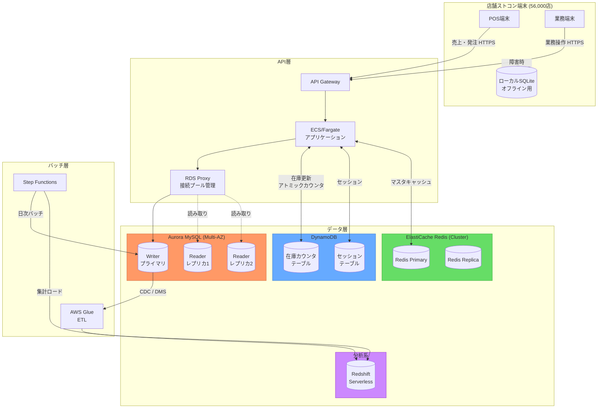
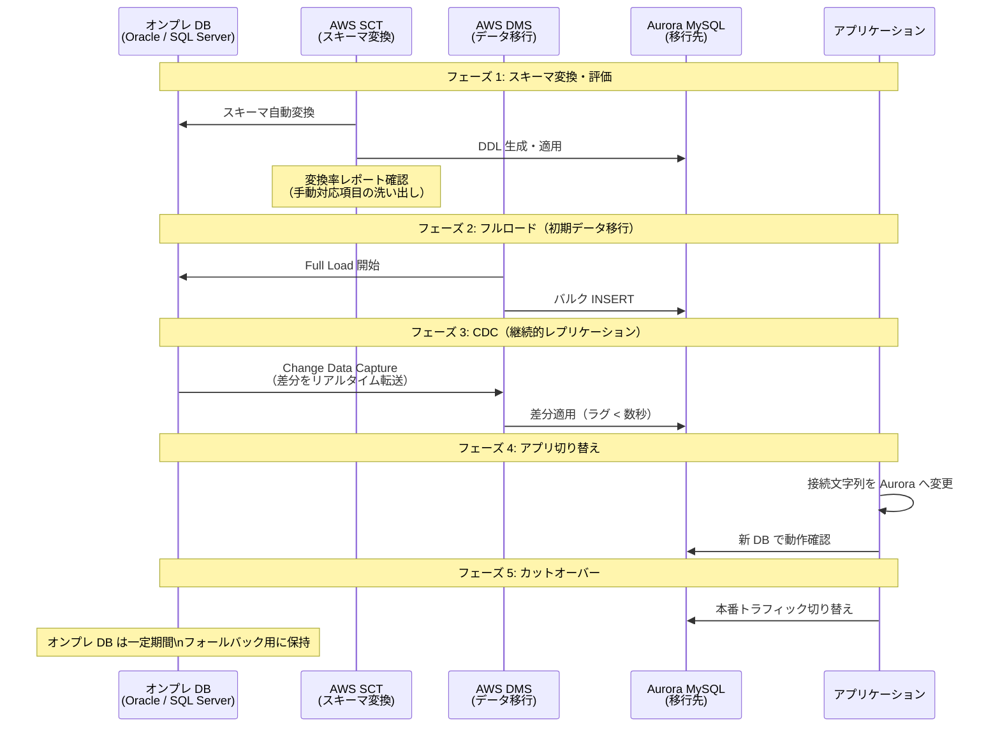

# AWS データベースサービス比較 — ストアコンピューター移行向けDB選定資料

- **調査目的**: WBS 3.1.2 先行調査 — コンビニストコン AWS 移行における DB サービス選定の判断材料整理
- **対象案件**: コンビニエンスストアストアコンピューター オンプレ→AWS 移行
- **想定規模**: 約 56,000 店舗
- **作成日**: 2026-03-26
- **作成者**: tech-researcher
- **関連文書**: [ストアコンピューター AWS移行 技術スタック調査](./store-computer-aws-migration-tech.md)

---

## 目次

1. [サービス比較表](#1-サービス比較表)
2. [ストコンのワークロード分析](#2-ストコンのワークロード分析)
3. [推奨DB構成](#3-推奨db構成)
4. [コスト試算](#4-コスト試算)
5. [移行パス（オンプレ→AWS）](#5-移行パスオンプレaws)
6. [マルチテナント設計のトレードオフ](#6-マルチテナント設計のトレードオフ)
7. [判断サマリーと推奨事項](#7-判断サマリーと推奨事項)

---

## 1. サービス比較表

### 1-1. 主要 4 サービスの基本比較

| 比較項目 | RDS (MySQL 8.0 / PostgreSQL 16) | Aurora (MySQL/PostgreSQL 互換) | DynamoDB | ElastiCache (Redis 7) |
|---------|--------------------------------|-------------------------------|----------|-----------------------|
| **データモデル** | リレーショナル（SQL） | リレーショナル（SQL、MySQL/PostgreSQL 互換） | キー・バリュー / ドキュメント（JSON） | キー・バリュー / データ構造（文字列, Hash, List, Sorted Set, Stream） |
| **スケーリング方式** | 垂直スケール（インスタンスサイズ変更）+ リードレプリカ（最大 5 台）による読み取り水平分散 | 書き込みは 1 台のプライマリ + 最大 15 台のリードレプリカ。Aurora Serverless v2 は 0.5〜128 ACU 自動スケール | 書き込み/読み取りともに水平自動スケール（On-Demand モードで無制限） | クラスター構成でシャーディング水平分散（ノード追加で拡張） |
| **可用性・冗長構成** | Multi-AZ: スタンバイに同期レプリケーション。フェイルオーバー 60〜120 秒 | Multi-AZ: Aurora Storage は 3AZ × 2 コピー（6 コピー）に自動分散。フェイルオーバー 30 秒以内 | マルチ AZ は標準（SLA 99.999%）。グローバルテーブルでマルチリージョン対応 | Multi-AZ + 自動フェイルオーバー（Cluster モード）。レプリカ最大 5 台 |
| **レイテンシ特性** | 通常 1〜10ms（インデックス最適化時）。大量同時接続時はコネクションプール設計が重要 | RDS 同等〜やや高速。リードレプリカは書き込みと非同期のため結果整合 | p99 1 桁 ms（DAX 使用で p99 マイクロ秒）。書き込みは Eventually Consistent / Strong Consistent 選択可 | サブミリ秒〜1ms。インメモリのため最速。ただし永続化は補助的 |
| **ACID トランザクション** | 完全対応（分離レベル指定可） | 完全対応（RDS と同等） | 単一テーブルは条件付き書き込みで擬似的に保証。TransactWrite で複数テーブルの原子性（ただし分散 2 フェーズコミット） | トランザクション非対応（MULTI/EXEC でキューイングはあるが ACID 保証なし） |
| **コストモデル** | インスタンス時間課金（db.t3.medium〜db.r6g.16xlarge）+ ストレージ GB/月 + I/O（Provisioned IOPS オプション） | インスタンス時間課金 + Aurora Storage（GB/月、自動拡張）+ I/O 課金（Standard）。Serverless v2 は ACU 時間課金 | オンデマンド: 読み取り RCU / 書き込み WCU 従量。プロビジョニング: 事前容量指定（予約割引あり）+ ストレージ GB/月 | ノード数 × インスタンスサイズ時間課金。データ転送料別途。Reserved Node（1/3 年）で最大 55%割引 |
| **最大ストレージ** | 64 TB（gp3）/ 16 TB（Provisioned IOPS） | 128 TB（自動拡張。手動管理不要） | 事実上無制限（アカウント単位の上限なし） | ノードメモリ依存（r7g.12xlarge で 317 GB/ノード） |
| **バックアップ** | 自動スナップショット（最大 35 日保持）+ PITR | 自動スナップショット + PITR（秒単位）+ バックトラック（Aurora MySQL のみ: 72 時間以内を巻き戻し） | PITR（最大 35 日）+ オンデマンドバックアップ（無期限保持可） | 自動スナップショット（最大 35 日）。Redis RDB / AOF 永続化は追加設定 |
| **運用負荷** | パッチ適用・マイナーバージョンアップは AWS 管理。メジャーバージョンアップは手動トリガー。コネクション管理（RDS Proxy 推奨）が必要 | RDS より運用負荷低（ストレージ管理不要）。フェイルオーバーが高速。RDS Proxy 対応 | フルマネージド（パッチ・バックアップ・スケール自動）。テーブル設計（パーティションキー選定）が重要 | パッチ・フェイルオーバー自動。クラスター構成変更は一時的なダウンタイムあり |
| **主なユースケース** | 汎用 OLTP、複雑な JOIN クエリが必要なシステム、Oracle/SQL Server からの移行先 | 高可用性 OLTP、高スループット書き込み、Aurora Serverless で需要変動対応 | 高スケール KV アクセス、セッション管理、在庫カウンタ、フラットな構造のデータ | キャッシュ層、セッションストア、ランキング・ソート処理、Pub/Sub |

### 1-2. Redshift（分析系）との位置付け

本比較表の 4 サービスはすべて OLTP または KV / キャッシュ向けです。売上集計・ABC 分析等の分析ワークロードには **Amazon Redshift** または **Redshift Serverless** が適切です（OLAP 専用、列指向ストレージ、PB 規模対応）。

---

## 2. ストコンのワークロード分析

### 2-1. データ種別ごとのアクセスパターン

| データ種別 | 代表テーブル例 | データ量規模（全社） | 読み取り比率 | 書き込みパターン | 整合性要件 | レイテンシ要件 |
|-----------|-------------|------------------|------------|----------------|----------|-------------|
| **商品マスタ** | M_ITEM, M_PRICE, M_CATEGORY | 数万 SKU × バリエーション | 高（95%+） | バッチ（本部から日次〜週次一括更新） | 読み取り整合性（更新後すぐ全店反映） | 中（100ms 以内） |
| **店舗・設定マスタ** | M_STORE, M_STAFF, M_SHIFT | 56,000 店 × 各設定 | 高（90%+） | 低頻度バッチ更新 | 参照整合性あり（店舗 ID は外部キー） | 低 |
| **POS 売上** | T_SALES, T_SALES_DETAIL | 56,000 店 × 数百件/日 ≒ 数千万件/日 | 低（後続の集計で使用） | リアルタイム高頻度書き込み | ACID 必須（金額・税計算） | 高（書き込み 50ms 以内） |
| **発注** | T_ORDER, T_ORDER_DETAIL | 56,000 店 × 数十件/日 | 中 | ピーク集中（発注締め切り前後） | ACID 必須（二重発注防止） | 高（書き込み 100ms 以内） |
| **検品・入庫** | T_RECEIVING | 56,000 店 × 数件〜数十件/日 | 低 | バッチ〜準リアルタイム | ACID（在庫数更新に連動） | 中 |
| **廃棄・棚卸** | T_DISPOSAL, T_INVENTORY | 56,000 店 × 数件/日 | 低 | バッチ | 結果整合で許容可 | 低 |
| **在庫カウンタ** | T_STOCK（品目別在庫数） | 数万 SKU × 56,000 店 | 高（画面表示・発注計算） | 高頻度インクリメント/デクリメント | アトミック更新必須（ネガティブ在庫防止） | 高（読み書き 10ms 以内） |
| **売上集計** | AGG_DAILY_SALES, AGG_ABC | 店舗 × 日次 × 商品 | 集計クエリ（GROUP BY, WINDOW） | 日次バッチ INSERT | 分析整合性（T+1 で可） | 低（バッチ） |
| **セッション・画面キャッシュ** | セッション KV | 同時接続端末数（数台/店） | 高 | 都度書き込み（TTL 付き） | 揮発性で可（失効=再ログイン） | 最高（1ms 以内） |
| **頻繁参照マスタキャッシュ** | 商品マスタのホットキャッシュ | 数万 SKU 分（数 MB〜数百 MB） | 高 | マスタ更新時に無効化 | キャッシュ一貫性（更新連動） | 最高（1ms 以内） |

### 2-2. 同時接続・スループット試算

| 想定シナリオ | 計算根拠 | 推定値 |
|------------|---------|--------|
| 全店同時オンライン端末数 | 56,000 店 × 平均 2〜3 端末 | 約 112,000〜168,000 接続 |
| ピーク時発注リクエスト | 56,000 店が 30 分以内に集中して発注送信 | 約 30〜50 RPS（平均）/ 瞬間ピークは 5〜10 倍 |
| 日次売上データ投入量 | 56,000 店 × 500 件/日平均 | 約 2,800 万レコード/日 |
| マスタ参照頻度 | 56,000 店 × 各操作で商品マスタ参照 | キャッシュ必須レベルの高頻度 |

---

## 3. 推奨 DB 構成

### 3-1. 推奨アーキテクチャ（Mermaid）



### 3-2. データ種別ごとの推奨 DB と根拠

#### Aurora MySQL（メインの OLTP 基盤）

**格納データ**: 商品マスタ / 店舗マスタ / POS 売上トランザクション / 発注 / 検品 / 廃棄 / 棚卸

| メリット | デメリット |
|---------|----------|
| Oracle / SQL Server からの SQL 互換移行が容易（SCT 活用） | コネクション数上限あり（RDS Proxy で緩和必要） |
| ACID 完全対応。発注の二重処理防止に必須 | インスタンスコストが固定発生（Serverless v2 で軽減可） |
| フェイルオーバー 30 秒以内（RDS 比で高速） | 複雑な JOIN クエリはチューニングが必要 |
| リードレプリカ最大 15 台で読み取りスケール可能 | グローバルテーブル相当の機能は Aurora Global Database（追加コスト） |
| バックトラック機能（Aurora MySQL）で人為ミスへの備え | |
| 最大 128 TB ストレージ（56,000 店の数年分 TX データを収容） | |

**Aurora vs RDS の選択基準（ストコン案件）**

RDS ではなく Aurora を推奨する主な理由:
- フェイルオーバー速度（Aurora: 30 秒以内 vs RDS: 60〜120 秒）→ 24/365 稼働のコンビニでは差が大きい
- 56,000 店規模のデータ量（数十 TB）に対してストレージ自動拡張（Aurora）が運用コスト削減
- リードレプリカ数（Aurora: 最大 15 台 vs RDS: 最大 5 台）→ マスタ参照のリード負荷分散
- バックトラック（Aurora MySQL）による誤オペレーション対応

---

#### DynamoDB（在庫カウンタ + セッション）

**格納データ**: 在庫カウンタ（品目別現在庫）/ セッション管理

| メリット | デメリット |
|---------|----------|
| アトミックカウンタ操作（ADD）でネガティブ在庫防止 | 複雑な JOIN / 集計クエリは苦手（分析は Redshift へ委譲） |
| On-Demand モードで予測不能なアクセスピークに自動対応 | テーブル設計（パーティションキー選定）が運用品質に直結 |
| SLA 99.999%（Aurora の 99.99% より高い） | コスト設計が難しい（読み取り/書き込み単位で課金） |
| TTL でセッションの自動期限切れ管理が容易 | |
| グローバルテーブルで DR 対応（マルチリージョン書き込み） | |

**在庫カウンタのキーデザイン例**

```
パーティションキー: STORE#{store_id}
ソートキー:        ITEM#{item_code}
属性:             stock_qty (Number), last_updated_at (String ISO8601)

UpdateExpression:  SET stock_qty = stock_qty + :delta
ConditionExpression: stock_qty + :delta >= 0   ← ネガティブ在庫防止
```

---

#### ElastiCache Redis（商品マスタキャッシュ + 高速セッション）

**格納データ**: 頻繁参照商品マスタ（ホットデータ）/ 画面セッション / 発注ランキング等

| メリット | デメリット |
|---------|----------|
| サブミリ秒応答でマスタ参照の体感速度を大幅改善 | メモリ上のデータのため揮発リスク（永続化は補助的） |
| Sorted Set でリアルタイム売れ筋ランキングが容易 | データサイズはノードメモリに依存 |
| キャッシュ無効化（INVALIDATE）パターンでマスタ更新との整合性維持 | DynamoDB（セッション TTL）と機能が重複する部分あり |
| Hash 型でフィールド単位の更新が効率的 | |

**商品マスタのキャッシュ設計**

```
Key:   ITEM:{item_code}
Value: Hash { name, price, category, tax_rate, ... }
TTL:   3600秒（マスタ更新バッチ後にパターン削除）

マスタ更新フロー:
  1. Aurora の商品マスタを更新
  2. DEL ITEM:* (または更新対象キーのみ削除)
  3. 次回参照時に Aurora から再キャッシュ（Cache-Aside パターン）
```

---

#### Redshift Serverless（分析・集計専用）

**格納データ**: 日次売上集計 / ABC 分析 / 推奨発注計算用データマート

| メリット | デメリット |
|---------|----------|
| OLAP 特化の列指向ストレージで集計クエリが Aurora 比で数十倍高速 | リアルタイム性低（Aurora → Glue → Redshift の ETL で T+1 程度） |
| Serverless で利用のないバッチ処理時間帯はコスト発生なし | 高頻度の小さいクエリには不向き（起動オーバーヘッドあり） |
| Aurora と DynamoDB のデータを統合集計可能（Glue ETL 経由） | |

---

### 3-3. 推奨アーキテクチャの構成サマリー

| データ種別 | 推奨サービス | 補足 |
|-----------|------------|------|
| 商品マスタ | Aurora MySQL（リードレプリカ）+ ElastiCache Redis | 読み取りは Redis キャッシュ優先、未ヒット時のみ Aurora |
| 店舗・設定マスタ | Aurora MySQL | マスタデータの整合性管理のため RDB に集約 |
| POS 売上トランザクション | Aurora MySQL（Writer） | ACID 必須。書き込みは Writer 経由 |
| 発注トランザクション | Aurora MySQL（Writer）+ SQS FIFO | 二重発注防止は SQS FIFO のメッセージグループ ID で制御 |
| 検品・廃棄・棚卸 | Aurora MySQL（Writer） | 在庫更新に連動した ACID 処理 |
| 在庫カウンタ | DynamoDB（アトミックカウンタ） | 高頻度更新。ネガティブ在庫防止の ConditionExpression を必須実装 |
| セッション | ElastiCache Redis（TTL 付き） | DynamoDB も代替可だがレイテンシ優先で Redis 推奨 |
| 売上集計・分析 | Redshift Serverless | Aurora から Glue ETL で日次ロード |
| 発注ランキング / 売れ筋 | ElastiCache Redis（Sorted Set） | リアルタイムランキング集計 |

---

## 4. コスト試算

### 4-1. 前提条件

- 対象: 全国 56,000 店のデータを集中管理する **セントラル構成**（後述のマルチテナント設計参照）
- リージョン: ap-northeast-1（東京）
- RI（Reserved Instance）/ Savings Plans 未適用の On-Demand 価格ベース
- 2026 年 3 月時点の公開価格を参照（為替 150 円/USD 想定）

### 4-2. Aurora MySQL 試算

| コンポーネント | 設定 | 月額概算（USD） | 備考 |
|-------------|-----|--------------|------|
| Writer インスタンス | db.r6g.2xlarge × 1（8vCPU/64GB RAM） | 約 $580 | 高スループット OLTP 向け |
| Reader インスタンス | db.r6g.xlarge × 3（4vCPU/32GB RAM） | 約 $435（145 × 3） | マスタ参照・報告クエリ |
| Aurora Storage | 10 TB（5 年分 TX データ推定） | 約 $1,000 | $0.1/GB・月 |
| Aurora I/O | 月 100 億 I/O 想定 | 約 $2,000 | $0.2/100 万 I/O（Standard） |
| RDS Proxy | Writer + 3 Reader | 約 $290 | 接続プール管理 |
| **小計** | | **約 $4,305/月** | **約 65 万円/月** |

> **Aurora I/O Optimized** 切り替えで I/O 料金なし（代わりにストレージ料金が上昇）。I/O が多い場合は検討推奨。

### 4-3. DynamoDB 試算

| コンポーネント | 設定 | 月額概算（USD） | 備考 |
|-------------|-----|--------------|------|
| 在庫テーブル（書き込み） | 5M WCU/月（更新頻度推定） | 約 $30 | On-Demand: $0.00000625/WCU |
| 在庫テーブル（読み取り） | 50M RCU/月 | 約 $62 | On-Demand: $0.00000125/RCU |
| セッションテーブル | 軽微 | 約 $20 | |
| ストレージ | 100 GB 想定 | 約 $25 | $0.25/GB・月 |
| **小計** | | **約 $137/月** | **約 2 万円/月** |

> アクセス集中時は Provisioned + Auto Scaling に切り替えコスト最適化可能。

### 4-4. ElastiCache Redis 試算

| コンポーネント | 設定 | 月額概算（USD） | 備考 |
|-------------|-----|--------------|------|
| Redis ノード | cache.r7g.large × 2（Multi-AZ） | 約 $280 | Primary + Replica |
| データ転送 | AZ 内は無料 | $0 | |
| **小計** | | **約 $280/月** | **約 4 万円/月** |

### 4-5. Redshift Serverless 試算

| コンポーネント | 設定 | 月額概算（USD） | 備考 |
|-------------|-----|--------------|------|
| Compute | 8 RPU × 2 時間/日 × 30 日 | 約 $360 | $0.375/RPU-hour。日次バッチのみ使用 |
| Storage | 5 TB（集計データ） | 約 $115 | $23/TB・月 |
| **小計** | | **約 $475/月** | **約 7 万円/月** |

### 4-6. 総コスト概算

| サービス | 月額（USD） | 月額（円） |
|---------|-----------|----------|
| Aurora MySQL | $4,305 | 約 65 万円 |
| DynamoDB | $137 | 約 2 万円 |
| ElastiCache Redis | $280 | 約 4 万円 |
| Redshift Serverless | $475 | 約 7 万円 |
| **DB 合計** | **$5,197** | **約 78 万円/月** |

> **注意事項**:
> - RI（1 年）適用で Aurora は最大 30〜40% 削減可能
> - 店舗数や TX ボリュームに応じてインスタンスサイズは要調整
> - データ転送コスト（ALB〜ECS〜DB 間、マルチ AZ 間）は上記に含まれない
> - DR 用マルチリージョン構成を取る場合は概ね 1.5〜2 倍のコスト

---

## 5. 移行パス（オンプレ→AWS）

### 5-1. 既存 DB（Oracle / SQL Server）からの移行フロー



### 5-2. AWS SCT の重要考慮事項

| 元 DB | 変換先 | 自動変換率（目安） | 手動対応が多い箇所 |
|------|-------|-----------------|----------------|
| Oracle | Aurora MySQL | 70〜80% | パッケージ（PL/SQL パッケージ → ストアドプロシージャ）、シーケンス（→ AUTO_INCREMENT）、アウタージョイン構文 |
| Oracle | Aurora PostgreSQL | 80〜90% | パーティション構文、ROWNUM（→ ROW_NUMBER()）、特殊な Oracle 関数 |
| SQL Server | Aurora MySQL | 65〜75% | T-SQL 固有構文、ストアドプロシージャの制御フロー |
| SQL Server | Aurora PostgreSQL | 75〜85% | 同上（PostgreSQL の方が SQL Server に近い構文が多い） |

**推奨**: Oracle からの移行には **Aurora PostgreSQL** が変換率が高く推奨。SQL Server からも PostgreSQL の方がベター。

### 5-3. DMS の適用可否と制約

| 項目 | 内容 |
|-----|------|
| CDC 対応 | Oracle（LogMiner/Binary Reader）・SQL Server（MS-CDC/Transaction Log）ともに対応 |
| LOB データ | BLOB/CLOB は別途設定が必要（Limited LOB mode / Full LOB mode）。パフォーマンスに影響大 |
| DDL レプリケーション | DMS は DDL（CREATE/ALTER/DROP）のレプリケーションは限定的。スキーマ変更は計画的に実施 |
| ダウンタイム | CDC 利用で最小限のダウンタイム（カットオーバー時の数分〜数十分）が実現可能 |
| トランザクション整合性 | Aurora では DMS の "Apply transaction in order" 設定を有効化すること |
| ストコン固有の注意 | 発注テーブル等の SEQUENCE 依存処理は Aurora 側でシーケンスを事前作成し、移行後の連番衝突を防ぐ |

---

## 6. マルチテナント設計のトレードオフ

### 6-1. 設計パターン比較

| 設計パターン | 概要 | メリット | デメリット | ストコンへの適用可否 |
|------------|-----|---------|----------|------------------|
| **店舗別 DB（Isolated）** | 店舗ごとに Aurora インスタンスを作成 | データ分離が完全、障害影響が店舗単位に限定 | 56,000 インスタンス＝運用コスト・コスト ともに現実的でない | **不適（推奨しない）** |
| **店舗別スキーマ（Schema-per-Tenant）** | 単一 Aurora に store_id ごとのスキーマ | 論理的な分離、テナント単位の DDL が可能 | Aurora の schema 数上限（実質数千が限界）、マイグレーションが全スキーマに必要 | **不適（56,000店は超過）** |
| **共有 DB + store_id カラム（Shared）** | すべての店舗データを単一テーブルに集約し store_id で識別 | 管理シンプル、コスト最小、一括集計が容易 | テナント間の行レベルセキュリティ（RLS）実装が必要、障害時の影響範囲が広い | **推奨（ただし注意点あり）** |
| **地域別クラスター（Regional Sharding）** | 北海道・東北・関東…等のリージョンでクラスターを分割 | 地理的な遅延軽減、障害影響範囲の局所化 | 地域をまたぐ集計クエリが複雑（Redshift で統合） | **大規模展開時の選択肢** |

### 6-2. ストコン案件での推奨: 共有 DB + store_id カラム方式

**理由**:
- Aurora は 128 TB まで対応。56,000 店 × 数年分のトランザクションを 1 クラスターで収容可能
- 本部での全店一括集計（売上ランキング、マスタ一括配信）が単純な SQL で実現
- スキーママイグレーション（カラム追加等）が 1 回の DDL 変更で全店に反映

**必須実装事項**:

```sql
-- 例: 全テーブルに store_id を持たせ、Row Level Security で分離

-- Aurora PostgreSQL の場合
ALTER TABLE t_sales ENABLE ROW LEVEL SECURITY;

CREATE POLICY store_isolation ON t_sales
  USING (store_id = current_setting('app.current_store_id')::INT);

-- アプリケーション側で接続後にストア ID を設定
SET LOCAL "app.current_store_id" = '12345';
```

**インデックス設計指針**:
- すべてのトランザクションテーブルの主要インデックスに `store_id` を先頭に含めること
- パーティションキー（Aurora MySQL でのパーティション分割）も `store_id` ベースで設計
- Aurora のパーティション分割（Range Partition by store_id のハッシュ）で物理的なストレージ局所性を確保

### 6-3. DynamoDB のテナント分離

DynamoDB では**テーブル共有 + パーティションキーに store_id を含める**設計が標準。

```
パーティションキー: STORE#12345
ソートキー:        ITEM#4901234567890
```

パーティションキーに `STORE#` プレフィックスを含めることで、店舗単位のアクセスが同一パーティションに局所化され、**ホットパーティション問題を回避**しやすくなる。

---

## 7. 判断サマリーと推奨事項

### 7-1. 最終推奨構成

| ワークロード | 採用サービス | 選定理由（一言） |
|-----------|------------|---------------|
| OLTP コア（売上/発注/マスタ） | **Aurora MySQL（Multi-AZ）+ RDS Proxy** | ACID・高可用・オンプレ移行互換性の最適バランス |
| 在庫カウンタ | **DynamoDB（アトミックカウンタ）** | ネガティブ在庫を DB 側で保証する唯一の選択肢 |
| セッション / 画面キャッシュ | **ElastiCache Redis** | サブミリ秒応答でユーザー体験を確保 |
| 売上・在庫分析 | **Redshift Serverless** | 日次バッチのみの OLAP → Serverless でコスト最小化 |

### 7-2. 決定フローチャート（追加サービス選定時の判断基準）

```mermaid
flowchart TD
    Q1{ACIDトランザクション\nが必要か？}
    Q1 -- Yes --> Q2{アクセス頻度が\n非常に高くスケールが\n予測不能か？}
    Q1 -- No --> Q3{レイテンシ要件は\n1ms以内か？}

    Q2 -- Yes --> REC_DYNAMO[DynamoDB\nOn-Demand]
    Q2 -- No --> REC_AURORA[Aurora MySQL\nまたはPostgreSQL]

    Q3 -- Yes --> REC_REDIS[ElastiCache Redis]
    Q3 -- No --> Q4{分析・集計クエリが\nメインか？}

    Q4 -- Yes --> REC_REDSHIFT[Redshift Serverless]
    Q4 -- No --> REC_DYNAMO2[DynamoDB\n(KVアクセス)]
```

### 7-3. リスクと軽減策

| リスク | 影響 | 軽減策 |
|-------|-----|-------|
| Aurora コネクション枯渇 | 全店接続が集中した際に接続拒否 | **RDS Proxy** を必須実装（コネクションプーリング） |
| マスタ更新とキャッシュの不整合 | 店舗端末が古い価格で販売 | **キャッシュ無効化フロー**をマスタ更新バッチに組み込む（更新後 DEL コマンド発行） |
| DynamoDB ホットパーティション | 特定店舗の集中アクセスでスロットリング | パーティションキー設計を `STORE#` プレフィックス付きにし、書き込み分散を確保 |
| Oracle → Aurora の変換残差 | PL/SQL パッケージの手動書き換えに工数 | **SCT レポートで変換不可箇所を早期に洗い出し**、PoC フェーズで工数を確定させる |
| 56,000店規模でのスキーマ変更 | テーブル変更（ALTER）がロック・タイムアウト | **Aurora の Online DDL** （pt-online-schema-change または gh-ost との組み合わせ）を移行前に検証 |
| セッション / Redis 障害時の再ログイン強制 | 店員が操作途中でログアウト | Redis Multi-AZ + 自動フェイルオーバーを有効化。セッション再構築の UX を設計（1 分以内に再ログインできるフロー） |

### 7-4. WBS 3.1.2 への提言

1. **優先 PoC 項目**: Aurora への Oracle / SQL Server 移行（SCT の変換率確認が最大の不確実性）
2. **アーキテクチャ決定事項**: 共有 DB + store_id 方式を採用し、Row Level Security の実装標準を策定
3. **コスト削減余地**: Aurora RI（1 年）+ ElastiCache Reserved Node で月次コスト 30〜35% 削減可能。設計確定後に購入検討
4. **段階移行の推奨順序**: まず Aurora でマスタデータ移行 → TX データ移行（DMS CDC）→ DynamoDB 在庫カウンタ追加 → Redis キャッシュ層導入
5. **ローカル DB との整合性**: オフライン耐性のためのローカル SQLite（店舗端末）とクラウド Aurora の CDC 同期方式は別途設計必要

---

*本レポートは tech-researcher が 2026-03-26 時点の情報をもとに作成しました。*
*AWS サービスの料金・仕様は頻繁に変更されるため、最新情報は AWS 公式ドキュメントおよび AWS Pricing Calculator で確認してください。*
