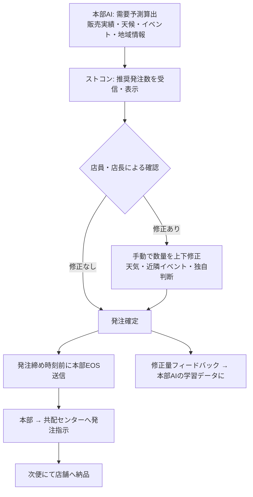
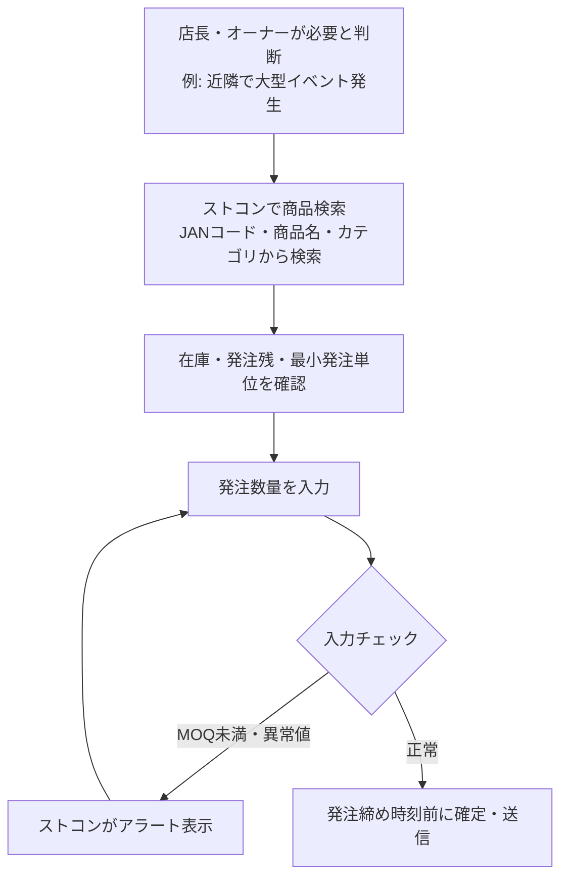
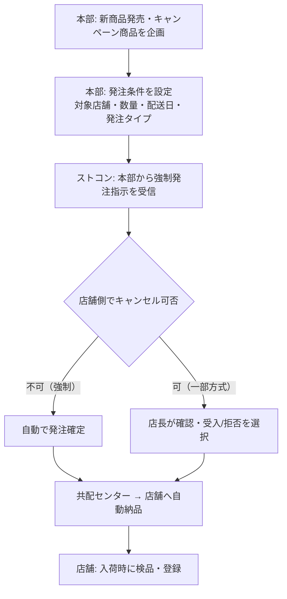
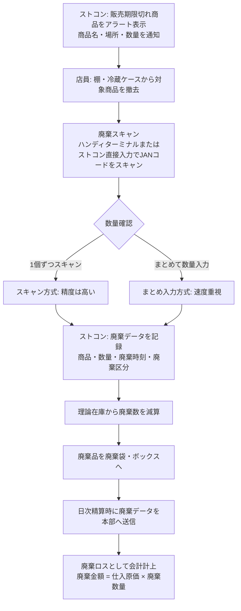
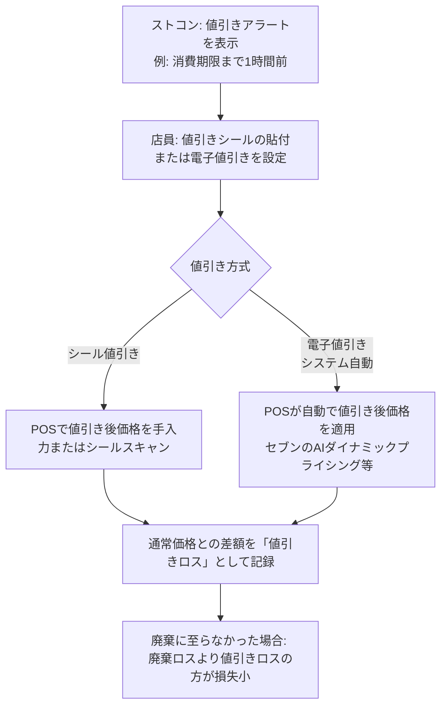
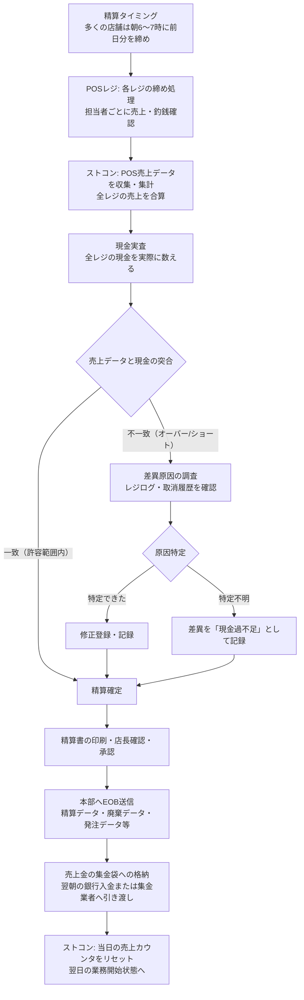
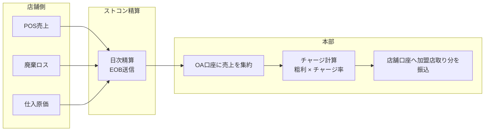
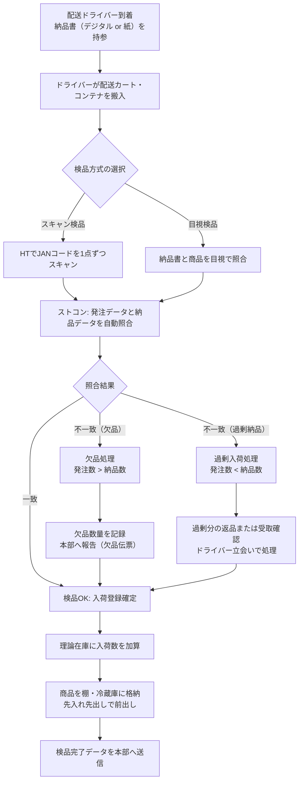
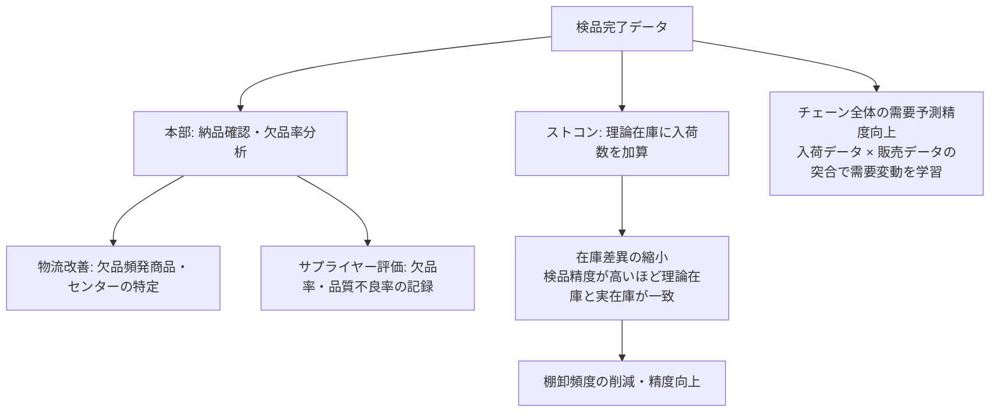
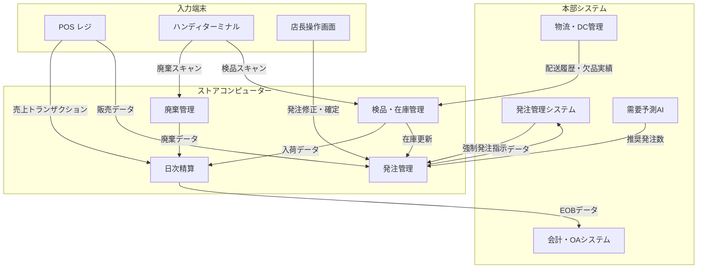

# コンビニエンスストア 主要業務プロセス詳細

**作成日**: 2026-03-26
**作成者**: retail-domain-researcher
**目的**: WBS 2.1.2 の先行調査 — 発注・廃棄・日次精算・検品の4プロセスをストコン役割中心に詳述
**前提資料**:
- `store-computer-domain-knowledge.md` — ストコン概要・機能一覧・用語集（本資料では重複省略）
- `convenience-industry-structure.md` — 業界構造・サプライチェーン・1日の業務フロー概要（本資料では重複省略）
- `industry-reports/storcon-deep-dive-2026-03-25.md` — クラウド移行・POS連携アーキテクチャ（本資料では重複省略）

**本資料の位置付け**: 既存3資料が「何をするか（What）」を整理しているのに対し、本資料は「どのようにするか（How）」— 詳細ステップ・判断基準・エラー処理・データ活用 — に焦点を当てる。

---

## 目次

1. [発注3方式](#1-発注3方式)
2. [廃棄管理（鮮度管理）](#2-廃棄管理鮮度管理)
3. [日次精算（日計処理）](#3-日次精算日計処理)
4. [検品（入荷検品処理）](#4-検品入荷検品処理)
5. [4プロセスの相互関係](#5-4プロセスの相互関係)

---

## 1. 発注3方式

### 1-1. 業務の概要・目的

発注は店舗運営の中核業務であり、「廃棄ロス（売れ残り）」と「チャンスロス（品切れ）」の双方を最小化しながら最適な在庫水準を維持することが目的である。コンビニは多頻度小口配送（1日1〜3便）が標準のため、発注の精度が直接的に粗利・廃棄ロス率に影響する。

ストコンは3つの発注方式を統合管理し、方式をまたいだ発注データを集約して本部へ送信する。

### 1-2. 3方式の詳細

#### 方式1: 自動発注（推奨発注 / AI発注）

本部のAI需要予測システムが算出した推奨数量をストコンが受信し、店員の確認を経て（または自動で）発注する方式。2020年代以降、主要3チェーンすべてで全国展開済みの主力方式。

**ストコンが担うデータ・処理**

| 処理 | 内容 | データソース |
|------|------|------------|
| 推奨数量の受信 | 本部AIが算出した商品ごとの推奨発注数を受信・表示 | 本部発注管理システム（下り通信） |
| 理論在庫参照 | 現在の帳簿在庫数を推奨発注計算に照合 | ストコン内部（販売-廃棄-入荷の積算） |
| 発注締め管理 | 配送便ごとの発注締め時刻を管理。時刻超過時はアラート | ストコン内部設定 |
| 修正・確定 | 店員が推奨数を修正し確定。修正量のフィードバックを本部AIへ送信 | 店員入力 |
| 発注データ送信 | 確定した発注データを本部へ送信（EOS通信） | — |

**業務フロー（推奨発注）**



**AI発注の精度を高めるインプットデータ（主要チェーン事例）**

| データ種別 | 具体例 | 更新頻度 |
|-----------|--------|---------|
| 販売実績 | SKU別・時間帯別・曜日別の販売数 | リアルタイム〜日次 |
| 在庫データ | 理論在庫数・発注残（発注済み未着） | リアルタイム |
| 気象データ | 気温・降水量・天気予報（3〜7日先） | 日次〜時間単位 |
| イベントカレンダー | 近隣のイベント・祝日・学校行事 | 週次 |
| プロモーション情報 | チラシ・クーポン配信予定 | 施策ごと |
| 価格変更情報 | 値引き・特売情報 | 施策ごと |
| エリア人流データ | 周辺人口推計・通行量（一部チェーン） | 日次 |

#### 方式2: 手動発注（マニュアル発注）

店長・オーナーが独自判断で発注品目・数量を入力する方式。AI発注でカバーしきれない特需・緊急対応に使用する。

**業務フロー（手動発注）**



**主な利用シーン**

| シーン | 具体例 |
|--------|--------|
| 特需対応 | 近隣で花火大会・スポーツイベント。ビール・アイスを増量発注 |
| 緊急補充 | 予想外の品切れが発生。発注締め前に追加発注 |
| 新商品の初回発注 | 推奨発注実績がない新商品。店長が独自判断で初回数を設定 |
| 季節商品の立ち上げ | おでん・中華まんのシーズン初回仕込み量 |

#### 方式3: 本部一括発注（セントラル発注 / 強制発注）

本部が商品・数量・配送日を指定して各店舗に強制的に発注する方式。個別店舗の発注操作は不要（または禁止）。

**業務フロー（本部一括発注）**



**本部一括発注が使われるケース**

| ケース | 理由 |
|--------|------|
| 新商品の初回導入 | 全店展開が必要なヒット見込み商品。陳列スペース確保のため強制配荷 |
| キャンペーン商品（限定品） | フェア・コラボ商品。均一展開が販促効果に直結 |
| 季節商品の一斉投入 | おでん・クリスマスケーキ等の季節商材 |
| 緊急商品の配布 | 社会的に需要が急増した商品（マスク等） |
| 均一棚割展開 | 本部指定の棚割に必要な商品を店舗規模別に割り当て |

### 1-3. 3方式の比較・使い分け基準

| 比較項目 | 自動発注（AI） | 手動発注 | 本部一括発注 |
|---------|-------------|---------|-----------|
| 発注の意思決定者 | AI（本部）+ 店員確認 | 店長・オーナー | 本部のみ |
| 対象商品 | 通常取扱全商品 | 特定商品（特需・緊急） | 新商品・キャンペーン商品 |
| 発注精度 | 高（大量データ活用） | 属人（熟練度に依存） | N/A（数量は本部が決定） |
| 柔軟性 | 中（修正は可能） | 高 | 低（店舗は受け入れるだけ） |
| 廃棄リスク | 低（最適化済み） | 中〜高（過剰発注の危険） | 中（本部判断次第） |
| チャンスロスリスク | 低 | 低（補完目的のため） | 低（本部の意図的配荷） |
| ストコン操作 | 確認・修正のみ | 品目・数量の全入力 | 受信・確認のみ |

**使い分けの実務的基準**

```
通常運用:   自動発注を基本とし、推奨数をレビューして微修正
特需対応:   手動発注で追加（自動発注に上乗せ）
新商品・フェア: 本部一括発注が主導。必要に応じて店舗が追加発注
```

### 1-4. 発注に関わる用語解説

| 用語 | 読み | 定義 |
|------|------|------|
| EOS | イーオーエス | Electronic Ordering System。電子発注システム。ストコンから本部へ発注データを送信する仕組み |
| 発注締め（はっちゅうしめ） | - | 各配送便に対する発注受付の締切時刻。締め後の発注は次便扱い |
| 発注残（はっちゅうざん） | - | 発注済みだがまだ入荷していない商品数量。理論在庫の計算に含める |
| MOQ | エムオーキュー | Minimum Order Quantity。最小発注単位。ケース入数・バラの最小単位 |
| 安全在庫（あんぜんざいこ） | - | 品切れを防ぐために確保しておく最低限の在庫数量 |
| 推奨発注数（すいしょうはっちゅうすう） | - | AIが算出した最適発注数。店員が修正してから確定する |
| 強制発注（きょうせいはっちゅう） | - | 本部から店舗への一括発注。店舗側の操作不要または禁止 |
| 配荷（はいか） | - | 本部が店舗へ商品を配分すること。特に本部一括発注で使われる |
| リードタイム | - | 発注から入荷までの所要時間。コンビニは原則1日（同日〜翌日） |
| チャンスロス | - | 品切れにより販売機会を逃した損失。廃棄ロスと表裏の関係 |

---

## 2. 廃棄管理（鮮度管理）

### 2-1. 業務の概要・目的

廃棄管理は、消費期限・賞味期限・販売期限を超えた商品を適切なタイミングで撤去・廃棄し、廃棄データをストコンに登録することで在庫を正確に管理する業務である。廃棄ロスはコンビニ経営で最大のコスト要因のひとつであり、適正な廃棄管理は以下の3つを同時に達成することが目的となる。

1. **食品安全法規遵守**: 消費期限切れ商品の販売禁止（食品衛生法）
2. **在庫精度の維持**: 廃棄分を理論在庫から正確に除外
3. **廃棄ロスの最小化**: AI予測・値引き等で廃棄量自体を減らす

### 2-2. 賞味期限・消費期限・販売期限の違い

| 区分 | 法的根拠 | 定義 | 廃棄タイミング |
|------|---------|------|-------------|
| 消費期限（しょうひきげん） | 食品衛生法 | この日を過ぎたら食べてはいけない（5日以内が目安） | 期限当日の販売期限時刻で撤去 |
| 賞味期限（しょうみきげん） | 食品衛生法 | この日まで品質が保証される（長期保存品向け） | 期限が近づいたら値引き対象、期限後は撤去 |
| 販売期限（はんばいきげん） | 各チェーンの社内ルール | 法的期限より早い独自の撤去タイミング | 販売期限時刻でストコンがアラートを発する |

**販売期限の設定例（弁当・おにぎりの場合）**

```
消費期限: 製造日の翌日 11:00
販売期限: 消費期限の 2〜3時間前（チェーンにより異なる）
  → 例: 翌日 8:00〜9:00 に撤去
```

販売期限は消費期限より早く設定されており、実際には「まだ安全に食べられる」状態で撤去することになる。この過剰廃棄を削減するために値引き販売・AI予測が活用される。

### 2-3. 廃棄登録の業務フロー



**廃棄区分の種類**

ストコンでは廃棄の理由を区分して登録する。区分ごとに原因分析と対策が異なる。

| 廃棄区分 | 内容 | 分析活用 |
|---------|------|---------|
| 期限廃棄 | 販売期限・消費期限超過による廃棄 | 発注精度の改善に直結 |
| 破損廃棄 | 商品の汚損・破損による廃棄 | 配送クレーム、取扱い改善 |
| サンプル廃棄 | 試食・開封確認等 | コスト管理 |
| カウンターFF廃棄 | コーヒー・揚げ物等の時間超過廃棄 | 製造数の最適化 |
| システム廃棄 | 棚卸差異等の調整目的 | 在庫精度の問題発見 |

### 2-4. 廃棄ロス削減の取り組み

#### 値引き販売（マークダウン）

2019年の食品ロス削減推進法施行を機に、各チェーンが値引き販売を本格解禁。ストコンでの処理フローは以下の通り。



**値引き vs. 廃棄のコスト比較**

```
例: 定価 500円 / 原価 350円 の弁当を 30% 値引きで販売した場合

値引き販売: 売価 350円 → 利益 0円（原価回収できた）
廃棄した場合: 売上 0円 → 損失 350円（原価丸損）

結論: 値引きして売る方が 350円の損失を防げる
```

#### AI需要予測による廃棄削減

| 段階 | 取り組み内容 | 廃棄削減効果 |
|------|-----------|------------|
| 発注段階 | AI発注で過剰発注を防止 | セブンで15〜20%改善（2023年実績） |
| 値引き最適化 | 消費期限までの時間・残数に応じてダイナミックに値引き率を変更 | 試験段階（2025〜2026年） |
| 製造量最適化（FF） | フライヤー・コーヒーの製造数をリアルタイム需要に合わせて調整 | 一部店舗で試験中 |

### 2-5. 廃棄管理に関わる用語解説

| 用語 | 読み | 定義 |
|------|------|------|
| 廃棄ロス（はいきろす） | - | 廃棄に伴う損失額。仕入原価が丸ごと損失になる |
| 廃棄ロス率（はいきろすりつ） | - | 売上高に対する廃棄金額の割合。目標はチェーン・店舗による |
| 値引きロス（ねびきろす） | - | 定価 - 値引き後価格の差額。廃棄ロスより小さいことが多い |
| デイリー品（でいりーひん） | - | 日配品（弁当・おにぎり・惣菜等）。廃棄管理の主対象 |
| FF（エフエフ） | - | Fast Food の略。コーヒー・揚げ物・中華まん等のカウンター商品 |
| 販売期限（はんばいきげん） | - | チェーン独自の商品撤去タイミング。消費期限より数時間早く設定 |
| 鮮度管理（せんどかんり） | - | 賞味期限・消費期限を守り、品質の劣化を防ぐ一連の管理活動 |
| 先入れ先出し（さきいれさきだし） | - | 古い在庫から販売するために手前に出す陳列管理（FIFO） |
| マークダウン | - | 値引き販売。期限切れ前に価格を下げて廃棄を回避する戦略 |
| ダイナミックプライシング | - | 残数・時間・需要に応じてリアルタイムで価格を変動させる手法 |

---

## 3. 日次精算（日計処理）

### 3-1. 業務の概要・目的

日次精算（日計処理）は、1営業日分の売上・仕入・廃棄・入出金を締めてストコンで集計し、精算データを本部へ送信する業務である。主な目的は以下の3つ。

1. **売上の正確な把握**: POS売上 × 現金残高の突合で過不足を検出
2. **本部への精算報告**: EOBデータとして本部に送信し、加盟店の会計・チャージ計算の基礎となる
3. **翌日業務の準備**: 精算後の在庫・売上状態をリセットし、翌日の業務サイクルを開始

### 3-2. 日次精算の業務フロー（詳細）



### 3-3. EOB（End of Business）送信データ

EOBはストコンから本部への最重要データ送信であり、一日の業務終了を意味する「締め送信」である。送信データには以下が含まれる。

| データ区分 | 具体的な内容 | 本部での活用 |
|-----------|-----------|-----------|
| 売上明細 | 商品別・時間帯別・決済種別の全取引明細 | DWHへ蓄積。需要予測・単品管理に活用 |
| 売上集計 | 総売上・客数・客単価・粗利（当日分） | 店舗パフォーマンス管理・チャージ計算 |
| 廃棄データ | 廃棄区分・商品・数量・廃棄時刻 | 廃棄ロス率の算出・発注精度改善 |
| 発注確定データ | 当日確定した発注内容 | 共配センターへの出荷指示 |
| 入荷確認データ | 当日の入荷・検品結果 | 物流トラッキング・欠品管理 |
| 在庫状況 | 精算時点の理論在庫（全商品） | 在庫管理・棚割見直しの参考 |
| サービス売上 | 収納代行・チケット発券・宅配受付の合計 | 収納代行の入金処理 |
| 現金過不足 | 実査との差額（オーバー/ショート） | 異常検知・店舗指導 |

### 3-4. オープンアカウント（会計）との関係

コンビニFCでは「**オープンアカウント（OA）**」と呼ばれる本部が管理する決済口座を通じて、店舗の売上・仕入・チャージを精算する仕組みが一般的である。



**オープンアカウントの構造**

| 区分 | 内容 | タイミング |
|------|------|---------|
| 売上入金 | POSで受け取った現金・電子マネーは本部口座へ集約（集金） | 日次〜翌日 |
| 仕入支払い | 商品仕入原価は本部が立替払い。後日OA口座で相殺 | 週次〜月次 |
| チャージ控除 | 本部が粗利に応じてチャージを控除 | 月次 |
| 加盟店収入振込 | 粗利からチャージを差し引いた残額が加盟店の収入 | 月次 |

**ストコン日次精算とOAの接続**: 日次精算のEOBデータが本部に届くことで、本部側のOA計算が更新される。精算データに誤りがあるとOA計算が狂うため、精算の正確性は加盟店の収入計算に直結する。

### 3-5. 精算レポートの種類と活用

ストコンが出力する精算レポートは、日常管理・月次管理・本部報告と目的に応じて複数の種類が存在する。

| レポート名 | 出力タイミング | 主な利用者 | 主な活用目的 |
|-----------|------------|---------|-----------|
| 日計表（にっけいひょう） | 日次精算時 | 店長・オーナー | 当日の売上・廃棄ロス・客数の確認。前日比・前週比の比較 |
| 時間帯別売上レポート | 随時・日次 | 店長・シフト管理者 | ピーク時間帯の把握。人員配置・発注計画の最適化 |
| 商品別売上レポート | 日次・週次 | 店長・SV | 売れ筋・死に筋の特定。棚割見直しへの活用 |
| 廃棄ロスレポート | 日次・週次 | 店長・SV | 廃棄ロス率の推移確認。発注精度の問題商品を特定 |
| 在庫差異レポート | 棚卸後 | 店長・SV | 理論在庫と実在庫の差異を商品別に確認。万引き・誤廃棄の示唆 |
| 月次損益レポート | 月次 | 店長・オーナー・SV | 月間の粗利・廃棄ロス・人件費の実績。経営判断の基礎資料 |
| 電子マネー・決済別集計 | 日次 | 店長・経理担当 | 現金・IC・QR等の決済種別の按分。電子マネー精算に活用 |

### 3-6. 精算処理における典型的な問題と対処

| 問題 | 原因 | ストコンでの対処 |
|------|------|--------------|
| 現金ショート | お釣り間違い・レジ操作ミス | レジ操作ログを確認。小額の場合は「現金過不足」として処理 |
| 廃棄未登録 | 廃棄したが入力を忘れた | 在庫差異として棚卸時に発覚。翌日の廃棄修正入力 |
| EOB送信失敗 | 通信障害・ストコン障害 | ストコンが蓄積し、回線復旧後に自動再送。翌日の手動送信も可 |
| 売上データ不一致 | POSとストコンの集計差 | POSの取引ログとストコンの集計を突合。差異原因を特定 |

### 3-7. 日次精算に関わる用語解説

| 用語 | 読み | 定義 |
|------|------|------|
| EOB | イーオービー | End of Business。日次業務終了時にストコンから本部へ送る締め送信データ |
| 日計表（にっけいひょう） | - | 1日の売上・廃棄・客数等をまとめた精算レポート |
| 現金実査（げんきんじっさ） | - | レジ内の現金を実際に数えて帳簿と照合する作業 |
| オーバー（現金過剰） | - | 実際の現金が帳簿より多い状態。お釣り少なく渡した等が原因 |
| ショート（現金不足） | - | 実際の現金が帳簿より少ない状態。お釣り多く渡した等が原因 |
| オープンアカウント（OA） | - | 本部が管理する店舗の精算口座。売上・仕入・チャージを集中管理 |
| チャージ | - | 加盟店が本部に支払うロイヤリティ。粗利の一定率で計算 |
| 日販（にっぱん） | - | 1日あたりの売上高。店舗パフォーマンスの代表的な指標 |
| 粗利（そり） | - | 売上 - 仕入原価。コンビニではチャージ計算の基準となる |
| 客単価（きゃくたんか） | - | 1購買あたりの平均支払額。客数 × 客単価 = 売上 |

---

## 4. 検品（入荷検品処理）

### 4-1. 業務の概要・目的

検品は配送ドライバーが納品した商品を受け取る際に、**発注した商品が正しく届いたかを確認し、ストコンに入荷を登録する**業務である。検品の目的は以下の3点。

1. **受取確認**: 発注数と納品数の一致確認（過剰・欠品の検出）
2. **在庫更新**: 入荷数を理論在庫に加算し、在庫精度を維持
3. **品質確認**: 賞味期限・温度・破損など商品品質の受取時確認

コンビニの多頻度納品（1日3便）の環境下では、検品は繁忙時間帯（特に朝便）に短時間で完了させる必要があり、スピードと正確性の両立が課題となる。

### 4-2. スキャン検品 vs. 目視検品

| 比較項目 | スキャン検品 | 目視検品（伝票照合） |
|---------|-----------|----------------|
| 方法 | ハンディターミナル（HT）でJANコードをスキャン | 納品書と商品を目視で照合 |
| 精度 | 高（スキャンにより品番・数量を機械的に確認） | 中〜低（人的ミスが発生しやすい） |
| 速度 | 低〜中（1個ずつスキャンが基本） | 高（慣れた担当者は素早く確認可能） |
| データ連携 | 即時ストコンへ反映 | 後でまとめて入力が必要 |
| 適用シーン | デイリー品・タバコ等の高精度要求品目 | 常温加工食品・雑貨等（数量少ない場合） |
| 主な採用方式 | 主要チェーンで標準化が進行中 | 一部小型配送・特定カテゴリで残存 |

**ハンディターミナル（HT）の機能**

ストコンと無線（Wi-Fi）または有線で連携し、以下の機能を提供する。

| 機能 | 内容 |
|------|------|
| スキャン検品 | JANコードをスキャン → 発注データと自動照合 |
| 棚卸入力 | 在庫数をスキャンで入力 |
| 廃棄登録 | 廃棄商品をスキャンで登録 |
| 価格ラベル印刷 | 値引き・棚替えの価格ラベルを無線で印刷指示 |
| 在庫照会 | 特定商品の現在庫数をリアルタイム確認 |

### 4-3. 検品の業務フロー（詳細）



### 4-4. 入荷時の品質チェック項目

検品では数量確認だけでなく、品質面の確認も必須である。

| チェック項目 | 対象商品 | 確認内容 | NGの場合の対応 |
|-----------|---------|---------|-------------|
| 賞味期限・消費期限 | デイリー品・チルド品 | 期限が十分に残っているか | ドライバーに返品。欠品扱いで記録 |
| 温度確認 | チルド（冷蔵）・冷凍品 | 配送中に温度逸脱がないか | 温度記録紙の確認。疑わしければ返品 |
| 破損・汚損 | 全商品 | 包装の破れ・液漏れ・変形 | 該当品を返品 |
| 品番確認 | 全商品 | 発注した商品と一致しているか | 誤納品の場合はドライバーに返品 |
| 数量 | 全商品 | 発注数と納品数の一致 | 欠品・過剰入荷の処理（上記フロー参照） |

**温度管理の重要性**

チルド品・冷凍品は「コールドチェーン」の維持が食品安全上の必須要件。入荷時の温度逸脱（温度管理ミス）は食中毒リスクに直結するため、以下の確認が求められる。

```
チルド品: 3〜10°C で管理（5°C 前後が標準）
冷凍品:  -18°C 以下で管理
ホット品: 60〜75°C の温度帯（コーヒー・おでん等）

→ 入荷時に温度記録紙（チャート紙）またはデジタル温度ロガーで確認
```

### 4-5. 差異発生時の処理

検品で発注数と納品数が一致しない「差異」が発生した場合、ストコンでの処理と本部への報告が必要になる。

#### 欠品（Shortage: 納品数 < 発注数）

| ステップ | 内容 |
|---------|------|
| 欠品確認 | HTまたはストコンで欠品数量を確認 |
| 欠品伝票発行 | ストコンで欠品伝票を発行（商品・数量・伝票番号） |
| ドライバー承認 | 欠品伝票にドライバーが確認サイン（またはデジタル承認） |
| 仕入調整 | 欠品分の仕入代金を控除。OA口座への反映 |
| 追加発注検討 | 品切れリスクを勘案して次便での追加発注を検討 |

#### 過剰入荷（Overage: 納品数 > 発注数）

| ステップ | 内容 |
|---------|------|
| 過剰確認 | 発注数を超える納品が発生 |
| 受取判断 | 店長が受取るか返品するかを判断 |
| 受取る場合 | 差額分を追加仕入として計上。廃棄リスクも増大 |
| 返品する場合 | 過剰分をドライバーに返品。伝票修正 |

### 4-6. 検品データの活用（在庫精度向上）

検品データはストコン内部で在庫管理に活用されるだけでなく、本部への送信後に広範な用途に使われる。



**入荷データが在庫精度に与える影響**

```
在庫精度低下の代表的な原因:
1. 検品漏れ（入荷したのに未登録）→ 理論在庫が実際より少なく表示
2. 誤品スキャン（別商品を登録）→ 在庫が別商品に誤計上
3. 廃棄未登録 → 理論在庫が実際より多く表示（Section 2 参照）

→ 検品・廃棄の二大入力精度が在庫精度の 9割を左右する
```

### 4-7. 検品に関わる用語解説

| 用語 | 読み | 定義 |
|------|------|------|
| HT（ハンディターミナル） | エイチティー | バーコードスキャナ内蔵の携帯型端末。ストコンと無線連携して使用 |
| 欠品（けっぴん） | - | 発注したが納品されなかった状態。または棚が空になった状態 |
| 過剰入荷（かじょうにゅうか） | - | 発注数を超えて納品された状態 |
| 欠品伝票（けっぴんでんぴょう） | - | 欠品時にストコンで発行する不足確認書類。仕入代金の調整に使用 |
| コールドチェーン | - | 食品の鮮度・品質を保つため、製造〜販売まで低温を維持する物流体制 |
| 温度ロガー | - | 配送中の温度を継続記録するデバイス。コールドチェーン管理に活用 |
| 検品精度（けんぴんせいど） | - | 発注と納品のデータが一致している割合。高いほど理論在庫の信頼性が高い |
| 理論在庫（りろんざいこ） | - | 入荷数 - 販売数 - 廃棄数で計算した帳簿上の在庫数。実在庫と差異が生じることがある |
| 先入れ先出し（FIFO） | - | 古い商品を前に出し、先に販売する陳列管理ルール。賞味期限管理の基本 |
| 伝票照合（でんぴょうしょうごう） | - | 納品書と現物商品を照らし合わせて確認する目視検品の方法 |

---

## 5. 4プロセスの相互関係

4つの業務プロセスは独立して機能するのではなく、ストコンを中心に密接に連携している。以下にその相互依存関係を示す。



**サイクルで見た連携関係**

| サイクル | 連携の流れ |
|---------|-----------|
| 発注 → 検品 | 発注データがストコンに保存され、入荷時の検品で発注 vs. 納品を照合する |
| 検品 → 在庫 → 発注 | 正確な検品入力が理論在庫を正確に保ち、次回発注の精度を維持する |
| 廃棄 → 在庫 → 発注 | 廃棄の正確な登録が理論在庫から廃棄分を除くことで、次回の過剰発注を防ぐ |
| POS → 精算 → EOB | POSの売上データがストコンに集約され、日次精算・EOB送信へとつながる |
| 廃棄 → 精算 | 廃棄ロス額は日次精算に含まれ、EOBで本部に報告・会計計上される |
| 検品 → 精算 | 入荷確認データが精算の仕入数量に反映され、OA計算の基礎となる |

**SIer視点での設計ポイント**

4プロセスはすべてストコンを経由するため、ストコンの可用性・整合性は全プロセスに影響する。クラウド移行・モダナイゼーション設計における留意点を以下に整理する。

| 設計観点 | 発注 | 廃棄 | 日次精算 | 検品 |
|---------|------|------|---------|------|
| オフライン継続動作の要否 | 要（締め時刻があるため） | 要（廃棄アラートが必要） | 要（現金実査は回線不問） | 要（ドライバー待機中に処理必要） |
| リアルタイム性要件 | 中（締め時刻まで） | 中（アラート即時） | 低（朝の締め処理） | 中（入荷時間内に完了） |
| データ整合性の重要度 | 高（発注残の精度） | 高（在庫精度に直結） | 最高（OA・会計に影響） | 高（在庫精度に直結） |
| クラウド移行優先度 | 高（AI発注はすでにクラウド） | 中 | 中（EOBは既存方式継続） | 低（ローカル処理が中心） |

---

## 参考情報

本資料は以下の公開情報・業界慣行・既存ドメイン知識を基に整理したものである。

- 各チェーン公式情報（セブン-イレブン、ファミリーマート、ローソン等のオーナー向け資料）
- 食品衛生法（消費期限・賞味期限の法的根拠）
- 食品ロス削減推進法（2019年施行。値引き拡大の法的背景）
- `store-computer-domain-knowledge.md`（ストコン概要・機能一覧）
- `convenience-industry-structure.md`（業界構造・FCモデル・サプライチェーン）
- `industry-reports/storcon-deep-dive-2026-03-25.md`（クラウド移行・アーキテクチャ）

**注記**: 各チェーンの具体的なシステム仕様・パラメータ値は非公開情報が多く、本資料は公開情報に基づく業界標準的な情報を記載している。実際の参画案件では機密保持契約（NDA）の範囲で個別確認すること。
