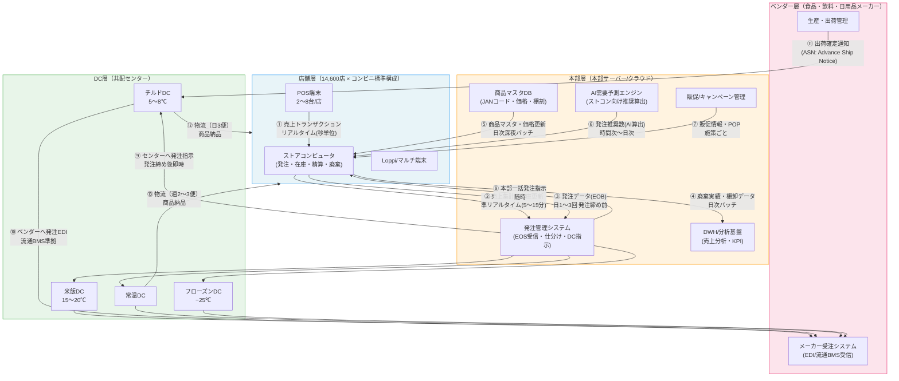
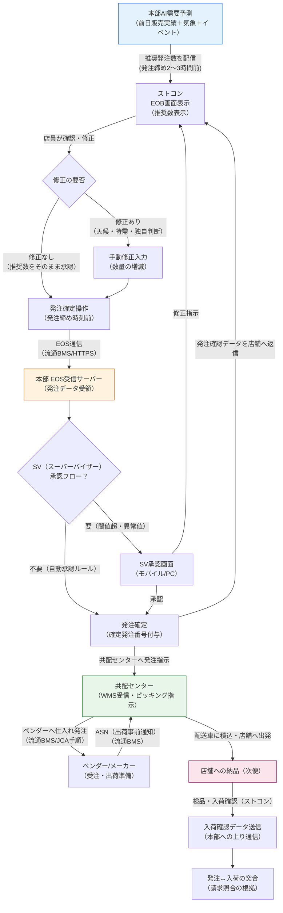

# WBS 2.2.1 データフロー深掘り — 上り/下り通信・バッチタイミング・EOB

---

## 目次

1. [サマリー（3行）](#1-サマリー3行)
2. [コンビニのデータフロー全体像](#2-コンビニのデータフロー全体像)
3. [上り通信（店舗→本部）](#3-上り通信店舗本部)
4. [下り通信（本部→店舗）](#4-下り通信本部店舗)
5. [バッチタイミング](#5-バッチタイミング)
6. [EOB（Electronic Order Book）深掘り](#6-eobelectronic-order-book深掘り)
7. [データフロー障害時の業務影響（PM視点）](#7-データフロー障害時の業務影響pm視点)
8. [AWS移行案件での押さえどころ](#8-aws移行案件での押さえどころ)
9. [次の学習ステップ](#9-次の学習ステップ)
10. [参考資料](#10-参考資料)

---

## 1. サマリー（3行）

コンビニの店舗↔本部データフローは「**上り（売上・在庫・発注実績）**」「**下り（マスタ・推奨・販促）**」の非対称な双方向通信で成立し、14,600店規模ではリアルタイム～日次バッチが複数レイヤーで共存する。EOB（Electronic Order Book）は発注データのライフサイクル全体を管理する中核プロセスであり、流通BMS規格に準拠した電子発注の根幹を担う。AWS移行案件においては、この「上り/下りの非同期分離」と「EOBのEDI互換性維持」が技術難度の核心であり、PMとして設計判断の拠り所にする必要がある。

---

## 2. コンビニのデータフロー全体像

### 2-1. 既存ノートとの差分

本ノートの前提として、以下の既存ノートで「何が流れるか（What）」は整理済みである。

| 既存ノート | カバー範囲 |
|---|---|
| [wbs-2-1-2-convenience-business-processes.md](./wbs-2-1-2-convenience-business-processes.md) | 発注3方式・廃棄・精算・検品の業務ステップ詳細 |
| [wbs-2-5-3-lawson-store-system.md](./wbs-2-5-3-lawson-store-system.md) | ローソン店舗システムのコンポーネント構成・NEC担当範囲 |
| [wbs-2-5-4-storcon-aws-tech-deep-dive.md](./wbs-2-5-4-storcon-aws-tech-deep-dive.md) | AWS移行技術（DMS/CDC/MGN）の詳細 |
| [wbs-5-1-convenience-supply-chain.md](./wbs-5-1-convenience-supply-chain.md) | 物流（DC種別・共配・クロスドッキング）の仕組み |
| [wbs-3-2-1-high-concurrency-design.md](./wbs-3-2-1-high-concurrency-design.md) | API Gateway＋SQS大規模同時接続設計パターン |

**本ノートの差分価値**: 「**どのタイミングで何を、どのプロトコルで、どの頻度で流すか（How & When）**」と「**止まったときに何が起きるか（Impact）**」に集中する。

### 2-2. 5層間のデータフロー鳥瞰図

コンビニのデータフローは店舗/本部/配送センター/ベンダー/DC（データセンター）の5層で構成される。物流データと情報データが並走する点がコンビニ特有の複雑性の源泉である。



### 2-3. 規模感

14,600店舗規模がもたらすデータ量を把握することはAWS移行設計の前提になる。

| 指標 | 数値 | 根拠・計算式 |
|---|---|---|
| 1店舗あたりの取扱SKU数 | 約2,800〜3,000 SKU | 大手コンビニの標準的な品揃え数 |
| 1店舗 1日あたりの売上トランザクション数 | 約1,000〜1,500件 | 来客数約1,000人 × 客単価購買1〜1.5品目 |
| 全店 1日あたりの売上トランザクション総数 | 約1,460万〜2,190万件 | 14,600店 × 1,000〜1,500件 |
| ピーク時のPOS送信レート | 約60〜200件/秒（全店合計） | 昼食・夕食時間帯に集中 |
| 1日あたりの商品マスタ更新件数 | 数百〜数千件 | 新商品導入・価格改定・終売 |
| ベンダー数（仕入先数） | 約2,000〜3,000社 | 食品・飲料・日用品・雑誌を含む |
| EOB発注明細数（全店1回の発注締め） | 約4,380万〜5,110万件 | 14,600店 × 3,000 SKU × 締め回数分（一部のみ発注が発生） |

> **PM 向け補足**: 14,600店 × 同時送信という"同時性"よりも、「発注締め時刻の直前に数万件の発注データが集中する」という**時間的集中（スパイク）**の方が設計上の急所になる。これは WBS 3.2.1 で扱う API GW + SQS パターンの設計背景と直結する。

---

## 3. 上り通信（店舗→本部）

### 3-1. 上り通信の全体マップ

「上り通信」とは店舗側（POS端末・ストコン）から本部・クラウドへ向かうデータフローの総称。コンビニ業務の根幹であり、本部の意思決定（AI発注・品揃え・価格設定）はすべてこの上りデータに基づく。

| データ種別 | 送信元 | 頻度 | プロトコル | 用途 | 停止時の影響 |
|---|---|---|---|---|---|
| 売上トランザクション | POSs → ストコン → 本部 | リアルタイム（秒単位） | HTTPS POST / TCP/IP | 売上把握・在庫減算 | 本部で売上リアルタイム把握不可 |
| 売上集計（時間次） | ストコン → 本部 | 1時間ごと | HTTPS POST / SFTP | DWH投入・KPI更新 | DWH集計遅延（数時間単位） |
| 理論在庫更新 | ストコン → 本部 | 準リアルタイム（5〜15分） | HTTPS POST | AI発注精度維持 | AI推奨精度低下 |
| 発注データ（EOB） | ストコン → 本部EOS | 日1〜3回（発注締め前） | 流通BMS / HTTPS | DC・ベンダーへの発注指示 | 配送便の欠品・二重発注リスク |
| 廃棄実績データ | ストコン → 本部 | 日次（深夜〜早朝） | SFTP / HTTPS | 廃棄ロス管理・AI学習 | 廃棄指標の遅延・KPI誤り |
| 検品データ（入荷確認） | ストコン → 本部 | 便ごと（日3回程度） | HTTPS POST | 物流精度確認・請求照合 | 受領確認なし・請求差異リスク |
| 棚卸データ | ストコン → 本部 | 月1〜2回 / 日次（差分） | SFTP | 在庫精度確認・帳簿棚卸 | 在庫評価誤差の蓄積 |
| 勤怠・タイムキーピング | ストコン → 本部 | 日次バッチ（深夜） | SFTP / HTTPS | 人件費管理・労務管理 | 給与計算の遅延 |
| クレーム・ヒヤリハット | ストコン → 本部 | 随時（発生時） | HTTPS POST | 品質管理・本部対応 | 品質問題の把握遅延 |
| 温度センサーデータ | IoT機器 → 本部 | 常時（分単位） | MQTT / Kinesis | 食品衛生管理・HACCP | 温度異常の未検知リスク |

### 3-2. 売上データの詳細フロー（POS → ストコン → 本部）

売上データは上り通信の中で最も重要かつ頻繁なデータであり、後段の在庫計算・AI発注・財務処理の基点となる。

```
[POS端末（1トランザクション）]
  ├── 商品JANコードスキャン
  ├── 決済処理（現金/IC/QR/電子マネー）
  └── 売上レコード生成（SKU・数量・単価・時刻・決済種別）
         │ TCP/IP ローカルLAN（店内）
         ▼
[ストアコンピュータ（リアルタイム処理）]
  ├── 売上累計テーブル更新（SKU別・時間帯別）
  ├── 理論在庫のデクリメント（在庫数 = 前在庫 − 販売数）
  ├── 廃棄候補フラグ更新（売れ行き鈍化商品のアラート）
  └── 一定件数・一定時間ごとにバッファリングして本部送信
         │ HTTPS POST（閉域VPN / KDDI専用線）
         ▼
[本部 EOS受信サーバー / クラウドイングレス]
  ├── 受信確認ACK返却（ストコンへ）
  ├── データレイク/DWHへのストリーミング投入
  ├── リアルタイム売上ダッシュボード更新
  └── AI需要予測エンジンへのフィード（次回推奨発注数の算出トリガー）
```

**「リアルタイム」の実態について**:

コンビニの売上データは厳密な「1件1件の即時送信」ではなく、**バッファリング＋準リアルタイム送信**が一般的である。

| 方式 | 仕組み | 採用理由 |
|---|---|---|
| トランザクション単位即時送信 | 1件ごとにHTTPS POSTを発行 | 最新性は高いが、POS端末〜本部間のレイテンシーが無視できない規模では非効率 |
| バッファリング送信（5〜15分） | 一定時間または一定件数に達したら一括POST | 通信効率よく、本部サーバー負荷を平準化できる |
| 日次バッチ締め | 深夜に1日分のデータをまとめてSFTP転送 | 財務・会計用途。現在は時間次との組み合わせが主流 |

> **PM 向け補足**: 現行ストコン（オンプレ）では「15分バッファリング + 日次バッチ締め」の二段構えが多い。AWS移行後に「全トランザクション即時ストリーミング」へ変更しようとすると、本部側の受信システムのキャパシティ設計が大きく変わる。移行スコープを「データフロー方式の変更」まで含むのか、「既存バッファリング方式をクラウド上で再現するか」はPMとして最初期に確認すべき判断ポイントである。

### 3-3. 在庫データの詳細

コンビニの「在庫」は帳簿在庫（理論在庫）と実在庫の2種類が常に存在し、両者の乖離が発注精度に直接影響する。

```
理論在庫（帳簿在庫） = 前日棚卸在庫 + 入荷実績 − 売上数量 − 廃棄数量
実在庫（物理在庫） = 棚卸時点の実際の商品数
差異 = 理論在庫 − 実在庫 （= 不明ロス: 万引き・破損・計上ミス等）
```

在庫データとして本部へ上りで送信される主な情報:

| データ名 | 内容 | 送信タイミング | 重要性 |
|---|---|---|---|
| 入荷検品データ | 便ごとの入荷確認（JANコード・数量・異常有無） | 便入荷時（日1〜3回） | 高（理論在庫の加算根拠） |
| 売上による在庫減 | POS売上と連動した自動デクリメント | 準リアルタイム | 高（発注推奨計算の基点） |
| 廃棄登録データ | 消費期限切れ商品の廃棄確認（スキャン） | 随時（期限前処理時） | 高（理論在庫の整合性） |
| 棚卸実績データ | 実地棚卸の結果（月次or日次） | 月1〜2回 / 日次差分 | 中（在庫差異の定期補正） |
| 発注残データ | 発注済み未着の商品数量 | 発注後即時更新 | 高（過剰発注防止） |

### 3-4. 通信プロトコルの体系

コンビニの上り通信で使われるプロトコルは歴史的な経緯から複数が混在する。

| プロトコル | 概要 | 使用場面 | 現状 |
|---|---|---|---|
| **HTTPS POST（REST/JSON）** | 標準WebAPI通信 | 新規開発の上り通信全般 | 主流（新システム） |
| **SFTP（SSH File Transfer Protocol）** | 暗号化ファイル転送 | 日次バッチ（売上・廃棄・棚卸） | 現役（レガシー系との接点） |
| **流通BMS** | 流通業界標準のEDI（XMLベース） | 発注・受注・出荷・請求データ | コンビニ発注の標準 |
| **JCA手順** | 1990年代の電話回線EDI規格 | 一部ベンダーとの旧来接続 | 縮小傾向・2020年代も残存 |
| **MQTT** | 軽量パブリッシュ/サブスクライブ | 温度センサー・IoTデータ | IoT拡張に伴い増加 |
| **TCP/IP ソケット** | 低レイヤーバイナリ通信 | ストコン〜POSローカル通信 | 店内LANで現役 |

> **JCA手順について**: JCA手順（Japan Chain-stores Association手順）は1980〜1990年代に電話回線を前提に策定された日本独自のEDI規格である。現在では流通BMSへの移行が進んでいるが、中小ベンダーや一部旧来システムとの接続でいまだ使用例がある。AWS移行案件では「JCA手順互換のゲートウェイ」が必要になるケースがあり、[GS1 Japan 流通BMSの公式サイト](https://www.dsri.jp/logi/bms/)で最新の移行ガイドを確認するとよい。

### 3-5. 上り通信のトラフィック試算（1店舗 1日）

```
【チルド弁当が3便入荷する標準店（2,800 SKU取扱）の例】

売上トランザクション: 1,200件 × 平均200バイト = 240 KB
理論在庫更新: 96回（15分ごと24時間） × 2,800 SKU × 10バイト = 2.7 MB
EOB発注データ（3便）: 3回 × 300 SKU発注 × 100バイト = 90 KB
廃棄・棚卸データ: 100件 × 150バイト = 15 KB
センサー・その他: 約100 KB

1店舗 1日の上りデータ総量 ≒ 3〜5 MB/日

全14,600店での合計:
  通常時: 44〜73 GB/日
  ピーク時（タ方食帯・発注締め前）: 瞬間最大 50〜200 Mbps（全店合計）
```

---

## 4. 下り通信（本部→店舗）

### 4-1. 下り通信の全体マップ

「下り通信」は本部から各店舗へ向かうデータフロー。上りとは逆に「1対N」の全店一斉配信が基本となるため、単純なシステム設計では**全店同時受信が集中して本部側が輻輳する**リスクがある。

| データ種別 | 配信元 | 頻度 | 配信方式 | 目的 | 停止時の影響 |
|---|---|---|---|---|---|
| 商品マスタ（新商品・廃番） | 本部マスタDB | 日次深夜バッチ | Push（全店一斉） | POS・ストコンの品番認識 | 未登録商品の販売不可 |
| 売価マスタ（通常価格） | 本部価格DB | 日次〜週次 | Push（全店一斉） | 値付け・レシート表示 | 価格誤りで会計クレーム |
| 売価マスタ（地域・時間帯別） | 本部価格DB | 施策ごと（即時〜日次） | Push（対象店舗絞込） | 地域差・タイムセール | 割引未反映・値付けミス |
| キャンペーン・クーポン設定 | 本部販促DB | 施策開始時 | Push（一斉） | 会計時の割引・特典付与 | クーポン未反映でクレーム |
| 発注推奨数（AI算出） | 本部AIエンジン | 時間次〜日次 | Push（店舗ごと個別値） | AI発注の推奨ベース | 推奨値なし→手動発注に切替 |
| 棚割マスタ | 本部MD（マーチャンダイジング） | 週次〜月次 | Push（一斉） | 商品陳列指示 | 棚割変更の反映漏れ |
| POP・販促画像 | 本部販促DB | 施策ごと | Push（一斉） | 店内デジタル掲示板 | POP表示されないまま販促開始 |
| 本部一括発注指示 | 本部発注管理 | 新商品導入・キャンペーン時 | Push（対象店舗） | 強制配荷 | 発注指示が届かず配荷漏れ |
| システム設定・パラメータ | 本部IT | 随時（システム更新時） | Push | ストコン動作設定 | バグ修正・機能追加が反映されない |
| ファームウェア更新 | 本部IT | 定期（深夜） | Push（段階展開） | セキュリティパッチ・機能改善 | 脆弱性未修正・旧バージョン混在 |

### 4-2. 商品マスタ更新の詳細

商品マスタは「マスタが未更新 → POSでスキャンしても認識できない → 販売不可」というダイレクトな業務停止に直結するため、下り通信の中で最もクリティカルな更新対象である。

**新商品導入時のマスタ更新スケジュール（典型例）**:

```
D-7（発売1週間前）: 本部でJANコード・商品情報をマスタDB登録
D-3（発売3日前）: 全店への商品マスタ配信開始（深夜バッチ）
D-2（発売2日前）: ストコンがマスタ受信・POSへ連携
D-1（発売前日）: 全店到達確認・未受信店舗への再配信
D+0（発売当日）: 全店でPOSスキャン可能な状態を保証
```

**商品マスタの主要フィールド（1レコード）**:

| フィールド | データ型 | 内容 |
|---|---|---|
| JAN コード | 13桁数字 | 商品識別の基本キー |
| 商品名 | 文字列 | レシート表示・ストコン画面表示 |
| 売価 | 整数（円） | 会計上の定価 |
| 原価 | 整数（円） | 仕入れ原価（会計・粗利計算） |
| 部門コード | コード | POS部門分類（弁当/飲料/日用品等） |
| 消費税区分 | フラグ | 軽減税率（8%）/ 標準税率（10%） |
| 温度帯コード | コード | 常温/チルド/フローズン（物流ルーティング） |
| 発注単位（MOQ） | 整数 | 最小発注単位（バラ/ケース） |
| ケース入数 | 整数 | 1ケースあたりの商品数 |
| 棚割コード | コード | 標準陳列位置の参照コード |
| 消費期限区分 | 分類 | 日付管理方法（製造年月日/消費期限） |
| 廃棄係数 | 数値 | 廃棄基準となる時間帯（経験則込み） |
| 取扱店舗区分 | フラグ/リスト | 全店共通/エリア限定/個店指定 |
| ステータス | 列挙型 | 新商品/通常/終売予定/廃番 |

1SKU分のマスタレコードが約500〜1,000バイトとすると、3,000 SKU × 14,600店分の一斉配信は約22〜44 GB規模となる。これを深夜バッチの時間窓（23:00〜05:00、6時間）で完了させる必要がある。

### 4-3. 発注推奨データの配信スキーム

[wbs-2-1-2-convenience-business-processes.md](./wbs-2-1-2-convenience-business-processes.md) に記載の「自動発注」の前提として、本部AIが各店舗・各SKUに対して「推奨発注数」を算出して送り込む仕組みがある。

```
[本部AI需要予測エンジン]
  入力: 各店舗の直近販売実績 + 気象API + イベント情報 + 地域人流
  出力: 店舗別・SKU別の推奨発注数（次便用）
  更新サイクル: 日1〜3回（発注締め時刻の2〜3時間前に最終算出）
         │
         ▼
[本部→全店一斉配信]
  配信方式: 店舗ごとに個別の推奨数が異なるため「1対N個別内容配信」
  データ量: 14,600店 × 300SKU/店 × 20バイト/推奨レコード = 87 MB/回
  配信完了SLO: 発注締め時刻の30分前までに全店到達
         │
         ▼
[各店舗ストコン]
  受信後: 発注画面に推奨数を表示（店員が確認・修正・確定）
```

> **PM 向け補足**: 「推奨数の配信遅延 → 店員が推奨数を参照できない状態で発注締めを迎える → 手動発注に切替 → 廃棄ロスまたはチャンスロスが増加」という業務インパクトは、SLOを決める際の重要な根拠になる。AWS移行後も「発注締め2〜3時間前の全店到達」というSLOは維持する必要がある。

### 4-4. 全店一斉配信の技術的難しさ

「1対14,600店への一斉配信」は単純なブロードキャストではなく、以下の制約がある。

**課題1: 店舗ネットワークの帯域制限**

各店舗の回線帯域は10〜100 Mbps程度。本部が大容量ファイルを同時に全店へPushしようとすると、回線が細い店舗で受信タイムアウトが発生する。

**課題2: バッチ時間窓の競合**

深夜バッチで商品マスタ・価格マスタ・棚割の3種が同時配信されると、ストコン側の処理時間が重なる。

**現行の対処パターン**:

| 対処 | 内容 |
|---|---|
| 段階配信（ローリング展開） | 深夜0時〜6時の時間窓を細分化し、地域・エリアごとに配信タイミングをずらす |
| 差分配信 | 変更があったSKUのみをdiff配信（全件一括ではなく差分） |
| 受信確認と再送 | ストコンが受信完了をACKで返却。未受信店舗は翌朝再試行キューに積む |
| 優先度制御 | 新商品（翌日発売分）を最優先配信、棚割更新は後回し |

---

## 5. バッチタイミング

### 5-1. バッチ処理の4層構造

コンビニのデータ処理はリアルタイム〜月次まで4層で役割を分担している。24/365営業という制約上、「バッチ専用の業務停止時間窓」が存在しないことが最大の設計制約である。

```mermaid
gantt
    title コンビニ 1日のデータ処理タイムライン（代表的なスケジュール）
    dateFormat HH:mm
    axisFormat %H:%M

    section リアルタイム処理
    POS売上送信（常時）           :active, rt1, 00:00, 24:00
    在庫デクリメント（常時）       :active, rt2, 00:00, 24:00
    温度センサー監視（常時）       :active, rt3, 00:00, 24:00

    section 準リアルタイム（5〜15分）
    在庫補正バッチ（15分ごと）     :batch15, 00:00, 24:00
    欠品アラート判定（15分ごと）   :batch15b, 00:00, 24:00

    section 時間次バッチ
    売上集計（1時間ごと）          :hourly1, 00:00, 24:00
    発注推奨算出（AI）             :hourly2, 06:00, 18:00

    section 発注締めイベント
    朝便発注締め（例: 07:00）      :crit, order1, 06:30, 07:15
    昼便発注締め（例: 11:00）      :crit, order2, 10:30, 11:15
    夕便発注締め（例: 14:00）      :crit, order3, 13:30, 14:15

    section 日次バッチ（深夜）
    EOD（End of Day）売上締め      :crit, eod1, 23:00, 23:30
    日次売上データ確定・送信       :eod2, 23:30, 00:30
    商品マスタ配信（全店）         :crit, master1, 00:00, 03:00
    価格マスタ配信                 :master2, 02:00, 04:00
    棚卸データ取込                 :stocktake, 01:00, 03:00
    財務データ送信                 :finance, 03:00, 05:00
    廃棄データ確定                 :waste, 04:00, 05:00
    勤怠データ送信                 :attendance, 04:30, 05:30
    翌日推奨発注算出（AI）         :crit, rec1, 05:00, 06:30
```

### 5-2. 各バッチ処理の詳細

#### リアルタイム処理（秒単位）

| 処理 | タイミング | 技術 | SLO目安 |
|---|---|---|---|
| POSトランザクション記録 | 各決済完了直後 | TCP/IP ローカルLAN | < 100ms（店内） |
| 売上カウンタ更新 | 決済完了直後 | ストコン内部DB | < 1秒（店内） |
| 理論在庫デクリメント | 決済完了直後 | ストコン内部DB | < 1秒（店内） |
| 温度異常アラート | 規定温度逸脱時 | IoT → MQTT → 本部 | < 1分 |
| 電子決済認証 | 各決済時 | HTTPS → 決済センター | < 3秒 |

#### 準リアルタイム処理（5〜15分）

| 処理 | タイミング | 目的 |
|---|---|---|
| 在庫補正・欠品候補更新 | 15分ごと | AI発注へのフィード精度維持 |
| 本部への売上速報送信 | 15〜30分ごと | 本部ダッシュボード更新 |
| 廃棄候補リスト生成 | 30分ごと | 店員への廃棄作業指示 |

#### 時間次バッチ（1〜6時間）

| 処理 | タイミング | 目的 |
|---|---|---|
| 売上時間帯別集計 | 毎時0分 | DWH投入・KPIダッシュボード |
| 発注推奨数算出（AI） | 発注締め2〜3時間前 | 最新の売上実績を組み込んだ推奨値 |
| 気象データ取込・予測更新 | 6時間ごと（気象APIの更新頻度に合わせ） | AI発注モデルの外部特徴量更新 |

#### 日次バッチ（深夜 23:00〜05:00）

コンビニの日次バッチは通常「**23:00 EOD締め → 翌05:00 翌日開始準備完了**」の6時間窓で実施される。24時間営業のため業務停止はなく、バッチはストコンのバックグラウンドで実行される。

| 処理 | 推奨開始時刻 | 所要時間目安 | 重要度 |
|---|---|---|---|
| EOD（End of Day）売上締め | 23:00〜23:30 | 15〜30分 | 最高 |
| 日次売上データ本部送信 | 23:30〜00:30 | 〜1時間 | 最高 |
| 商品マスタ配信受信 | 00:00〜03:00 | 最大3時間 | 最高 |
| 棚卸実績取込 | 01:00〜03:00 | 〜2時間 | 高 |
| 価格マスタ更新受信 | 02:00〜04:00 | 〜2時間 | 最高 |
| 財務データ本部送信 | 03:00〜05:00 | 〜2時間 | 高 |
| 廃棄データ確定送信 | 04:00〜05:00 | 〜1時間 | 高 |
| 勤怠・タイムキーピング送信 | 04:30〜05:30 | 〜1時間 | 中 |
| 翌日AI推奨発注算出 | 05:00〜06:30 | 〜1.5時間 | 最高 |

**深夜バッチ処理の依存関係**:

```
23:00 EOD締め
  → 23:30 売上確定データを本部送信（この値が翌日のAI推奨算出に使われる）
    → 05:00 AI推奨算出開始（前提: 全店の売上確定データ受信済みであること）
      → 06:30 推奨発注データ全店配信完了（前提: 07:00発注締めの30分前）
        → 07:00 朝便発注締め
```

このチェーンのどこかが遅延すると「推奨発注数のない状態で発注締めを迎える」というインパクトが発生する。

### 5-3. コンビニ特有の制約：24/365の深夜バッチ問題

```
【一般的なECサイト等の夜間バッチ】
  00:00〜06:00 サービス停止 → バッチ実行 → 06:00 サービス再開

【コンビニの夜間バッチ】
  00:00〜06:00 営業継続中（深夜帯も来客あり）
  ↓
  バッチと業務が並走:
  - 商品マスタ更新中でも新しい商品のスキャン要求が来る
  - 価格マスタ書き換え中に決済が入る
  - 発注推奨算出中に手動発注が入る
```

この制約に対応するため、現行ストコンは以下の設計を採用している。

| 設計パターン | 内容 |
|---|---|
| シャドウテーブル方式 | 更新中はシャドウテーブルに書き込み、更新完了後にスワップ。業務側は旧テーブルを参照し続ける |
| ロック粒度の細分化 | テーブル全体ロックではなくSKU単位・地域単位のロックで並行更新を許容 |
| 段階適用 | 商品マスタを全SKU一括適用ではなく部門別・温度帯別に段階的に適用 |
| ロールバック保証 | 更新失敗時は旧マスタに自動ロールバック（整合性確保） |

### 5-4. 週次・月次バッチ

| 処理 | サイクル | 内容 |
|---|---|---|
| 週次KPIレポート | 毎週月曜早朝 | 前週の売上・廃棄・客数・客単価集計 |
| 棚割マスタ更新（MD施策反映） | 週1〜2回 | MD（マーチャンダイジング）部門の棚割変更 |
| ベンダー向け売上情報共有 | 週次 | 主要ベンダーへの販売実績フィードバック |
| 月次経営KPIレポート | 月末〜翌月1日 | 月次P&L・エリア別分析 |
| 棚卸（月次完全棚卸） | 月1〜2回 | 理論在庫と実在庫の差異チェック・補正 |
| 販促企画実績集計 | 月次 | キャンペーン効果測定・次回施策へのフィードバック |

---

## 6. EOB（Electronic Order Book）深掘り

### 6-1. EOBの歴史と位置付け

EOB（Electronic Order Book、電子発注帳）は「**発注業務を紙の発注帳から電子化したもの**」を指す。広義には電子発注システム全体（EOSと同義に使われることもある）を指し、狭義には「店舗ストコン上で使う発注管理インターフェース」を意味する。

**用語の整理**:

| 用語 | 正式名称 | 意味 |
|---|---|---|
| **EOS** | Electronic Ordering System | 電子発注システム全体。ストコンから本部へ発注データを送信する仕組みの総称 |
| **EOB** | Electronic Order Book | 発注帳の電子版。発注明細の管理・確認・送信に使う電子帳票またはその機能モジュール |
| **流通BMS** | 流通ビジネスメッセージ標準 | 日本の流通業界のEDI標準規格（XMLベース）。発注・受注・出荷・請求に対応 |
| **JCA手順** | 日本チェーンストア協会手順 | 1990年代の電話回線EDI規格。文字ベース。現在は縮小傾向 |

**歴史的変遷**:

```
1970年代: 手書きの発注帳。電話・FAXで卸/メーカーへ発注
    ↓
1980〜1990年代: JCA手順（電話回線EDI）の普及
  - 専用端末（発注端末）でJANコード入力 → 電話回線でEDI送信
  - バッチ送信（深夜）が一般的
    ↓
1990年代後半〜2000年代: EOS（ストコン統合）の普及
  - ストコンにEOS機能を統合
  - POS売上データに基づく推奨発注の導入
  - インターネット接続による常時接続化
    ↓
2003年〜: 流通BMS策定・普及
  - XML/ASCIIベースの日本標準EDI
  - 発注・受注・出荷・請求をカバー
  - GS1 Japan（旧財団法人流通システム開発センター）が標準化主体
    ↓
2010年代: AI発注との統合
  - 本部AIが算出した推奨発注数をEOB画面に表示
  - 店員の「確認→修正→確定」フローへ変化（以前は店員が一から入力）
    ↓
2020年代: クラウド化・自動発注化
  - セルフ発注率の向上（店員確認なしでAIが自動確定）
  - EOBインターフェースのクラウド化（シンクライアント化）
```

[GS1 Japan 流通BMS公式サイト](https://www.dsri.jp/logi/bms/)では流通BMS Ver.3の仕様書が公開されており、本部↔ベンダー間のEDI接続仕様の確認に必須のリソースである。

### 6-2. EOBデータモデル

EOBの発注1件を構成するデータ構造（代表的なフィールド）:

```
【発注ヘッダー（1取引につき1件）】
  発注番号:     ユニークID（ストコン生成）
  発注店舗コード: 14,600店のうちどこか
  発注先コード:  共配センターコード
  便コード:      朝便/昼便/夕便/常温便...
  発注日時:      発注確定のタイムスタンプ
  納品予定日時:  次便の納品予定
  発注種別:      自動発注/手動発注/本部一括発注

【発注明細（ヘッダー1件に対してN件）】
  行番号:        明細内の連番
  JANコード:     13桁
  商品名:        マスタ参照
  発注単位:      バラ/ケース
  発注数量:      確定した発注数（店員が修正済みの数値）
  推奨発注数:    AIが算出した推奨値（参照用）
  現在理論在庫:  発注時点の帳簿在庫
  前回発注数:    前回同便での発注数（比較参照用）
  ステータス:    未送信/送信済み/受領確認済み/キャンセル
```

### 6-3. 発注フロー（EOB完全版）

EOBを使った発注の完全フローは以下の通りである。



### 6-4. EOBとWMS/SCMの接続点

EOBは単独で完結するシステムではなく、複数の周辺システムと密に連携している。

| システム | 連携内容 | データ方向 |
|---|---|---|
| WMS（倉庫管理システム・共配センター側） | EOBの発注データを受けてピッキング指示を生成 | 本部→センターWMS |
| SCM（サプライチェーン管理） | EOBの発注集計からベンダーへの仕入れ発注に変換 | SCM→ベンダーEDI |
| 財務・会計システム | 発注確定データが仕入れ計上の根拠となる | 本部 EOB→ERP |
| AI需要予測エンジン | 発注確定数（特に修正量）をフィードバックとして学習 | ストコン→本部AI |
| POS（店内） | 売上による在庫減算データをEOBの推奨算出基礎データとして提供 | POS→ストコン→本部AI |

### 6-5. EOB停止時のフォールバック（手発注）

EOBが機能しない状態での手発注手順は業務継続の重要プロトコルである。

**EOB停止の典型的な原因**:

| 原因 | 頻度 | 対処 |
|---|---|---|
| ストコン障害 | 低（ハードウェア故障等） | 本部提供の緊急発注FAX・電話対応 |
| ネットワーク断（回線障害） | 中（台風・設備工事等） | モバイル回線バックアップで代替送信 |
| 本部EOSサーバー障害 | 低（計画外） | 受付時刻延長・FAX受付切替 |
| マスタ不整合（ソフトウェアバグ） | 低 | ロールバック＋代替発注 |

**手発注への切替フロー**:

```
EOB停止検知（ネットワーク断・サーバーエラー）
  ↓
ストコンが「手発注モード」に自動遷移（または手動切替）
  ↓
店舗側での記録手段:
  1. 紙の発注用紙（JANコード・数量を手書き）
  2. ストコン内部の発注データはローカルに保存（後で送信）
  ↓
本部への連絡:
  - SVへ電話報告
  - FAX発注（本部指定フォーマット）
  - メール発注（本部指定アドレス宛）
  ↓
回線復旧後:
  - ストコンに保存されていた発注データを送信（二重送信防止のための重複チェック必須）
  - 本部側で手発注受付分とEOS受信分の突合を実施
```

### 6-6. 二重送信問題とべき等性

EOBで発生しやすい障害として「二重送信（Duplicate Order）」がある。

**発生パターン**:

```
店舗: 発注データを送信
  → タイムアウト（本部からACKが返ってこない）
  → 店舗: 「送れていない」と判断して再送信
  → 実際には本部は1回目を受信していた
  → 結果: 同一発注が2件登録され、2倍の商品が配送されてしまう
```

**対策**:

| 対策 | 内容 |
|---|---|
| 発注番号によるべき等性保証 | 同一の発注番号は2回目以降を無視（冪等キー） |
| ACK確認タイムアウト延長 | 応答待ち時間を伸ばし、再送前に十分に待機 |
| べき等性キー（Idempotency Key） | 発注ヘッダーに「初回送信フラグ」と「送信回数カウンタ」を付与 |
| 本部側の重複チェック | EOS受信サーバーで「発注番号×店舗コード×日時」の複合ユニーク制約 |

---

## 7. データフロー障害時の業務影響（PM視点）

### 7-1. 上り通信が止まった場合

上り通信の停止は「本部が店舗の状態を把握できなくなる」ことを意味する。

| 影響範囲 | 具体的な業務影響 | 発生時間目安 |
|---|---|---|
| 本部の売上リアルタイム把握 | 売上ダッシュボードが更新されなくなる（経営への影響は数時間後から） | 停止後 15〜60分でダッシュボードが古くなる |
| AI推奨発注の精度 | 最新の在庫・販売データが反映されない推奨値が使われる | 停止後 次回推奨算出タイミングから |
| 発注データ送信 | 店舗の発注が本部へ届かない → 次便配送が手配されない → 品切れ | 停止が発注締め時刻をまたいだ時点 |
| 財務・会計 | 売上確定データが本部に送信できない → 月末精算に影響 | 停止が深夜バッチをまたいだ時点 |
| 入荷検品確認 | 物流側で「納品済み」なのに本部で「未確認」状態が続く → 請求差異 | 便入荷のたびに発生 |

**業界標準のRTO/RPO目安（上り通信）**:

| 指標 | 目安 | 根拠 |
|---|---|---|
| RTO（目標復旧時間） | 1〜4時間以内 | 次回発注締め（最短でも3〜4時間間隔）をまたがないこと |
| RPO（目標復旧時点） | 最新の発注締め完了時点 | 発注データの消失が最大の損失 |
| 発注データのみのRTO | 30分以内 | 発注締め時刻の関係上より短い窓 |

### 7-2. 下り通信が止まった場合

下り通信の停止は「店舗が本部の最新情報で動けなくなる」ことを意味する。停止後も既存マスタで業務継続できるが、マスタが古くなるにつれ影響が拡大する。

| 影響範囲 | 具体的な業務影響 | 発生時間目安 |
|---|---|---|
| 新商品販売 | マスタが届いていない → POSでスキャン不可 → 販売できない | 発売当日0時以降すぐに発生 |
| 価格誤り | 価格改定が反映されない → 旧価格で販売 → 会計差異・クレーム | 価格改定施行日0時以降 |
| キャンペーン未反映 | クーポン・値引きが効かない → 顧客クレーム | 施策開始時刻から |
| AI推奨発注配信停止 | 推奨数が届かない → 手動発注に切替 → 廃棄ロス・チャンスロス増加 | 次回発注締めから |
| 本部一括発注指示不達 | 新商品の強制配荷指示が届かない → 配荷計画の乱れ | 指示送信時から即座に |

**業界標準のRTO/RPO目安（下り通信）**:

| 指標 | 目安 | 根拠 |
|---|---|---|
| 商品マスタ配信RTO | 0:00（発売当日前）までに完了 | 新商品発売スケジュールの厳守 |
| 価格マスタ配信RTO | 価格改定施行時刻まで | 消費者庁の景品表示法リスク |
| 推奨発注配信RTO | 発注締め30分前 | 発注業務への影響最小化 |

### 7-3. EOB停止時

EOBが停止した場合の業務影響は他のシステム停止とは異なる連鎖的な特徴がある。

```
EOB停止
  ↓ 即座
  発注データが本部へ届かない
  ↓ 発注締め時刻経過
  当該便の配送が手配されない
  ↓ 配送便欠品
  チルド弁当・惣菜の欠品（日3便のうち1便でも欠けると影響大）
  ↓ 顧客影響
  午後〜夜の弁当・惣菜売場が空になる（売上機会損失）
```

**販売機会損失の試算（1店舗・1便欠損）**:

```
チルド弁当の夕便（約40〜60品目）が欠損した場合:
  - 夕食帯（17:00〜21:00）の弁当売上 ≈ 1日売上の25〜30%
  - 1店舗の日商が約50〜60万円（標準的なコンビニ）
  - 夕食帯の弁当売上 ≈ 12〜18万円/店
  - 14,600店全体では ≈ 17〜26億円/日（夕便1便欠損で全店影響の場合の最大値）
```

> **PM 向け補足**: EOB停止は財務インパクトが非常に大きいため、RTO目標は「次の発注締め時刻の30分前」（最短で2〜3時間）に設定するのが業界標準。RTO = 4時間以上の障害は重大インシデント扱いとなる。

---

## 8. AWS移行案件での押さえどころ

### 8-1. 上り/下り通信の非同期バッファ分離

現行オンプレのストコンは「HTTPS同期送信 + 失敗時ローカルキュー」という設計が多い。AWS移行でクラウドネイティブに設計し直す場合、SQSやKinesisによる非同期バッファが推奨される。

[wbs-3-2-1-high-concurrency-design.md](./wbs-3-2-1-high-concurrency-design.md)の§6「4サービス統合設計（ストコン売上集約ユースケース）」で詳細設計済み。本ノートではその「Why（なぜ非同期化するか）」のビジネス文脈を補足する。

**上りの非同期化が必要な理由（ビジネス文脈）**:

| 同期通信の課題 | 非同期化（SQS）で解決 |
|---|---|
| 発注締め前の集中送信で本部受信APIが一時過負荷 | SQSに一旦格納し、後段が処理できるペースで取り出す |
| ネットワーク瞬断時に発注データが消失 | SQSのAt-least-once保証でメッセージ消失を防ぐ |
| 本部システムのメンテナンス中に発注データが詰まる | SQSがバッファとして機能し、回復後に処理再開 |
| 店舗端末が本部からの応答を待って画面が固まる | 非同期化で「202 Accepted」を即時返却 |

**下りの非同期化（SNS Fan-out）が必要な理由**:

```
【課題】
  本部が商品マスタ更新ファイルを直接14,600店に同時プッシュしようとすると:
  - 本部の送信帯域: 14,600 × 数MB = 数十GB を短時間で捌く必要
  - 各店舗のネットワーク品質にばらつきがある
  - 一部の店舗で受信失敗しても全体の処理が止まる

【解決策: SNS + SQS Fan-out】
  本部: SNS Topicに更新マスタを1件発行
    ↓
  SNS → 14,600個のSQSキューにFan-out（各店舗ごとにキュー）
    ↓
  各店舗のストコン（またはクラウドエージェント）: 自分のSQSキューをポーリング
    ↓
  店舗ごとに独立して受信・処理 → 一店舗の失敗が他に影響しない
```

### 8-2. バッチ窓がない制約下でのオンライン移行

現行ストコンから AWS クラウドへの移行は「24/365営業のまま切り替える」必要がある。これはオンラインマイグレーションの中でも最難度の部類に属する。

[wbs-2-5-4-storcon-aws-tech-deep-dive.md](./wbs-2-5-4-storcon-aws-tech-deep-dive.md)のDMS/CDC設計を前提として、データフロー観点での追加の注意点を記す。

**フェーズ移行の設計パターン**:

```
Phase 1: オンプレ継続、クラウドへ上りデータのミラーリング（観測）
  → オンプレ → 両方向送信 → クラウドが受信・保存（業務にはまだ使わない）
  → クラウド受信データとオンプレデータの突合で乖離チェック

Phase 2: 下り通信のクラウド化（段階展開）
  → 非クリティカルなデータ（棚割・販促POP）からクラウド配信に切替
  → クリティカルな商品マスタ・価格マスタは最後まで保留

Phase 3: 上り発注データのクラウド処理切替
  → EOBの発注データをクラウド側で受信・処理
  → オンプレはバックアップとして並行稼働（双書き）

Phase 4: 全データフローのクラウド化完了
  → オンプレを停止（グリーンフィールド完了）
```

**双書き（Two-phase Write）のリスク**:

| リスク | 内容 | 対策 |
|---|---|---|
| 在庫の二重減算 | オンプレとクラウドの両方が在庫デクリメントすると在庫がマイナスになる | 書き込み側を明確に1つに固定（マスターを切り替える） |
| 発注の二重送信 | 切替境界で両方から発注が送信される | 発注番号の冪等性保証（第6章参照） |
| データ乖離の累積 | 移行期間が長くなるほど両システムの差異が拡大 | 毎日の突合バッチでドリフト検出 |

### 8-3. EOBのEDIプロトコル互換性

現行ストコンの発注データ送信で使われている「流通BMS」はXMLベースのEDI規格。AWSへの移行後もベンダー・センターとのEDI通信は流通BMS準拠を維持する必要がある。

**AWSでの流通BMS受信パターン**:

```
[ストコン（AWS上またはオンプレ）]
  流通BMS XMLフォーマットで発注データ送信
         │ HTTPS
         ▼
[API Gateway / ALB]
  受信エンドポイント（流通BMS互換のURLスキーム）
         │
         ▼
[Lambda または ECS Fargate]
  流通BMS XMLパーサー
  → 内部JSONフォーマットに変換
  → SQS / EventBridgeへ
         │
         ▼
[バックエンド処理]
  発注管理DB（Aurora）への書き込み
  センターWMSへの発注指示（流通BMS XMLに再変換）
```

> **互換性のトレードオフ**: ベンダー側が流通BMS ver.2系しか対応していない場合と、ver.3対応済みの場合でAWS側の実装が変わる。移行設計の初期フェーズでベンダーのEDIバージョンマトリクスを整備することが必須。[流通BMS公式の仕様書](https://www.dsri.jp/logi/bms/)を参照のこと。

### 8-4. WBS 3.2.1との接続点

[wbs-3-2-1-high-concurrency-design.md §6「4サービス統合設計（ストコン売上集約ユースケース）」](./wbs-3-2-1-high-concurrency-design.md)では以下のアーキテクチャが詳細設計されている。

| WBS 3.2.1での設計 | データフロー文脈での意味 |
|---|---|
| API Gateway でリクエスト受付 | 上り通信のイングレスポイント（14,600店からの同時接続受付） |
| SQS Standard で売上データ非同期バッファ | 発注締め直前スパイクの吸収（発注データは FIFO で順序保証） |
| ECS Fargate Auto Scaling | バッチ窓がなく常にトラフィックがある環境でのリアルタイム処理 |
| DynamoDB On-Demand | 在庫カウンタの高頻度更新（全店同時売上での書き込みスロットリング回避） |

このアーキテクチャは「上り通信の非同期化」で解説した課題に対する具体的な技術解答である。PM視点では、このパターンが「なぜこのスタックか」を説明するビジネス文脈（=本章）と「どう実装するか」の技術詳細（=WBS 3.2.1）を合わせて説明できる状態を目指す。

**「コスト vs 可用性」の判断軸**:

| 構成選択肢 | コスト | 可用性 | PM判断のポイント |
|---|---|---|---|
| SQS Standard（順序不保証） | 低 | 高 | 売上データ（集計用途）には十分 |
| SQS FIFO（順序保証） | 中（25%増） | 高 | 発注処理（二重発注防止）には必須 |
| Kinesis Data Streams | 中 | 高（シャード設計次第） | センサーデータ等の高スループット連続ストリームに適 |
| SNS + SQS Fan-out | 中 | 高 | 下り通信（全店一斉配信）のスケーラブルな解法 |

---

## 9. 次の学習ステップ

本ノートで「上り/下り通信の全体像・バッチタイミング・EOBフロー」の深掘りを完了した。次のWBSタスクとの接続は以下の通り。

| 次のタスク | WBS | 本ノートとの接続点 |
|---|---|---|
| 非機能要件（SLO/SLA/可用性設計） | WBS 2.2.2 | 第7章のRTO/RPO目安が基礎データになる |
| バッチ＋リアルタイム処理設計パターン | WBS 3.2.2 | 第5章のバッチタイミング設計が前提知識 |
| 流通BMS / EDI詳細仕様 | WBS 3.3.x（相当） | 第6章のEDIプロトコル整理の深掘り |
| ストコン移行フェーズ設計 | WBS 4.1.x | 第8-2章のPhase移行パターンを詳細化 |

**学習優先度の観点**:

PM参画（2026年6月）まで2ヶ月を切っている。優先すべきは「なぜこの設計になっているか（Why）」のビジネス文脈の理解である。EOBの発注フローと障害影響は顧客（ローソン）との会議で必ず話題になるため、本ノートの第6章・第7章を繰り返し読み込むことを推奨する。

---

## 10. 参考資料

### 業界標準・公式資料

| 資料名 | URL | 用途 |
|---|---|---|
| 【GS1 Japan 流通BMS公式サイト】 | [https://www.dsri.jp/logi/bms/](https://www.dsri.jp/logi/bms/) | 流通BMS仕様書・移行ガイド（EDI設計の基本） |
| 【GS1 Japan 流通BMS Ver.3 仕様書】 | [https://www.dsri.jp/logi/bms/pdf/bms_ver3.pdf](https://www.dsri.jp/logi/bms/pdf/bms_ver3.pdf) | 発注・受注・出荷・請求の電文フォーマット |
| 【公益財団法人流通経済研究所 コンビニエンスストア統計調査】 | [https://www.ryutsukeizai.or.jp/](https://www.ryutsukeizai.or.jp/) | 業界統計・店舗数・売上規模データ |
| 【一般社団法人日本フランチャイズチェーン協会（JFA）コンビニ統計】 | [https://www.jfa-fc.or.jp/particle/320.html](https://www.jfa-fc.or.jp/particle/320.html) | 毎月のコンビニ統計（店舗数・売上） |
| 【経済産業省 流通・物流の電子化推進ガイドライン】 | [https://www.meti.go.jp/policy/it_policy/edi/](https://www.meti.go.jp/policy/it_policy/edi/) | EDI推進政策・JCA手順廃止スケジュール |
| 【NEC プレスリリース：ローソンPOS刷新】 | [https://jpn.nec.com/press/](https://jpn.nec.com/press/) | NEC/ローソンの店舗システム動向 |

### ローソン IR・開示資料

| 資料名 | URL | 用途 |
|---|---|---|
| 【ローソン 統合報告書（最新版）】 | [https://www.lawson.co.jp/company/ir/library/annual/](https://www.lawson.co.jp/company/ir/library/annual/) | 店舗数・DX投資・ストコン施策の把握 |
| 【ローソン デジタルトランスフォーメーション推進資料】 | [https://www.lawson.co.jp/company/ir/](https://www.lawson.co.jp/company/ir/) | 2024〜2026年のDX計画・KDDIとの連携方針 |

### AWS 公式ドキュメント

| 資料名 | URL | 用途 |
|---|---|---|
| 【Amazon SQS 開発者ガイド（FIFO キュー）】 | [https://docs.aws.amazon.com/sqs/latest/dg/sqs-fifo-queues.html](https://docs.aws.amazon.com/sqs/latest/dg/sqs-fifo-queues.html) | EOB発注データの順序保証・重複排除設計 |
| 【Amazon Kinesis Data Streams 開発者ガイド】 | [https://docs.aws.amazon.com/streams/latest/dev/introduction.html](https://docs.aws.amazon.com/streams/latest/dev/introduction.html) | 上りリアルタイムストリーム処理 |
| 【AWS Database Migration Service ユーザーガイド】 | [https://docs.aws.amazon.com/dms/latest/userguide/Welcome.html](https://docs.aws.amazon.com/dms/latest/userguide/Welcome.html) | ストコンDB移行（CDC/フルロード） |
| 【Amazon SNS Fan-out to SQS】 | [https://docs.aws.amazon.com/sns/latest/dg/sns-sqs-as-subscriber.html](https://docs.aws.amazon.com/sns/latest/dg/sns-sqs-as-subscriber.html) | 下り通信（商品マスタ全店配信）の設計 |
| 【Amazon EventBridge Scheduler】 | [https://docs.aws.amazon.com/scheduler/latest/UserGuide/what-is-scheduler.html](https://docs.aws.amazon.com/scheduler/latest/UserGuide/what-is-scheduler.html) | バッチ処理スケジューリング |

### 内部学習ノートへのリンク

| ノート | リンク | 参照セクション |
|---|---|---|
| コンビニ業務プロセス詳細（発注3方式・廃棄・精算） | [wbs-2-1-2-convenience-business-processes.md](./wbs-2-1-2-convenience-business-processes.md) | 1章（発注）・2章（廃棄）・3章（精算） |
| ローソン店舗システムアーキテクチャ | [wbs-2-5-3-lawson-store-system.md](./wbs-2-5-3-lawson-store-system.md) | 4章（データフロー）・5章（AWS移行） |
| ストコンAWS移行技術深掘り（DMS/CDC） | [wbs-2-5-4-storcon-aws-tech-deep-dive.md](./wbs-2-5-4-storcon-aws-tech-deep-dive.md) | 2章（DMS）・5章（データ移行戦略） |
| コンビニサプライチェーン・物流システム | [wbs-5-1-convenience-supply-chain.md](./wbs-5-1-convenience-supply-chain.md) | 3章（発注データの流れ）・4章（EOS詳細） |
| 大規模同時接続設計（API GW+SQS+DynamoDB） | [wbs-3-2-1-high-concurrency-design.md](./wbs-3-2-1-high-concurrency-design.md) | 6章（統合設計・ストコンユースケース） |
