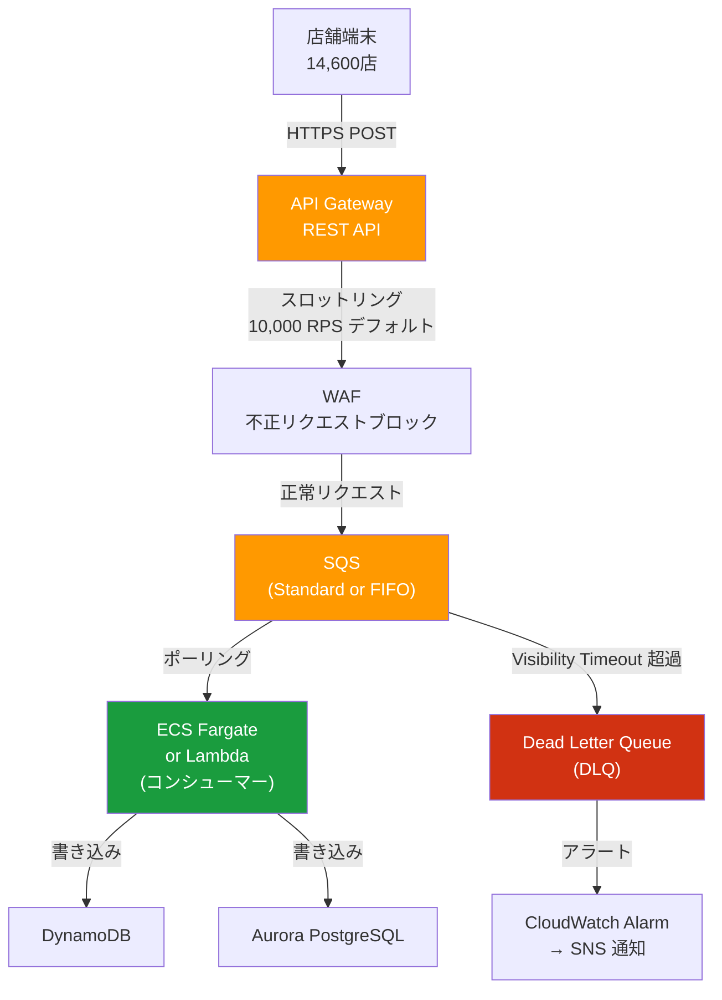
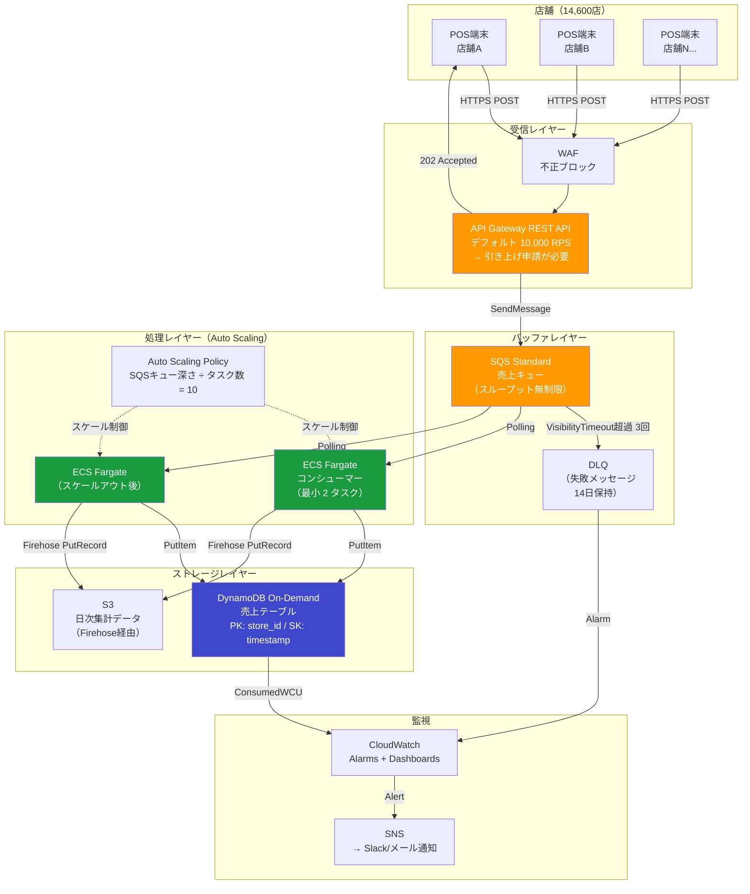
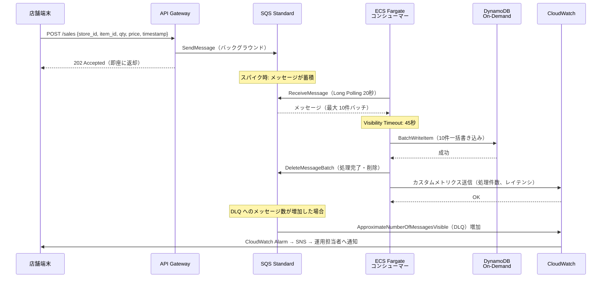

# WBS 3.2.1 大規模同時接続設計 — API Gateway + SQS / Auto Scaling / DynamoDB On-Demand ハンズオンメモ

---

## 目次

1. [サマリー（3行）](#1-サマリー3行)
2. [4サービスの全体像とユースケースマッピング](#2-4サービスの全体像とユースケースマッピング)
3. [API Gateway + SQS パターン](#3-api-gateway--sqs-パターン)
4. [Auto Scaling パターン](#4-auto-scaling-パターン)
5. [DynamoDB On-Demand パターン](#5-dynamodb-on-demand-パターン)
6. [4サービス統合設計（ストコン売上集約ユースケース）](#6-4サービス統合設計ストコン売上集約ユースケース)
7. [切り戻し/障害時の挙動](#7-切り戻し障害時の挙動)
8. [コスト試算（ストコン全店規模）](#8-コスト試算ストコン全店規模)
9. [次の学習ステップ](#9-次の学習ステップ)
10. [参考資料](#10-参考資料)

---

## 1. サマリー（3行）

14,600 店舗から同時に売上・在庫データが到着するシナリオでは、**API Gateway でリクエストを受け、SQS でスパイクを吸収し、Auto Scaling で処理能力を動的に確保し、DynamoDB On-Demand でバックエンドのキャパシティ管理を不要にする**という4層の組み合わせが標準解になる。各サービスは独立してスケールするため、単一ボトルネックが全体を止めにくい設計になっている。PM 視点では「スロットリングのデフォルト値」「スケールアウトの速度」「On-Demand のコスト上振れリスク」の3点が意思決定の核心となる。

---

## 2. 4サービスの全体像とユースケースマッピング

### 2-1. 各サービスの役割と相性

| サービス | 役割 | 大規模同時接続での位置付け |
|---|---|---|
| **API Gateway** | HTTPS エンドポイントの受付・認証・スロットリング | 全リクエストの入口。不正・過負荷を第一層でブロック |
| **SQS** | メッセージキューによる非同期バッファ | スパイクを吸収し、後段の処理速度に合わせて均一流出 |
| **Auto Scaling** | EC2/ECS/Lambda のキャパシティ動的制御 | SQS の深さに応じてコンシューマー数を増減 |
| **DynamoDB On-Demand** | サーバーレス KV ストア（キャパシティ自動） | 書き込み集中時のスロットリングを自動回避 |

これら4サービスを**数珠つなぎ**にすることで、各レイヤーが独立してスケールできる。一方、設計を誤ると「API Gateway は通るが SQS が詰まる」「ECS は追いついているが DynamoDB が throttle する」といったレイヤー別のボトルネックが発生する。本ノートはその設計判断をハンズオン手順と合わせて整理する。

### 2-2. コンビニストコン移行での典型ユースケース

| ユースケース | 発生タイミング | データ量規模 | 推奨パターン |
|---|---|---|---|
| **売上データ集約** | 随時〜閉店時間帯に集中 | 14,600 店 × 数十件/分 | API GW → SQS Standard → Lambda → DynamoDB |
| **在庫同期** | POSレジ精算のたびに発生 | 1トランザクションあたり数件 | API GW → SQS FIFO → ECS Fargate → DynamoDB |
| **FF（フリーズ&フロート）発注連携** | 発注締め 14:00 前後に集中 | 14,600 店 × 30 SKU = 約 438,000 件/回 | API GW → SQS FIFO → ECS Fargate → Aurora |
| **商品マスタ一斉配信** | 本部更新後、全店に Fan-out | 全店同時受信 | SNS → SQS × N → Lambda → ElastiCache |
| **店舗センサーデータ収集** | 常時（温度・電力等） | 14,600 店 × 数件/分 | API GW → Kinesis → Lambda → Timestream |

> 既存ノート [wbs-5-2-aws-service-design-patterns.md](./wbs-5-2-aws-service-design-patterns.md) の §3-1「SQS / SNS / EventBridge / Kinesis — ストコンシナリオ別の使い分け」でパターン A〜D の詳細フローを定義済み。本ノートは「設計の Why（なぜ SQS を挟むのか）」と「ハンズオン手順」に集中する。

### 2-3. 既存ノートとの差分整理

| トピック | 参照先 | 本ノートの追加価値 |
|---|---|---|
| SQS/SNS/EventBridge の使い分けフローチャート | [wbs-5-2-aws-service-design-patterns.md §3-2](./wbs-5-2-aws-service-design-patterns.md) | ハンズオン CLI 手順・実測値の補完 |
| DynamoDB テーブル設計（在庫カウンタパターン） | [wbs-5-2-aws-service-design-patterns.md §2-1](./wbs-5-2-aws-service-design-patterns.md) | On-Demand モードの選択根拠とコスト上振れリスク |
| ECS Auto Scaling 設定値 | [wbs-5-2-aws-service-design-patterns.md §4-3](./wbs-5-2-aws-service-design-patterns.md) | ハンズオン手順・コールドスタート対策の詳細 |
| 移行フェーズの段階的リアルタイム化 | [wbs-2-5-4-storcon-aws-tech-deep-dive.md](./wbs-2-5-4-storcon-aws-tech-deep-dive.md) | 本ノートは設計パターン習得に特化 |

---

## 3. API Gateway + SQS パターン

### 3-1. アーキテクチャ図



### 3-2. なぜ「間に SQS を挟む」のか

**スパイク吸収**

API Gateway は同時に何万リクエストが来ても受け付けられるが（スロットリング上限まで）、後段の ECS や Lambda は即座にはスケールできない。SQS を挟むことで、「受信バースト → キューに蓄積 → コンシューマーのペースで処理」というバッファリングが実現する。

**非同期化によるレスポンスタイム改善**

SQS 統合では API Gateway が SQS への `SendMessage` 完了をもって即座に `202 Accepted` を返せる。店舗端末は「発注を受け付けた」という応答を数十 ms で受け取れる。処理完了を待つ同期モデルに比べ、店舗端末の体感レスポンスが大幅に改善する。

**リトライ責任の分界**

同期 API の場合、処理失敗時は店舗端末側で再送ロジックを実装する必要がある。SQS を挟むと、Visibility Timeout と MaxReceiveCount の設定で「コンシューマーが一定回数失敗したらDLQへ移動」というリトライ管理を SQS 側が担う。店舗端末のクライアントコードをシンプルに保てる。

### 3-3. SQS FIFO vs Standard の選択

| 比較項目 | SQS Standard | SQS FIFO |
|---|---|---|
| **スループット** | 事実上無制限（秒数万 msg/s 以上） | 3,000 msg/s（バッチ送信で 300 バッチ × 10件）または 300 msg/s（個別送信） |
| **順序保証** | ベストエフォート（順序不定） | Message Group ID 単位で厳密な順序保証 |
| **重複排除** | At-least-once（まれに重複あり） | Exactly-once（重複排除ID使用時） |
| **料金** | $0.00000040/メッセージ（最初の 100 万件は無料） | $0.00000050/メッセージ（25%割高） |
| **ユースケース** | 売上データ集約（順序不要）、ログ収集 | 発注処理（二重発注防止）、在庫更新（順序依存） |

**ストコン案件での使い分け判断**:

```
発注処理、在庫トランザクション → SQS FIFO
  理由: Message Group ID = {store_id} で店舗単位の順序保証
        Deduplication ID = {order_id} で二重発注防止

売上データ集約、センサーログ → SQS Standard
  理由: 集計・分析用途で順序依存なし、スループット優先
```

### 3-4. Visibility Timeout と DLQ 設計

**Visibility Timeout**

コンシューマーがメッセージを取得すると、そのメッセージは一定時間（Visibility Timeout）他のコンシューマーから見えなくなる。処理が完了したらコンシューマーが削除する。完了前にタイムアウトすると再可視化（再試行）。

```
設計指針:
  Visibility Timeout = コンシューマーの最大処理時間 × 1.5 倍
  
  例: ECS Fargate の発注処理が最大 30 秒かかる場合
  Visibility Timeout = 45 秒 が適切
  
  Lambda の場合: Lambda タイムアウト設定 × 1.5 を基本として設定
```

**DLQ（Dead Letter Queue）設計**

```
推奨設定:
  maxReceiveCount: 3（3回失敗したらDLQへ移動）
  DLQ の MessageRetentionPeriod: 14 日（デフォルトは 4 日）
  
  DLQ 監視:
    CloudWatch Alarm: ApproximateNumberOfMessagesVisible > 0 で発火
    → SNS → メール/Slack 通知
    → 本部の運用担当者がメッセージ内容を確認して再処理
```

### 3-5. ハンズオン手順: API Gateway REST API → SQS 統合

以下は AWS CLI で「API Gateway が SQS に直接 SendMessage する統合」を構築する手順。

**Step 1: SQS キュー作成**

```bash
# Standard キュー作成
aws sqs create-queue \
  --queue-name storcon-sales-queue \
  --attributes '{
    "VisibilityTimeout": "45",
    "MessageRetentionPeriod": "86400",
    "ReceiveMessageWaitTimeSeconds": "20"
  }' \
  --region ap-northeast-1

# キューの ARN と URL を取得（後続で使用）
QUEUE_URL=$(aws sqs get-queue-url \
  --queue-name storcon-sales-queue \
  --region ap-northeast-1 \
  --query 'QueueUrl' --output text)

QUEUE_ARN=$(aws sqs get-queue-attributes \
  --queue-url $QUEUE_URL \
  --attribute-names QueueArn \
  --region ap-northeast-1 \
  --query 'Attributes.QueueArn' --output text)

echo "Queue URL: $QUEUE_URL"
echo "Queue ARN: $QUEUE_ARN"
```

**Step 2: API Gateway が SQS に書き込むための IAM ロール作成**

```bash
# 信頼ポリシードキュメント
cat > apigw-trust-policy.json << 'EOF'
{
  "Version": "2012-10-17",
  "Statement": [
    {
      "Effect": "Allow",
      "Principal": {
        "Service": "apigateway.amazonaws.com"
      },
      "Action": "sts:AssumeRole"
    }
  ]
}
EOF

# IAM ロール作成
aws iam create-role \
  --role-name storcon-apigw-sqs-role \
  --assume-role-policy-document file://apigw-trust-policy.json

# SQS SendMessage 権限を付与
aws iam put-role-policy \
  --role-name storcon-apigw-sqs-role \
  --policy-name sqs-send-policy \
  --policy-document '{
    "Version": "2012-10-17",
    "Statement": [{
      "Effect": "Allow",
      "Action": ["sqs:SendMessage"],
      "Resource": "'"$QUEUE_ARN"'"
    }]
  }'

ROLE_ARN=$(aws iam get-role \
  --role-name storcon-apigw-sqs-role \
  --query 'Role.Arn' --output text)
```

**Step 3: API Gateway REST API 作成と SQS 統合設定**

```bash
# REST API 作成
API_ID=$(aws apigateway create-rest-api \
  --name storcon-sales-api \
  --description "Store Computer Sales Data Ingestion" \
  --region ap-northeast-1 \
  --query 'id' --output text)

# ルートリソース ID 取得
ROOT_ID=$(aws apigateway get-resources \
  --rest-api-id $API_ID \
  --region ap-northeast-1 \
  --query 'items[0].id' --output text)

# /sales リソース作成
RESOURCE_ID=$(aws apigateway create-resource \
  --rest-api-id $API_ID \
  --parent-id $ROOT_ID \
  --path-part "sales" \
  --region ap-northeast-1 \
  --query 'id' --output text)

# POST メソッド作成
aws apigateway put-method \
  --rest-api-id $API_ID \
  --resource-id $RESOURCE_ID \
  --http-method POST \
  --authorization-type NONE \
  --region ap-northeast-1

# SQS 統合設定（API Gateway → SQS 直接統合）
aws apigateway put-integration \
  --rest-api-id $API_ID \
  --resource-id $RESOURCE_ID \
  --http-method POST \
  --type AWS \
  --integration-http-method POST \
  --uri "arn:aws:apigateway:ap-northeast-1:sqs:path/$(aws sts get-caller-identity --query 'Account' --output text)/storcon-sales-queue" \
  --credentials $ROLE_ARN \
  --request-parameters '{"integration.request.header.Content-Type": "'"'"'application/x-www-form-urlencoded'"'"'"}' \
  --request-templates '{"application/json": "Action=SendMessage&MessageBody=$util.urlEncode($input.body)"}' \
  --region ap-northeast-1
```

**Step 4: ステージのデプロイとテスト**

```bash
# ステージデプロイ
aws apigateway create-deployment \
  --rest-api-id $API_ID \
  --stage-name dev \
  --region ap-northeast-1

# テストコール（売上データ送信）
ENDPOINT="https://${API_ID}.execute-api.ap-northeast-1.amazonaws.com/dev/sales"
curl -X POST $ENDPOINT \
  -H "Content-Type: application/json" \
  -d '{"store_id": "STORE#10001", "item_id": "4901234567890", "qty": 1, "price": 150, "timestamp": "2026-04-18T10:00:00Z"}'
```

**Step 5: CloudWatch でキューの詰まりを確認**

```bash
# キューの現在のメッセージ数確認
aws sqs get-queue-attributes \
  --queue-url $QUEUE_URL \
  --attribute-names ApproximateNumberOfMessages,ApproximateNumberOfMessagesNotVisible \
  --region ap-northeast-1

# CloudWatch でキュー深さのメトリクスを取得
aws cloudwatch get-metric-statistics \
  --namespace "AWS/SQS" \
  --metric-name "ApproximateNumberOfMessagesVisible" \
  --dimensions Name=QueueName,Value=storcon-sales-queue \
  --start-time "$(date -u -d '1 hour ago' +%Y-%m-%dT%H:%M:%SZ)" \
  --end-time "$(date -u +%Y-%m-%dT%H:%M:%SZ)" \
  --period 60 \
  --statistics Average \
  --region ap-northeast-1
```

### 3-6. PM 視点: API Gateway の料金モデルと判断指針

**REST API vs HTTP API の選択**

| 比較項目 | REST API | HTTP API |
|---|---|---|
| **料金** | $3.50/100万リクエスト | $1.00/100万リクエスト（約 71% 安い） |
| **SQS 直接統合** | 対応（AWS サービス統合） | 非対応（Lambda 経由が必要） |
| **WAF 統合** | 対応 | 対応 |
| **使用量プラン・APIキー** | 対応 | 非対応 |
| **推奨ユースケース** | SQS 直接統合・細かいスロットリング制御が必要な場合 | マイクロサービスルーティング・コスト優先の場合 |

> ストコン案件では **SQS 直接統合を使うなら REST API 一択**。Lambda を挟む場合は HTTP API + Lambda の組み合わせが安価。

**スロットリングのデフォルト値と案件でのサイジング判断**

```
デフォルト値（変更申請不要）:
  - アカウントレベル: 10,000 RPS（Region 単位）
  - バーストリミット: 5,000 RPS（瞬間最大）

ストコン案件での推定ピーク:
  14,600 店 × 1 req/店 × ピーク係数 3 = 最大 43,800 req/s
  → デフォルトの 10,000 RPS を超える可能性あり

対応策:
  1. AWS サポートへクォータ引き上げリクエスト（無料、リードタイム 1〜2 週間）
  2. 使用量プラン（Usage Plan）で店舗グループごとにレート制限
  3. SQS を挟めば API Gateway 側は即返却のため 43,800 TPS でも応答時間は問題なし
     ただし SQS SendMessage の呼び出しが API Gateway スロットルに先にひっかかる
```

---

## 4. Auto Scaling パターン

### 4-1. EC2 vs ECS vs Lambda — 使い分け

| 比較軸 | EC2 Auto Scaling | ECS Service Auto Scaling | Lambda Concurrency |
|---|---|---|---|
| **スケール単位** | EC2 インスタンス（分単位） | ECS タスク（秒〜分単位） | 同時実行数（ミリ秒単位） |
| **コールドスタート** | 1〜5 分（AMI サイズ依存） | 30秒〜2分（イメージサイズ依存） | 100ms〜数秒（ランタイム依存） |
| **最小コスト構成** | 最小 1 インスタンス常時起動 | 最小 1 タスク常時起動（0 タスク設定可だがコールドスタートあり） | $0（リクエストがなければ課金なし） |
| **ステート管理** | EC2 内にステートを持てる | タスクはステートレスを推奨 | ステートレス必須 |
| **ストコン推奨ユースケース** | レガシー Lift&Shift | 発注 API、在庫 API（常時起動 + スケール） | 軽量イベント処理、DynamoDB Streams トリガー |

> 既存ノート [wbs-5-2-aws-service-design-patterns.md §1-1](./wbs-5-2-aws-service-design-patterns.md) で業務ワークロード別の選定マトリクスを整理済み。本節はスケーリング設定の実装詳細に集中する。

### 4-2. スケーリングポリシーの選択

| ポリシー種別 | 仕組み | 適合シナリオ |
|---|---|---|
| **Target Tracking** | 指定メトリクス（CPU使用率等）を目標値に維持するよう自動調整 | 予測困難な不規則トラフィック。設定が最も簡単 |
| **Step Scaling** | 閾値を段階的に定義し、超過幅に応じてスケールアウト量を変える | スパイクに素早く反応させたい場合（Target Trackingより反応速い） |
| **Scheduled Scaling** | 指定した時刻に最小/最大タスク数を変更 | 発注締め 14:00 など業務ピークが予測可能な場合 |
| **Predictive Scaling** | 過去パターンから将来のトラフィックを予測して事前スケール | 安定稼働後（実績データが溜まってから） |

**ストコン案件での推奨組み合わせ**:

```
Scheduled Scaling（事前スケール）:
  13:30 → 最小タスク数を 3 倍に設定（発注締め 14:00 の 30 分前）
  15:00 → 通常値に戻す

Step Scaling（スパイク対応）:
  CPU 70% 超 → +2 タスク
  CPU 85% 超 → +5 タスク
  CPU 30% 未満 10 分継続 → -1 タスク（スケールイン）

Target Tracking（平常時の効率化）:
  SQS キュー深さ / タスク数 = 10（1タスクあたり10メッセージ処理を目標）
  → Application Auto Scaling の カスタムメトリクスターゲット追跡
```

### 4-3. コールドスタート問題と対策

**問題の本質**

Lambda と ECS の違いはコールドスタートの発生頻度と影響範囲：

```
Lambda コールドスタート:
  - 新しい同時実行インスタンスが起動するたびに発生
  - Node.js: 100〜500ms / Python: 100〜300ms / Java: 1〜5秒
  - 全国 14,600 店が朝 7:00 に同時にアクセスすると
    バースト起動で多数のコールドスタートが同時発生する

ECS Fargate コールドスタート:
  - タスク起動は 30 秒〜2 分（イメージサイズ依存）
  - ただし常時起動タスクはコールドスタートしない
  - スケールアウト時に追加タスクのみ起動遅延あり
```

**対策一覧**

| 対策 | 対象 | 効果 | コスト |
|---|---|---|---|
| **Lambda Provisioned Concurrency** | Lambda | 指定数のインスタンスを常時温機状態に保持 → コールドスタートなし | 予約済み並列数 × 時間で課金（約 $0.015/vCPU-hour）。例: 100並列 × 720h = 約 $108/月 |
| **Lambda SnapStart** | Lambda（Java 21+） | スナップショットからの起動で Java のコールドスタートを数 ms に短縮 | 追加コストなし |
| **ECS 最小タスク数** | ECS Fargate | 最小 2 タスク（Multi-AZ）を常時起動し、スケールアウト分のみ遅延 | 常時起動コスト（0.25vCPU/0.5GB なら約 $9/月/タスク） |
| **ECS Warmup 設定（Lifecycle Hook）** | ECS | Auto Scaling の登録完了をヘルスチェック合格後まで遅延させる | 設定コストのみ |
| **SQS バッファ活用** | ECS + SQS | SQS にメッセージが溜まる間にスケールアウトが完了する。設計でコールドスタートの影響を隠蔽できる | SQS 料金のみ |

**推奨**: 発注受付 API のような SLA 要件が厳しい処理は ECS Fargate（最小 2 タスク常時起動 + Step Scaling）を使用。Lambda は補助的な非同期処理（DynamoDB Streams トリガー、マスタ差分配信等）に限定することで、コールドスタートリスクを設計段階で排除する。

### 4-4. ハンズオン手順: ECS Fargate で CPU Target Tracking を設定

**Step 1: ECS クラスターとサービスの作成（Fargate）**

```bash
# クラスター作成
aws ecs create-cluster \
  --cluster-name storcon-cluster \
  --region ap-northeast-1

# タスク定義作成（最小構成の例）
cat > storcon-task-def.json << 'EOF'
{
  "family": "storcon-consumer",
  "networkMode": "awsvpc",
  "requiresCompatibilities": ["FARGATE"],
  "cpu": "256",
  "memory": "512",
  "executionRoleArn": "arn:aws:iam::ACCOUNT_ID:role/ecsTaskExecutionRole",
  "containerDefinitions": [
    {
      "name": "storcon-consumer",
      "image": "ACCOUNT_ID.dkr.ecr.ap-northeast-1.amazonaws.com/storcon-consumer:latest",
      "essential": true,
      "logConfiguration": {
        "logDriver": "awslogs",
        "options": {
          "awslogs-group": "/ecs/storcon-consumer",
          "awslogs-region": "ap-northeast-1",
          "awslogs-stream-prefix": "ecs"
        }
      }
    }
  ]
}
EOF

aws ecs register-task-definition \
  --cli-input-json file://storcon-task-def.json \
  --region ap-northeast-1

# ECS サービス作成（最小 2 タスク）
aws ecs create-service \
  --cluster storcon-cluster \
  --service-name storcon-consumer-service \
  --task-definition storcon-consumer \
  --desired-count 2 \
  --launch-type FARGATE \
  --network-configuration "awsvpcConfiguration={subnets=[subnet-xxxxxxxx,subnet-yyyyyyyy],securityGroups=[sg-xxxxxxxx],assignPublicIp=DISABLED}" \
  --region ap-northeast-1
```

**Step 2: Application Auto Scaling の登録**

```bash
# スケーラブルターゲットとして ECS サービスを登録
aws application-autoscaling register-scalable-target \
  --service-namespace ecs \
  --scalable-dimension ecs:service:DesiredCount \
  --resource-id service/storcon-cluster/storcon-consumer-service \
  --min-capacity 2 \
  --max-capacity 50 \
  --region ap-northeast-1
```

**Step 3: Target Tracking ポリシー（CPU 使用率 70% 目標）**

```bash
cat > scaling-policy.json << 'EOF'
{
  "TargetValue": 70.0,
  "PredefinedMetricSpecification": {
    "PredefinedMetricType": "ECSServiceAverageCPUUtilization"
  },
  "ScaleOutCooldown": 60,
  "ScaleInCooldown": 300
}
EOF

aws application-autoscaling put-scaling-policy \
  --service-namespace ecs \
  --scalable-dimension ecs:service:DesiredCount \
  --resource-id service/storcon-cluster/storcon-consumer-service \
  --policy-name storcon-cpu-target-tracking \
  --policy-type TargetTrackingScaling \
  --target-tracking-scaling-policy-configuration file://scaling-policy.json \
  --region ap-northeast-1
```

**Step 4: Scheduled Scaling（発注締め前の事前スケール）**

```bash
# 発注締め 30 分前（13:30 JST = 04:30 UTC）に最小タスクを 6 に拡張
aws application-autoscaling put-scheduled-action \
  --service-namespace ecs \
  --scalable-dimension ecs:service:DesiredCount \
  --resource-id service/storcon-cluster/storcon-consumer-service \
  --scheduled-action-name scale-out-before-order-deadline \
  --schedule "cron(30 4 ? * MON-FRI *)" \
  --scalable-target-action MinCapacity=6,MaxCapacity=50 \
  --region ap-northeast-1

# 発注締め後 1 時間（15:00 JST = 06:00 UTC）に戻す
aws application-autoscaling put-scheduled-action \
  --service-namespace ecs \
  --scalable-dimension ecs:service:DesiredCount \
  --resource-id service/storcon-cluster/storcon-consumer-service \
  --scheduled-action-name scale-in-after-order-deadline \
  --schedule "cron(0 6 ? * MON-FRI *)" \
  --scalable-target-action MinCapacity=2,MaxCapacity=50 \
  --region ap-northeast-1
```

**Step 5: 擬似負荷でスケーリング動作を確認**

```bash
# SQS にメッセージを大量送信して負荷を擬似（AWS CLI ループ）
for i in $(seq 1 1000); do
  aws sqs send-message \
    --queue-url $QUEUE_URL \
    --message-body "{\"store_id\": \"STORE#$(printf '%05d' $i)\", \"test\": true}" \
    --region ap-northeast-1 &
done
wait

# ECS タスク数の推移をモニタリング
watch -n 10 "aws ecs describe-services \
  --cluster storcon-cluster \
  --services storcon-consumer-service \
  --region ap-northeast-1 \
  --query 'services[0].{desired:desiredCount,running:runningCount,pending:pendingCount}'"
```

### 4-5. PM 視点: スケーリング速度とリスク判断指針

**スケールアウト速度の現実**

```
ECS Fargate タスク起動: 30 秒〜2 分（平均 60 秒程度）
Auto Scaling の判断ラグ: CloudWatch メトリクスは 1 分粒度 + 評価期間（例: 3 分）
合計スケールアウトまでのリードタイム: 最短 2〜4 分

→ 14:00 発注締めの 1 分前に急に全店がリクエストしてきた場合、
  スケールアウトが追いつかない可能性がある
→ Scheduled Scaling で事前スケールが必須
```

**ステージング環境での負荷試験の必須性**

PM として承認すべき品質ゲート：

| テスト種別 | 目的 | 実施タイミング |
|---|---|---|
| **ピーク負荷試験** | 発注締め同時 43,800 req/s を再現し、エラー率 0.1% 以下を確認 | 本番移行 2 ヶ月前 |
| **スケールアウト試験** | Auto Scaling が 5 分以内にピーク対応できること確認 | 本番移行 1 ヶ月前 |
| **コールドスタート試験** | 週末の低トラフィック後に月曜 7:00 の突発スパイクを再現 | ステージング常設 |
| **SQS 詰まり試験** | コンシューマー停止中にメッセージを積み、再起動後の Catch-up 速度確認 | ステージング常設 |

---

## 5. DynamoDB On-Demand パターン

### 5-1. Provisioned vs On-Demand の選択

| 比較項目 | Provisioned（プロビジョニング） | On-Demand |
|---|---|---|
| **キャパシティ管理** | WCU / RCU を事前指定（変更可だが反映まで数時間） | 不要（AWS が自動スケール） |
| **スロットリング** | 設定値を超えると ProvisionedThroughputExceeded | 突然の 2 倍スパイクまで自動対応（それ以上は数分で対応） |
| **料金** | $0.000742/WCU・時、$0.0001484/RCU・時（ap-northeast-1） | $1.4269/100万書き込み、$0.285/100万読み込み（ap-northeast-1） |
| **割引** | Reserved Capacity で最大 77% 割引 | 割引なし |
| **コスト効率が高い閾値** | 70% 以上の使用率が恒常的な場合 | アクセスパターンが予測困難または新規サービス |

**選択フローチャート**:

```
アクセスパターンが予測可能か？
  Yes → Provisioned + Auto Scaling（ピーク対応）
    ↓ さらに: 使用率 70% 以上が見込めるか？
      Yes → Reserved Capacity で割引
      No  → Provisioned のまま（スパイク時は Auto Scaling）

  No / 新サービス / トラフィック急変が想定される場合
  → On-Demand（まず On-Demand で様子見 → 安定後 Provisioned に切り替え）
```

**ストコン案件での推奨**:

```
移行初期（6〜12ヶ月）: On-Demand
  理由: 店舗システムの実際のアクセスパターンが不明
        移行フェーズ中はトラフィックが不規則（店舗ごとに切り替え時期が異なる）

安定期（12ヶ月以降）: Provisioned + Auto Scaling + Reserved Capacity
  理由: 実績データが溜まりアクセスパターンが把握できる
        14,600 店規模だと Reserved Capacity の割引効果が大きい
```

### 5-2. パーティションキーのホットスポット問題

**問題の本質**

DynamoDB は内部的にパーティションキーのハッシュ値によってデータを分散させる。同じパーティションキーに書き込みが集中すると、その**単一パーティション**がボトルネックになる（1パーティションの書き込み上限: 1,000 WCU）。

```
悪い例: 全店舗の売上データを同一パーティションに書き込む
  パーティションキー = "SALES_DATA"（固定値）
  → 全ての書き込みが 1 パーティションに集中
  → 14,600 店 × 10 TPS = 146,000 WCU が 1 パーティションに → スロットリング

良い例: ストアIDをパーティションキーにする
  パーティションキー = "STORE#10001", "STORE#10002", ... "STORE#14600"
  → 14,600 パーティションに均等分散
  → 各パーティションは 10 WCU 程度
```

**カウンタシャーディング（アトミックカウンタ分散）**

全国合計の在庫や売上を高頻度でカウンタ更新する場合、単一レコードへの集中書き込みが発生する。

```python
# シャーディングなし（NG）: 全更新が 1 レコードに集中
table.update_item(
    Key={'PK': 'GLOBAL_SALES_COUNTER'},
    UpdateExpression='SET total = total + :val',
    ExpressionAttributeValues={':val': Decimal('1')}
)

# シャーディングあり（推奨）: N 個のシャードに分散
import random

shard_count = 100  # シャード数
shard_id = random.randint(0, shard_count - 1)

table.update_item(
    Key={'PK': f'GLOBAL_SALES_COUNTER#{shard_id}'},
    UpdateExpression='SET total = total + :val',
    ExpressionAttributeValues={':val': Decimal('1')}
)

# 集計クエリ: 全シャードの合計を取得
total = sum(
    table.get_item(Key={'PK': f'GLOBAL_SALES_COUNTER#{i}'})
        .get('Item', {}).get('total', 0)
    for i in range(shard_count)
)
```

### 5-3. ハンズオン手順: On-Demand テーブル作成と throttling 監視

**Step 1: On-Demand テーブル作成**

```bash
# On-Demand モードで DynamoDB テーブル作成
aws dynamodb create-table \
  --table-name storcon-sales \
  --attribute-definitions \
    AttributeName=store_id,AttributeType=S \
    AttributeName=timestamp,AttributeType=S \
  --key-schema \
    AttributeName=store_id,KeyType=HASH \
    AttributeName=timestamp,KeyType=RANGE \
  --billing-mode PAY_PER_REQUEST \
  --region ap-northeast-1

# テーブル作成完了を待つ
aws dynamodb wait table-exists \
  --table-name storcon-sales \
  --region ap-northeast-1

echo "Table created successfully"
```

**Step 2: PutItem 高スループット試験（AWS CLI ループ）**

```bash
# 複数の店舗から同時に書き込みを模擬（bash バックグラウンドジョブ）
TIMESTAMP=$(date -u +%Y-%m-%dT%H:%M:%SZ)

for store_num in $(seq 1 100); do
  store_id="STORE#$(printf '%05d' $store_num)"
  for item_num in $(seq 1 10); do
    aws dynamodb put-item \
      --table-name storcon-sales \
      --item "{
        \"store_id\": {\"S\": \"${store_id}\"},
        \"timestamp\": {\"S\": \"${TIMESTAMP}-${item_num}\"},
        \"item_id\": {\"S\": \"4901234$(printf '%06d' $item_num)\"},
        \"qty\": {\"N\": \"1\"},
        \"price\": {\"N\": \"150\"}
      }" \
      --region ap-northeast-1 &
  done
done
wait

echo "Bulk write completed"
```

**Step 3: CloudWatch で throttling を監視**

```bash
# DynamoDB の throttle メトリクスを確認
aws cloudwatch get-metric-statistics \
  --namespace "AWS/DynamoDB" \
  --metric-name "WriteThrottleEvents" \
  --dimensions Name=TableName,Value=storcon-sales \
  --start-time "$(date -u -d '30 minutes ago' +%Y-%m-%dT%H:%M:%SZ)" \
  --end-time "$(date -u +%Y-%m-%dT%H:%M:%SZ)" \
  --period 60 \
  --statistics Sum \
  --region ap-northeast-1

# 消費された WCU の確認
aws cloudwatch get-metric-statistics \
  --namespace "AWS/DynamoDB" \
  --metric-name "ConsumedWriteCapacityUnits" \
  --dimensions Name=TableName,Value=storcon-sales \
  --start-time "$(date -u -d '30 minutes ago' +%Y-%m-%dT%H:%M:%SZ)" \
  --end-time "$(date -u +%Y-%m-%dT%H:%M:%SZ)" \
  --period 60 \
  --statistics Sum \
  --region ap-northeast-1
```

### 5-4. PM 視点: コスト予測の難しさと予算超過リスク

**On-Demand の単価計算**

```
ap-northeast-1 での On-Demand 料金（2026年4月時点の参考値）:
  書き込み: $1.4269 / 100万 WCU
  読み取り: $0.2854 / 100万 RCU（Eventually Consistent）
           $0.5707 / 100万 RCU（Strongly Consistent）
  ストレージ: $0.285 / GB・月

ストコン全店 売上データ書き込みの概算:
  14,600 店 × 100 件/日 × 30 日 = 43,800,000 件/月
  → 43,800,000 WCU × $1.4269 / 1,000,000 = 約 $62/月（書き込みのみ）
  
  読み取り（本部集計: 10倍と仮定）:
  438,000,000 RCU × $0.2854 / 1,000,000 = 約 $125/月
  
  合計（On-Demand, 売上テーブルのみ）: 約 $187/月 + ストレージ
```

**予算超過リスクのシナリオ**

1. **バグによる無限ループ書き込み**: コンシューマーのバグで同一メッセージを処理し続けると On-Demand では無制限に課金される。AWS Budgets でアラートを設定し、Lambda のリトライポリシーも慎重に設計する必要がある。

2. **スキャン操作の使用**: `Scan` 操作（テーブル全件スキャン）は全アイテムに対して RCU を消費する。14,600 店 × 100 件のデータに対して全件スキャンすると、1,460,000 RCU が 1 回のクエリで消費される。**Global Secondary Index（GSI）** による検索に設計を統一することが重要。

3. **GSI の書き込み増幅**: GSI を追加すると、ベーステーブルへの書き込みに加えて GSI へも書き込みが発生（書き込み増幅係数 = 1 + GSI 数）。GSI を 3 つ追加した場合、実際の WCU 消費はベーステーブルの 4 倍になる。

---

## 6. 4サービス統合設計（ストコン売上集約ユースケース）

### 6-1. 統合アーキテクチャ図



### 6-2. シーケンス図（1リクエストの流れ）



### 6-3. Throughput 試算（14,600 店舗全店規模）

**前提条件**

```
対象: 売上データ集約（POSトランザクションごとにリアルタイム送信）
店舗数: 14,600 店
売上イベント: 平均 10 件/分/店（コンビニ 1 店舗の平均客数から試算）
ピーク係数: 3 倍（レジ集中時間帯）
```

**試算結果**

| レイヤー | 平常時 | ピーク時 | 上限値 | マージン |
|---|---|---|---|---|
| **全体 TPS** | 2,433 TPS | 7,300 TPS | — | — |
| **API Gateway** | 2,433 RPS | 7,300 RPS | 10,000 RPS（デフォルト） | 27% |
| **SQS** | 2,433 msg/s | 7,300 msg/s | 無制限（Standard） | 余裕あり |
| **ECS タスク（1タスク/10 msg/s）** | 244 タスク | 730 タスク | 最大 50 タスク設定では**不足** | 要設定変更 |
| **DynamoDB On-Demand** | 2,433 WCU/s | 7,300 WCU/s | 40,000 WCU/s（瞬間ピーク上限） | 82% |

**重要な設計変更点**

```
ECS タスク数の上限設定:
  1 タスクが SQS から 10 msg/s を処理すると仮定した場合
  → ピーク 7,300 msg/s を捌くには 730 タスク必要
  → AWS のデフォルト設定（Max 50）では到底足りない
  
対策:
  1. バッチ処理（BatchWriteItem）で 1 タスクの処理能力を上げる
     1 タスク × 10 件/バッチ × 10 バッチ/秒 = 100 msg/s
     → ピーク対応に 73 タスク程度で済む
  
  2. SQS のキュー深さを許容する（最終的に処理されればよい）
     → ピーク後 30 分以内にキューが空になることを SLA として定義
  
  3. Fargate 使用量クォータ引き上げ申請
     デフォルトのリージョン Fargate vCPU クォータは 3,072 vCPU
     50 タスク × 0.25 vCPU = 12.5 vCPU なので現時点では問題なし

DynamoDB On-Demand の上限:
  On-Demand モードのアカウントデフォルト上限: 40,000 WCU/s
  ピーク 7,300 WCU/s は上限の 18% → 余裕あり
  ただし GSI を追加すると書き込み増幅が発生（GSI × ベース WCU）
```

### 6-4. ボトルネック候補と緩和策

| ボトルネック候補 | 発生条件 | 緩和策 |
|---|---|---|
| **API Gateway スロットリング** | ピーク TPS > 10,000 RPS | クォータ引き上げ申請（1〜2週間） |
| **SQS FIFO スループット制限** | 順序保証が必要なキューで > 3,000 msg/s | Message Group ID を細かく分割（store×item単位） or Standard キューに変更 |
| **ECS スケールアウト遅延** | 突発スパイクでスケールアウトが間に合わない | Scheduled Scaling で事前スケール + SQS バッファで隠蔽 |
| **DynamoDB ホットパーティション** | 特定 store_id に書き込みが集中 | パーティションキー設計の見直し + Write Sharding |
| **DynamoDB On-Demand の 2 倍スパイク制限** | 通常量の 2 倍を超える突然のスパイク | 最初の数分は throttle が発生する可能性。SQS のバッファで緩和 |

---

## 7. 切り戻し/障害時の挙動

### 7-1. 各サービスの fault isolation と blast radius

| サービス障害 | 影響範囲 | 自動回復機能 |
|---|---|---|
| **API Gateway 障害** | 全店舗からのリクエスト受付が停止 | AWS マネージド（SLA 99.99%）、ユーザー側での回復操作不要 |
| **SQS 障害** | メッセージのエンキューが停止。APIGWから202が返せなくなる | AWS マネージド（SLA 99.9%）。メッセージは耐久性あり（3AZに保存）|
| **ECS タスク障害** | コンシューマーが停止。SQSにメッセージが蓄積 | ECS が desired count を維持するため自動再起動（数十秒） |
| **DynamoDB 障害** | 書き込みエラー。ECS コンシューマーがリトライ | SLA 99.999%。単一 AZ 障害では影響なし |
| **特定 AZ の障害** | その AZ のタスクが停止 | ECS が他 AZ にタスクを再スケジュール（Multi-AZ 設定必須） |

**SQS によるブラストラディウス局所化**

SQS を挟むことで、ECS や DynamoDB の障害が店舗端末に直接影響しない。店舗端末は API Gateway から 202 を受け取れる限り「処理受付済み」として動作を継続できる。バックエンドが数分間停止しても、SQS にメッセージが蓄積されるだけで、回復後にキャッチアップされる。

### 7-2. 最小構成の監視アラームセット

```bash
# DLQ メッセージ増加アラーム
aws cloudwatch put-metric-alarm \
  --alarm-name storcon-dlq-not-empty \
  --metric-name ApproximateNumberOfMessagesVisible \
  --namespace AWS/SQS \
  --statistic Average \
  --period 60 \
  --threshold 1 \
  --comparison-operator GreaterThanOrEqualToThreshold \
  --evaluation-periods 1 \
  --dimensions Name=QueueName,Value=storcon-sales-queue-dlq \
  --alarm-actions arn:aws:sns:ap-northeast-1:ACCOUNT_ID:storcon-ops-alert \
  --region ap-northeast-1

# ECS タスク数がゼロになった場合のアラーム
aws cloudwatch put-metric-alarm \
  --alarm-name storcon-ecs-no-running-tasks \
  --metric-name RunningTaskCount \
  --namespace AWS/ECS \
  --statistic Minimum \
  --period 60 \
  --threshold 1 \
  --comparison-operator LessThanThreshold \
  --evaluation-periods 2 \
  --dimensions Name=ClusterName,Value=storcon-cluster Name=ServiceName,Value=storcon-consumer-service \
  --alarm-actions arn:aws:sns:ap-northeast-1:ACCOUNT_ID:storcon-ops-alert \
  --region ap-northeast-1

# DynamoDB 書き込みスロットリングアラーム
aws cloudwatch put-metric-alarm \
  --alarm-name storcon-dynamodb-write-throttle \
  --metric-name WriteThrottleEvents \
  --namespace AWS/DynamoDB \
  --statistic Sum \
  --period 300 \
  --threshold 100 \
  --comparison-operator GreaterThanThreshold \
  --evaluation-periods 1 \
  --dimensions Name=TableName,Value=storcon-sales \
  --alarm-actions arn:aws:sns:ap-northeast-1:ACCOUNT_ID:storcon-ops-alert \
  --region ap-northeast-1
```

### 7-3. 年末年始凍結期間中のインシデント対応フロー（PM 視点）

ストコン案件では本番切り替え後に**凍結期間（年末年始・繁忙期）**が設定されることが多い。凍結期間中はシステム変更が禁止されるため、インシデント発生時の対応範囲が制限される。

**凍結期間の定義**（例）

```
凍結開始: 12/25（月）00:00
凍結解除: 1/5（金）09:00

許可操作: 設定変更なし・デプロイなし・スケール手動変更のみ
禁止操作: ロジック変更・テーブル変更・IAM変更
```

**インシデント発生時の判断フロー**

```
Step 1: 障害の分類
  A. AWS マネージドサービス障害 → AWSサポートへ連絡、Status Dashboardを監視
  B. アプリケーション層の障害 → 凍結中はコード変更不可
  C. 設定・スケール問題 → 手動スケール変更は凍結中も可能

Step 2: SQS のメッセージ保持
  → SQS はデフォルト 4 日間メッセージを保持（設定で最大 14 日）
  → 障害中に蓄積したメッセージは障害復旧後に自動処理される
  → 凍結中のインシデント時に「メッセージを消すな、溜めろ」がデフォルト対応

Step 3: 外部コミュニケーション
  → 店舗への影響があれば加盟店向け情報を 1 時間以内に発報
  → 本部担当者（MD、物流、会計）への影響を整理
  → AWS マネージドサービスが原因の場合は Service Level Agreement を確認

Step 4: エスカレーション判断
  → 売上データ欠損が 1 日分を超える場合: 凍結解除の例外申請
  → 24 時間以内に復旧見込みが立たない場合: 手動バックアップ手順の発動
```

---

## 8. コスト試算（ストコン全店規模）

### 8-1. 月次 TCO 概算

以下は **14,600 店舗・売上データ集約ユースケース**に絞った概算試算。ap-northeast-1 の参考単価を使用。実際の価格は [AWS 料金計算ツール](https://calculator.aws/pricing/2/home) で最新値を確認すること。

**API Gateway（REST API）**

```
月間リクエスト数:
  14,600 店 × 100 件/日 × 30 日 = 43,800,000 件/月

料金:
  最初の 333 百万件/月: $3.50 / 100 万件
  43,800,000 × $3.50 / 1,000,000 = $153.30/月
  
  キャッシュ（不使用の場合）: $0
  
API Gateway 月額小計: 約 $153/月
```

**SQS**

```
月間メッセージ数: 43,800,000 件/月
最初の 100 万件は無料

料金:
  (43,800,000 - 1,000,000) × $0.00000040 = $17.12/月
  
SQS 月額小計: 約 $17/月（非常に安価）
```

**ECS Fargate**

```
常時起動タスク:
  最小 2 タスク × 0.25 vCPU × 0.5 GB
  vCPU 時間: 2 × 0.25 vCPU × 720 時間 = 360 vCPU-time
  360 × $0.04048/vCPU-時間 = $14.57/月
  
  メモリ: 2 × 0.5 GB × 720 時間 = 720 GB-time
  720 × $0.004445/GB-時間 = $3.20/月

ピーク時の追加タスク（1日2時間と仮定):
  20 タスク × 0.25 vCPU × 2 時間/日 × 30 日 = 300 vCPU-time
  300 × $0.04048 = $12.14/月

ECS Fargate 月額小計: 約 $30/月（最小構成）
```

**DynamoDB On-Demand**

```
書き込み:
  43,800,000 WCU × $1.4269 / 1,000,000 = $62.50/月

読み取り（集計クエリ: 書き込みの 5 倍と仮定）:
  219,000,000 RCU × $0.2854 / 1,000,000 = $62.50/月

ストレージ（1件 = 1KB と仮定):
  43,800,000件 × 1KB = 43.8 GB/月
  43.8 GB × $0.285/GB = $12.48/月

DynamoDB 月額小計: 約 $138/月
```

**総計（売上集約ユースケース単体）**

| サービス | 月額概算 | 備考 |
|---|---|---|
| API Gateway | $153 | REST API、キャッシュなし |
| SQS | $17 | Standard キュー |
| ECS Fargate | $30 | 最小 2 タスク + ピーク時追加 |
| DynamoDB On-Demand | $138 | 書き込み + 読み取り + ストレージ |
| CloudWatch | $20 | 推定（メトリクス + ログ） |
| **合計** | **約 $358/月** | **売上集約のみ** |

### 8-2. オンプレとの比較ポイント

| 観点 | オンプレ（現行） | AWS 移行後 |
|---|---|---|
| **初期コスト** | サーバー購入・設置費用（数百万〜数千万円） | ほぼゼロ（従量課金開始） |
| **スケール時コスト** | 事前に高スペックサーバーを購入する必要 | ピーク時のみ追加課金（ECS Auto Scaling） |
| **運用人件費** | インフラ担当者がパッチ・ハード交換・監視を担当 | AWS マネージドにより削減可能（推定 20〜30% 削減） |
| **障害時の費用** | ハード交換は数時間〜数日のダウンタイム＋交換費用 | マネージドサービスは SLA の範囲で自動回復 |
| **TCO 比較の難しさ** | 既存サーバーの減価償却が終わっていると「移行コスト > 現行」になることも | 5年 TCO で比較すると通常は AWS が有利（運用効率化込み） |

> PM 視点の移行判断指針については [wbs-5-2-aws-migration-best-practices.md §10](./wbs-5-2-aws-migration-best-practices.md) を参照。

---

## 9. 次の学習ステップ

### WBS 3.2.2 との繋がり

本ノートが扱った「大規模同時接続（リアルタイム受信）」の次のステップは WBS 3.2.2「バッチ + リアルタイム処理の並走設計」。

| 本ノート（3.2.1）で習得 | 3.2.2 で拡張する内容 |
|---|---|
| SQS によるスパイク吸収 | Kinesis Data Streams での大量リアルタイムストリーム処理 |
| ECS Auto Scaling による動的スケール | AWS Batch によるバッチジョブ並列化 |
| DynamoDB On-Demand のリアルタイム書き込み | S3 + Glue Catalog + Athena によるバッチ集計 |
| API Gateway でのリクエスト受付 | EventBridge Scheduler によるバッチ定時起動 |

### AWS Well-Architected Framework の Performance Efficiency Pillar

本ノートで扱ったパターンは [AWS Well-Architected Framework — Performance Efficiency Pillar](https://docs.aws.amazon.com/wellarchitected/latest/performance-efficiency-pillar/welcome.html) の以下の設計原則に対応する。

- **Selection**: 各ワークロードに最適なサービスを選択（API Gateway / SQS / ECS / DynamoDB）
- **Review**: 新しいサービス（On-Demand モード等）を継続的にキャッチアップ
- **Monitoring**: CloudWatch による継続的なパフォーマンス計測と改善
- **Trade-offs**: On-Demand のコスト柔軟性 vs Provisioned の価格効率

---

## 10. 参考資料

### AWS 公式ドキュメント

- [Amazon API Gateway 開発者ガイド — AWS サービス統合](https://docs.aws.amazon.com/apigateway/latest/developerguide/how-to-integration-settings.html)
- [Amazon SQS 開発者ガイド — FIFO キューの使用](https://docs.aws.amazon.com/AWSSimpleQueueService/latest/SQSDeveloperGuide/FIFO-queues.html)
- [Amazon ECS — Application Auto Scaling](https://docs.aws.amazon.com/AmazonECS/latest/developerguide/service-auto-scaling.html)
- [Amazon DynamoDB — オンデマンドキャパシティモード](https://docs.aws.amazon.com/amazondynamodb/latest/developerguide/HowItWorks.ReadWriteCapacityMode.html)
- [AWS Well-Architected Framework — Performance Efficiency Pillar](https://docs.aws.amazon.com/wellarchitected/latest/performance-efficiency-pillar/welcome.html)
- [Amazon API Gateway — スロットリングの設定](https://docs.aws.amazon.com/apigateway/latest/developerguide/api-gateway-request-throttling.html)
- [Amazon DynamoDB — ベストプラクティス（パーティションキー設計）](https://docs.aws.amazon.com/amazondynamodb/latest/developerguide/bp-partition-key-design.html)
- [Amazon ECS — スケジュールされたスケーリング](https://docs.aws.amazon.com/AmazonECS/latest/developerguide/scheduled_tasks.html)

### AWS ブログ・ホワイトペーパー

- [AWS Architecture Blog — API Gateway + SQS パターン解説](https://aws.amazon.com/blogs/compute/building-resilient-applications-with-amazon-sqs-dead-letter-queues/)
- [AWS Compute Blog — Lambda Provisioned Concurrency の活用](https://aws.amazon.com/blogs/compute/new-for-aws-lambda-predictable-start-up-times-with-provisioned-concurrency/)
- [AWS Database Blog — DynamoDB On-Demand キャパシティの選択指針](https://aws.amazon.com/blogs/database/amazon-dynamodb-auto-scaling-performance-and-cost-optimization-at-any-scale/)

### 既存ノートへの内部リンク

- [wbs-5-2-aws-service-design-patterns.md §3-1 メッセージング使い分けフローチャート](./wbs-5-2-aws-service-design-patterns.md) — 本ノートの前提。SQS/SNS/EventBridge/Kinesis の選択フローチャートはこちら
- [wbs-5-2-aws-service-design-patterns.md §2-1 DynamoDB テーブル設計（在庫カウンタパターン）](./wbs-5-2-aws-service-design-patterns.md) — アトミックカウンタの UpdateItem コード例を含む
- [wbs-5-2-aws-migration-best-practices.md §10 PM視点の論点整理](./wbs-5-2-aws-migration-best-practices.md) — 移行フェーズでの TCO 比較・意思決定指針
- [wbs-3-1-2-aws-database-comparison.md §1 主要 4 サービス比較](./wbs-3-1-2-aws-database-comparison.md) — DynamoDB の Provisioned vs On-Demand の詳細比較表
- [wbs-2-5-4-storcon-aws-tech-deep-dive.md §2 移行に重要なAWSサービス詳細](./wbs-2-5-4-storcon-aws-tech-deep-dive.md) — DMS/MGN の詳細移行手順

---

*このノートは WBS 3.2.1 ハンズオンメモとして作成。実際のハンズオン実施時は `ACCOUNT_ID` / Subnet ID / Security Group ID を実環境の値に置き換えること。AWS CLI コマンドは 2026-04-18 時点の公式ドキュメントをベースに作成。*
